# 零编程基础逆向破解此crack过程记录
前情提要：
使用到的工具有：IDA、X64dbg
这个crackme的地址
https://www.52pojie.cn/thread-1921178-1-1.html
## 思路

通过问询AI可以知道，破解有两条路：1、强行修改跳转，2、找到密码。先来看看如何强行修改跳转吧。

---

## 方法一：强行修改跳转

### 一、下载工具

#### 1.下载IDA

这个我直接去52pojie上找然后下载的

#### 2.下载x64dbg

去谷歌搜索x64dbg，进入官网https://x64dbg.com/， 然后点击下载就完事儿了！

对了，还有一个重要的工具就是AI，我都是问AI告诉我怎么做的。
准备完毕，开始着手吧！

---

### 二、用IDA进行静态分析

**_PS_** _注意，这里说一下IDA是干啥的：IDA 是一个：静态分析工具，它不运行程序，只分析代码结构。我们可以用它来看函数逻辑、找关键字符串、看流程图（程序结构）从而来进行逆向分析。_

打开IDA——>点击<u>ok</u>——>点击<u>new</u>，开始新项目，找到要分析的文件crackme.exe并打开（也可以直接拖进去），会弹出<u>load a new file</u>的弹窗，直接点ok，等待其自动分析完毕，页面下方output框会显示：`The initial autoanalysis has been finished.`就是初步分析完毕。

直接进入眼帘的就是一个流程图一样的页面即**反汇编视图**，
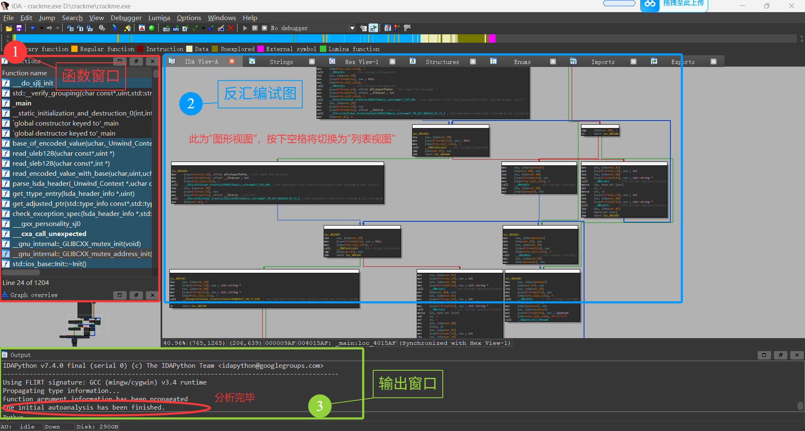

按住`shift`+`f12`,打开字符串窗口,找到类似"Correct"、"Wrong"、"Success"、"Fail"、"Password"的字眼，双击
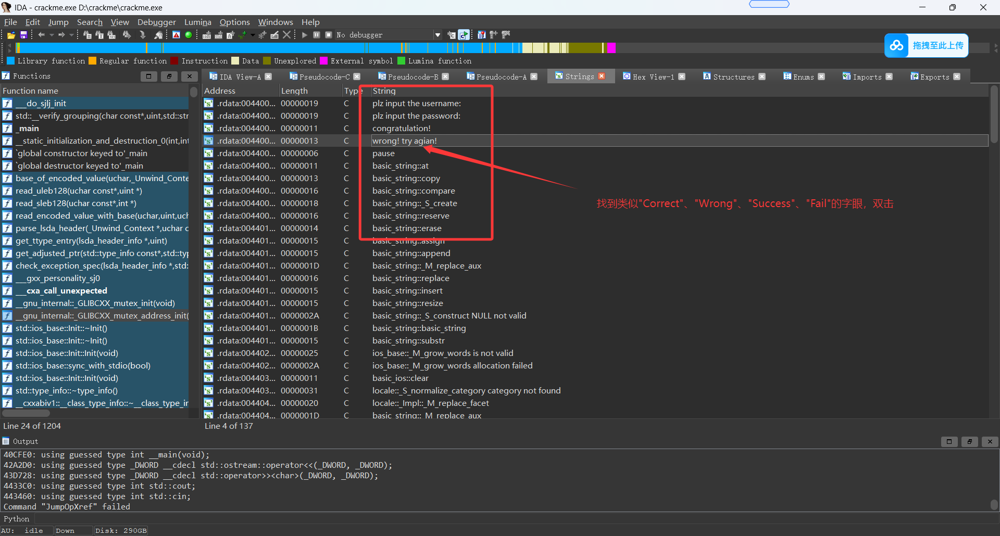

双击之后进入，可以看到这一行：`rdata:00440043 aWrongTryAgian  db 'wrong! try agian! ',0`
按`x键`，看看是哪里引用
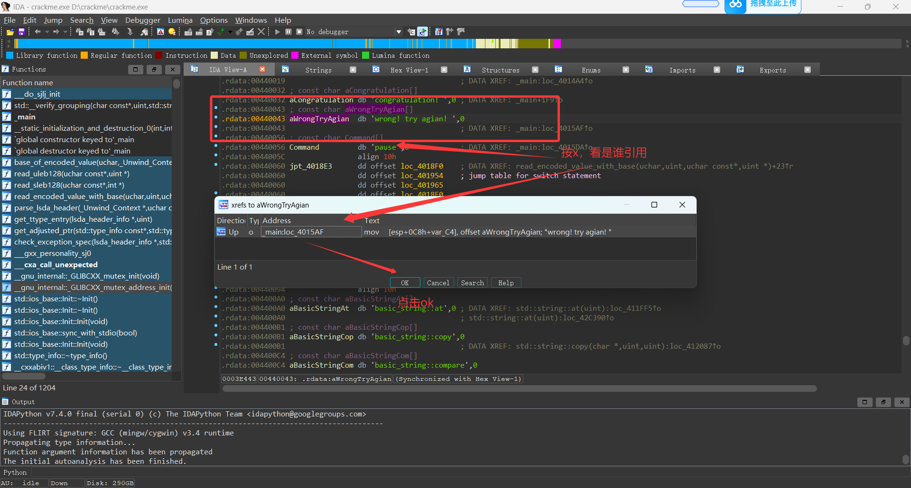

按下`x键`之后，可能跳转到反汇编图形视图或者是反汇编列表视图，如果跳转到图形视图可以按下空格键看列表视图
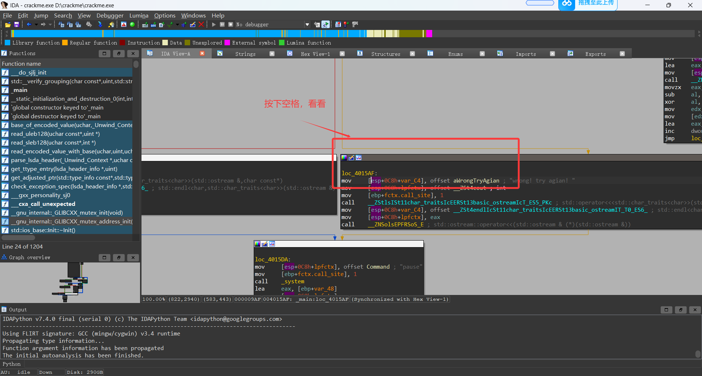
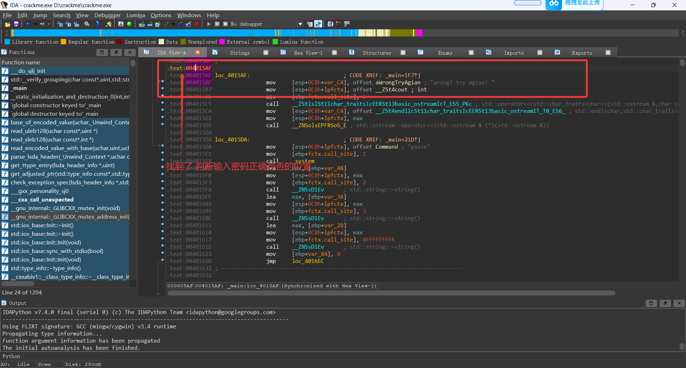

在列表视图中，可以看到这个位置

```
.text:004015AF loc_4015AF:                             ; CODE XREF: _main+1F7↑j

.text:004015AF                 mov     [esp+0C8h+var_C4], offset aWrongTryAgian ; "wrong! try agian! "
```

这个地方就是输入错误密码弹出<u>“wrong! try agian!”</u>之处，那么我们往上找就能找到对比密码判断输入密码正确与否的地方：`.text:00401587                 jz      short loc_4015AF`，记住这个地址：`00401587`
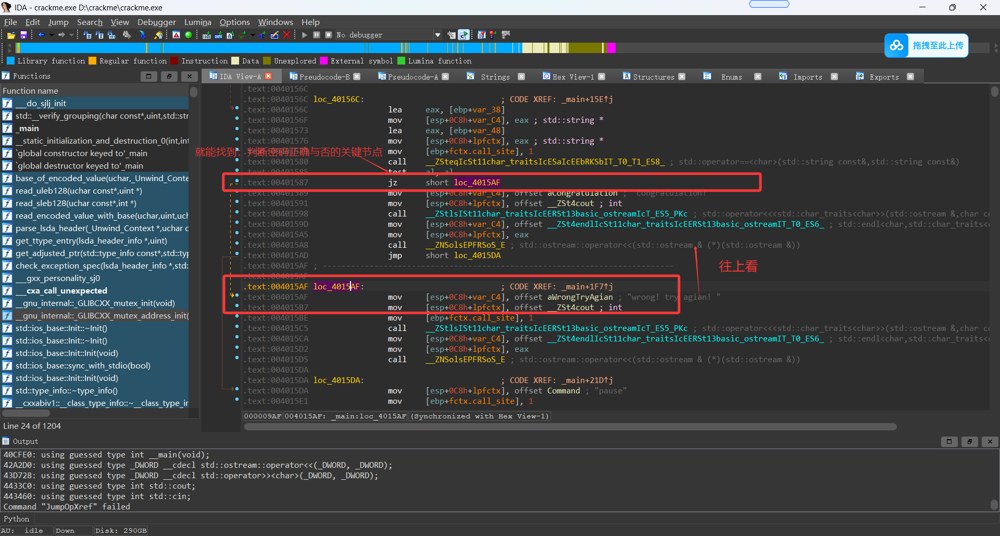

按下`F5`，看其伪代码
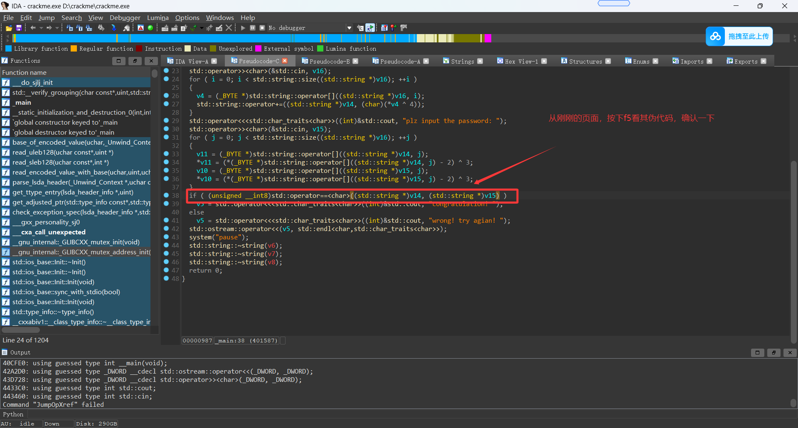

我们就可以看到,以下代码：

```
if ( (unsigned __int8)std::operator==<char>((std::string *)v14, (std::string *)v15) )
    v5 = std::operator<<<std::char_traits<char>>((int)&std::cout, "congratulation! ");
  else
    v5 = std::operator<<<std::char_traits<char>>((int)&std::cout, "wrong! try agian! ");
```

按照我的理解，意思就算将正确密码与输入密码进行对比，如果正确就打印<u>"congratulation! "</u>，如果错误就打印<u>"wrong! try agian! "</u>。
同义，在上面反汇编视图里面`00401587`这个地方就是对比密码（正确就跳转到<u>"congratulation! "</u>,错误就跳转<u>"wrong! try agian! "</u>）的地方。

**PS:**
je = 相等跳
jne = 不等跳
jz = 等于0跳
jnz = 不等于0跳

**那么，`.text:00401587                 jz      short loc_4015AF`意思就是当等于0时就跳转到`loc_4015AF`,那我们就把`jz`改成`jnz`，那不就是无论你输入什么都不跳到"wrong! try agian! "，而是跳到"congratulation! "了吗！**

---

### 三、用x64dbg进行动态调试

既然知道了可能破解的地方，我们就到x64dbg里面进行动态调试，试试看到底能不能这样干。

#### 1、动态调试

这个crack.exe是32位的，我们就打开x32dbg，把它拖进去，按下`CTRL`+`G`,输入我们在IDA找到的那个需要改动的目标的地址，即`00401587`
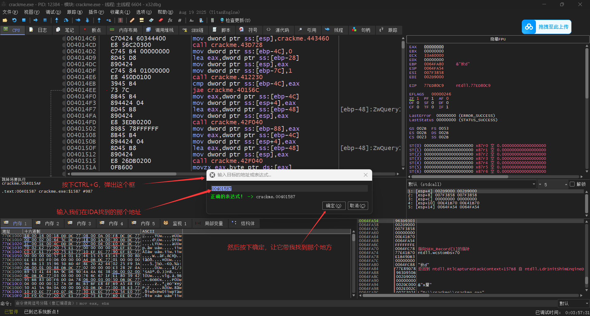
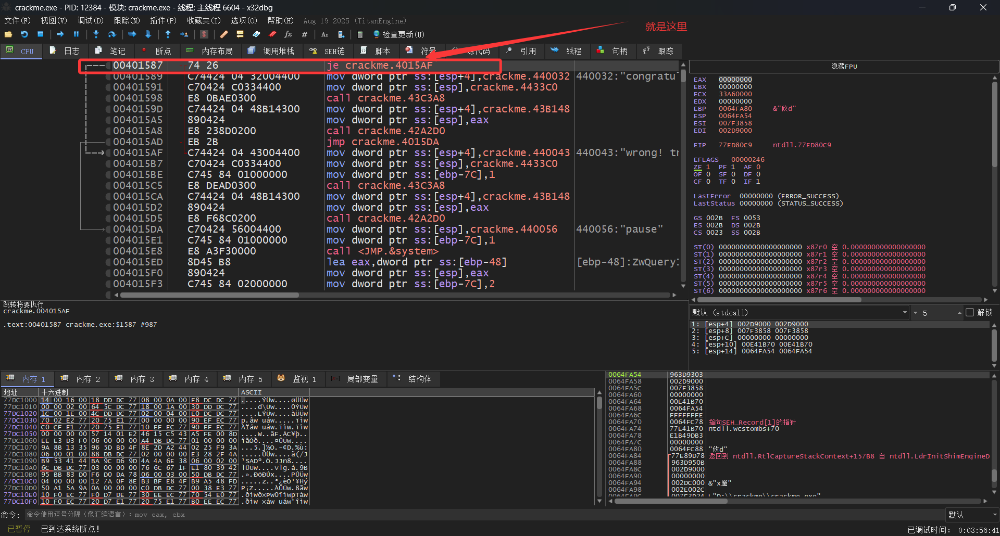

点击这一行`00401587 | 74 26                    | je crackme.4015AF                       |`，按下`空格键`（或是鼠标右键点选汇编），将弹框中的`jz 0x004015AF`改为`jnz 0x004015AF`或是`nop`，点击`确定`
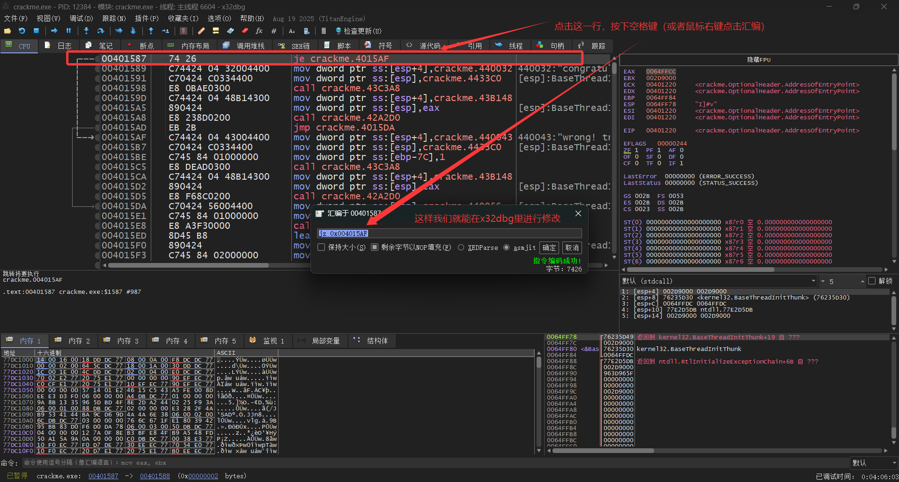
要注意的是改了之后会继续弹框，给下一个地址进行修改，这时候要点击`取消`
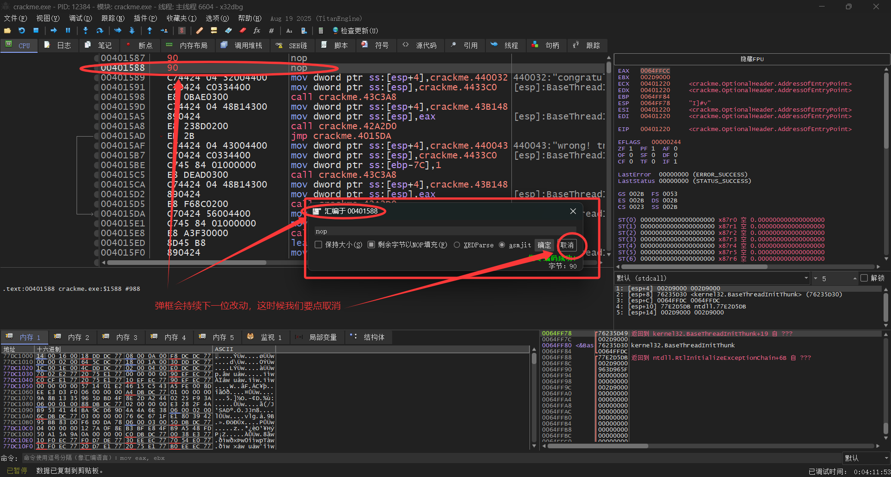

改后，点击`运行`(或者按`F9`运行)，随机输入用户名和密码，看看效果
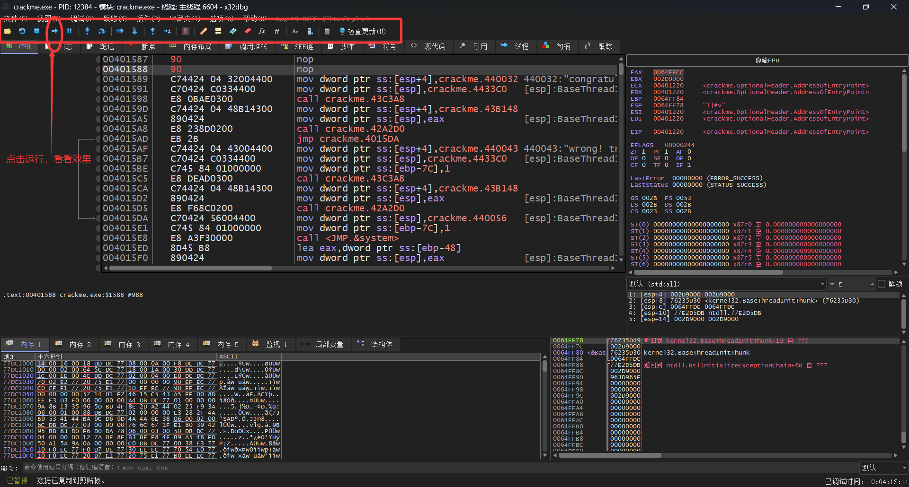
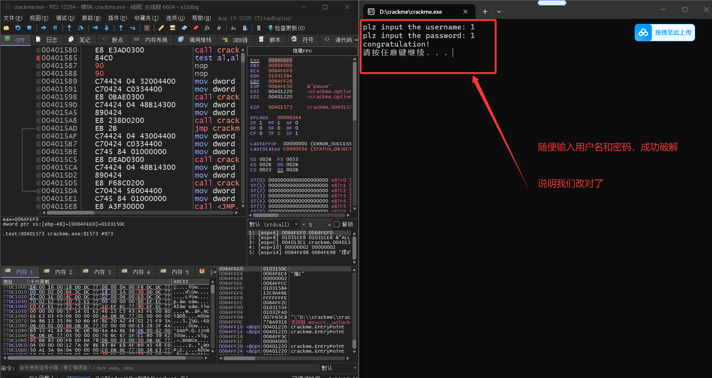
显示"congratulation! "就是成功破解了！
但是！这只是在x32dbg里调试运行的结果，而不是真正的破解，关掉x32dbg之后再打开crack.exe，随机输入用户名和密码依旧会显示"wrong! try agian! "。那么，我们接下去就给它打个补丁，真正破解它。

#### 2、打补丁

鼠标右键，点击`补丁`，会弹出补丁弹框，点击`修补文件`，会弹出保存文件，取名为crack_patched.exe
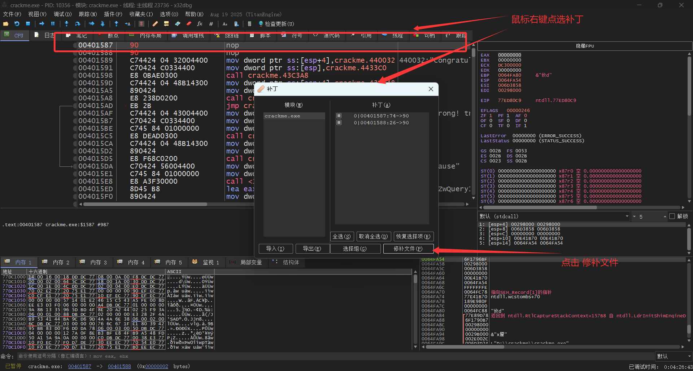

现在，你关掉x32dbg，打开crack_patched.exe，随机输入用户名和密码，都会显示"congratulation! "
就这样大功告成，零代码基础的你就成功破解了这个crack.exe，非常简单！

---

## 方法二：找到密码

打开IDA,找到伪代码这一页，复制粘贴整页代码问AI，让AI解释一下这个代码啥意思，并让AI生成一个输入用户名计算出密码的python文件。

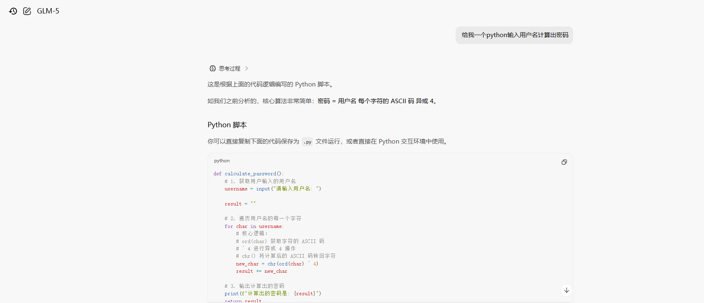

复制粘贴AI给的代码到VSCode，并保存。
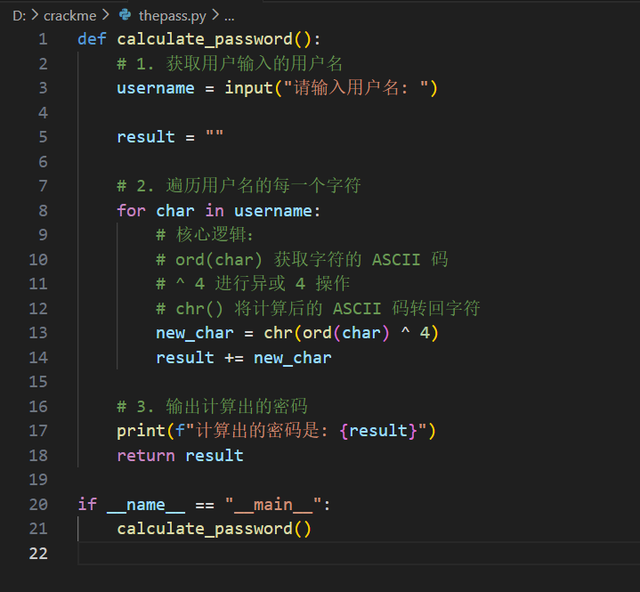

然后在该python文件夹所在的目录打开cmd，运行该python文件，就可以算出，随机用户名对应的密码，打开crack.exe试一下，是对的。
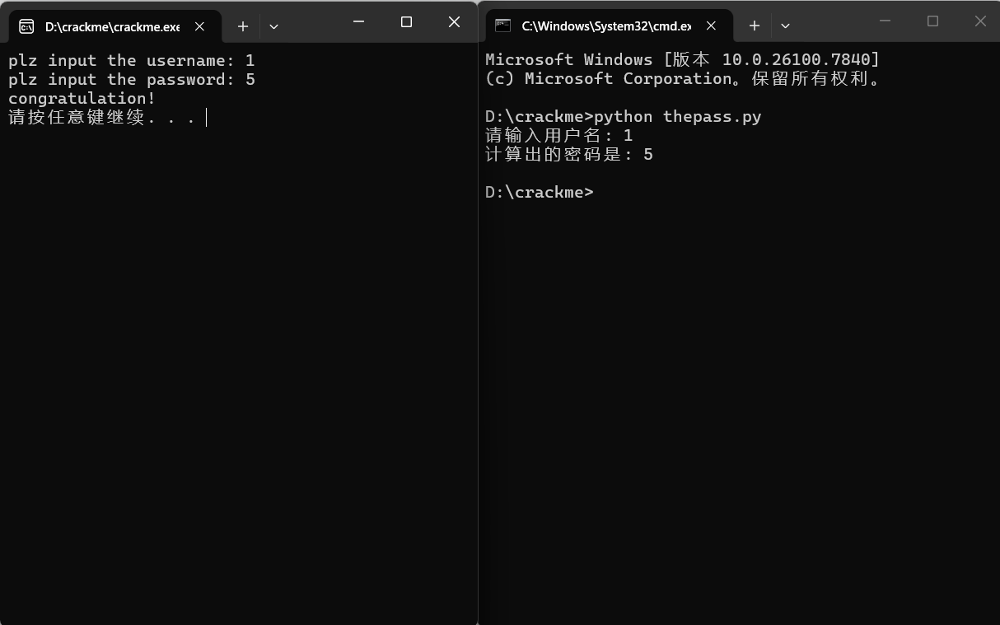
这样就找到密码了。
