## 0基础分析阶段执行银狐木马(带混淆)
准备工具:
ida（安装mcp插件）
VM虚拟机
x64dbg
opencode
零基础？完全不懂？没事ai一键搞定，我们ai真是太好用啦
病毒样本来源: https://www.52pojie.cn/forum.php?mod=viewthread&tid=2087485
可以跟着一起做
---

我们来分析一下这个样本！

我们可以在虚拟机里双击这个exe文件，看看他在干什么：疯狂弹窗要权限
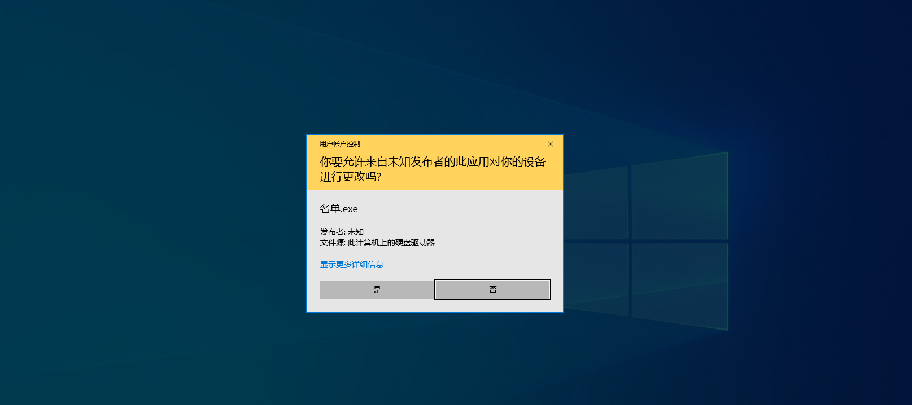
（看上去有点疯狂，我们为了以防万一，把它的后缀名改成.bin再在IDA、x64dbg里分析吧！）

我们可以也先在虚拟机里面用x64dbg运行一下这个样本，看看他在干啥：
它一直在疯狂弹窗要权限！
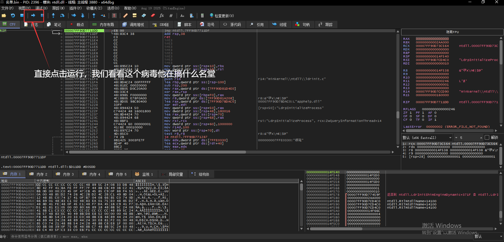

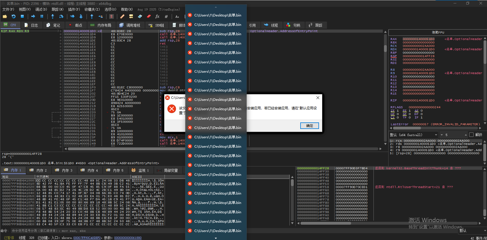
那我们就来分析一下这个样本它究竟在干什么！它为什么疯狂弹窗要权限，要权限后它要干什么？？

打开IDA，把样本（.bin文件）拖进去
点击左侧function框，CTRL+F输入main找主程序入手调查！
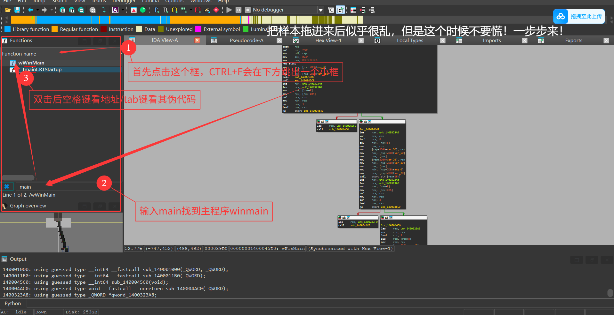
跳到伪代码这一页：
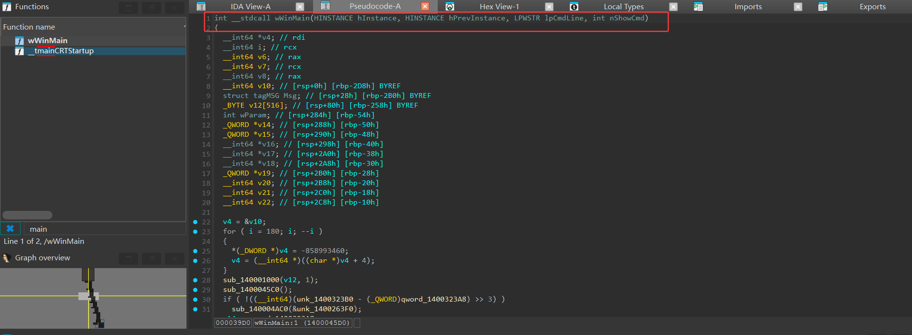
这一大坨代码对于咱啥也不懂的人来说太难受了，我们可以问问AI：
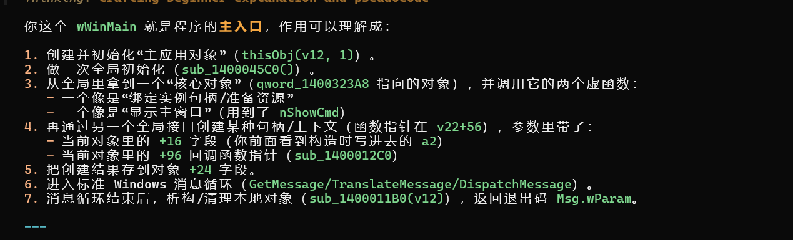
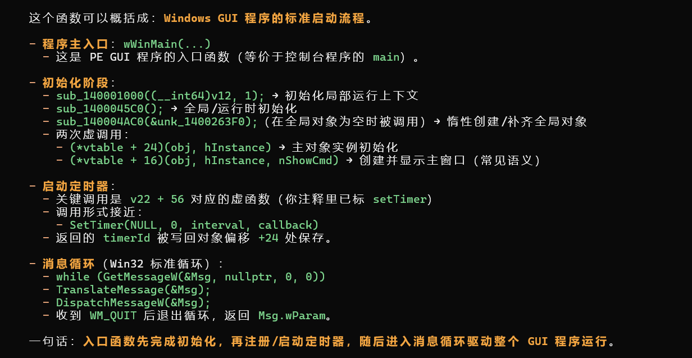
我们可以粗略分析一下这个wwinmain，是不是跟ai说的一样！

---

**但是在正式分析样本之前，我们需要掌握两个知识点！如下：**

- **动态调试去还原间接call的方法**
- **rax、rdx、rcx、r8、r9分别是什么，是用来干啥的**

## 知识点1：动态调试去还原间接call的方法

在分析病毒样本时，我们会经常碰见 用间接call隐藏自己的目的地的情况，这时就需要用到这个方法：通过动态调试去还原间接call的方法
举个例子：
我们在x64dbg里运行wwinmain：复制wwinmain的地址1400045D0到x64dbg里并找到，打断点运行到此处，接着点击步过，一直步过到下一个call（地址为140004610）（如果有遇到会跳过的call，不用管他，就当他是来迷惑你的，这个病毒怎么这么坏啊）
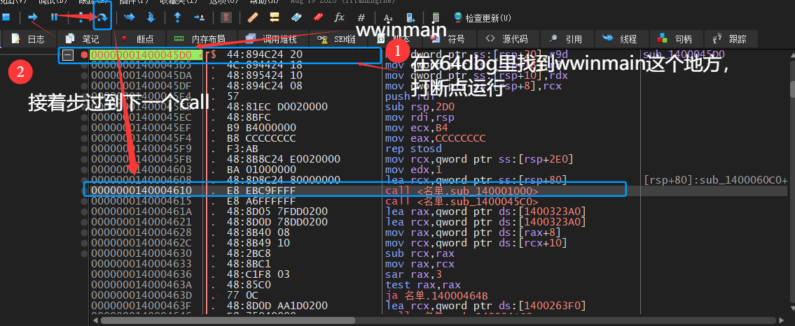
到了
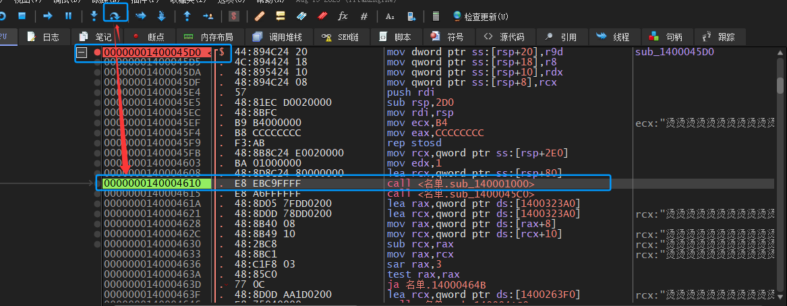
如图，点击步进按钮，单步进去看看这个间接call实际上是在什么
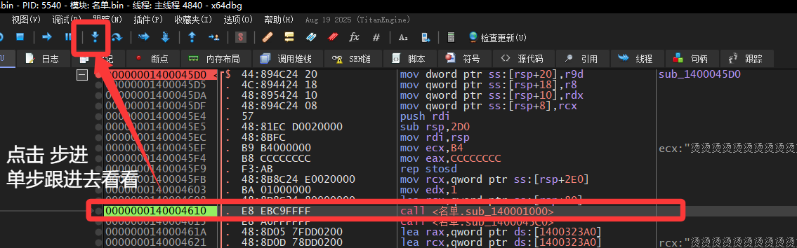
点击步进后就跳到了如图这里↓，也就是说上面那个间接call实际是在执行这个
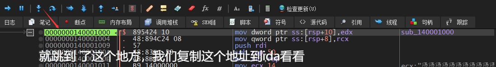
我们复制这个地址到IDA看看
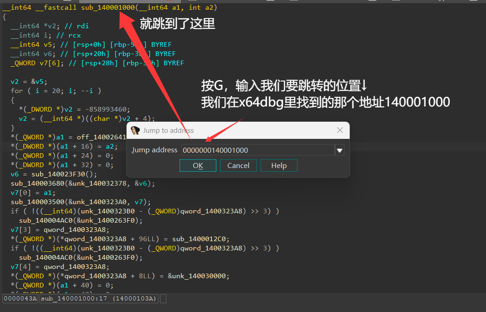
因此，我们就还原出call（地址为140004610）他的真面目的是这个函数sub140001000↑

**那既然我们知道了这个间接call的真面目了，那么我们怎么回到wwinmain的这个轨道，接着从上面那个间接call（地址为140004610）之后继续找下一个间接call还原呢？**
回到x64dbg，点击调用堆栈
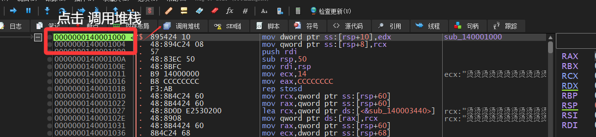

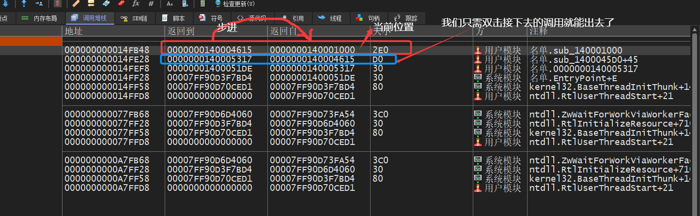
检查一下这个地址是不是我们原先地方：（可以自己去试试复制地址到ida跳转到了如图下方标记“出来的地方”这个位置。对比确认一下是不是这样，这里就不多赘述）
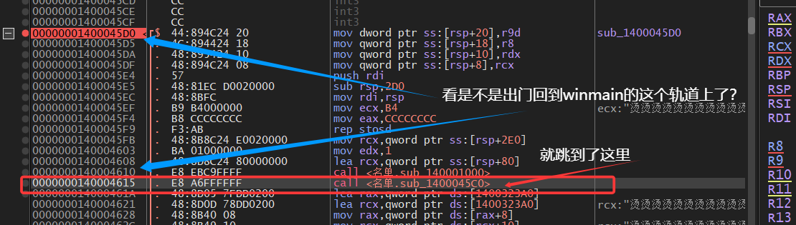
这样我们就出来啦！在上面打断点的地方继续往下跟进就能继续揭秘了
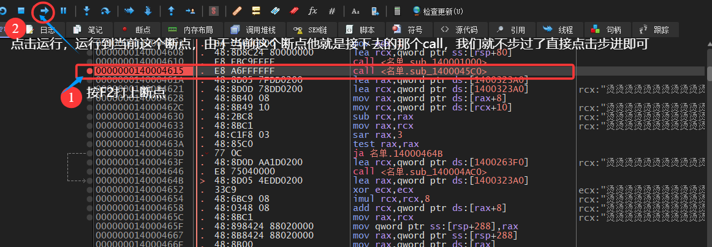

以上，就是动态调试去还原间接call的方法，接下去我们会一直用到，到时候就不多赘述了！！！

## 知识点2：RAX、RCX、RDX、R8、R9

在 64位（x64） 里，RAX/RCX/RDX/R8/R9 都是 CPU寄存器，你可以理解成“超快的小变量”。

- RAX：常当“结果寄存器”（函数返回值常放这里）
- RCX：常当第1个参数
- RDX：常当第2个参数
- R8：常当第3个参数
- R9：常当第4个参数
  举个例子：
  在这个样本里怎么用的呢？
  例如后面我们会找到settimer，我们通过查询文档可知，UINT_PTR SetTimer(HWND hWnd, UINT_PTR nIDEvent, UINT uElapse, TIMERPROC lpTimerFunc)。
  最后一个参数TIMERPROC lpTimerFunc是一个定时器回调函数，他会多少秒后执行这个函数。那么我们在x64dbg里运行到settimer时，看到的R9就是它的最后一个参数
  

好！掌握这些小知识点，我们就开始正式分析！

---

# 一、静态动态结合分析wWinMain主程序

刚刚在ida的wwinmain伪代码页面，我们按tab键看其地址（在图形视图里时，则是按空格键看地址，如图）
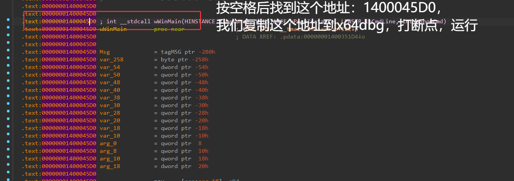
我们在x64dbg里运行wwinmain：复制wwinmain的地址1400045D0到x64dbg里并找到，打断点运行到此处，接着点击步过，一直步过到下一个call

### call 1：virus_object_ctor——创建并初始化一个对象，然后把它注册到全局对象管理器，并设置回调函数

到了

如图，点击步进按钮，单步进去看看这个间接call实际上是在什么

点击步进后就跳到了如图这里↓，也就是说上面那个间接call实际是在执行这个

我们复制这个地址到IDA看看

因此，我们就还原出call（地址为140004610）他的真面目的是这个函数sub140001000↑

问一下ai这个函数在干什么：这个函数本质是创建并初始化一个对象，然后把它注册到全局对象管理器，并设置回调函数。

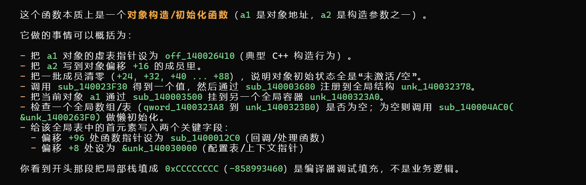
那么我们就在IDA里给这个函数注释并改名字，便于我们辨认和后续分析
按/ 输入我们要注释的东西：
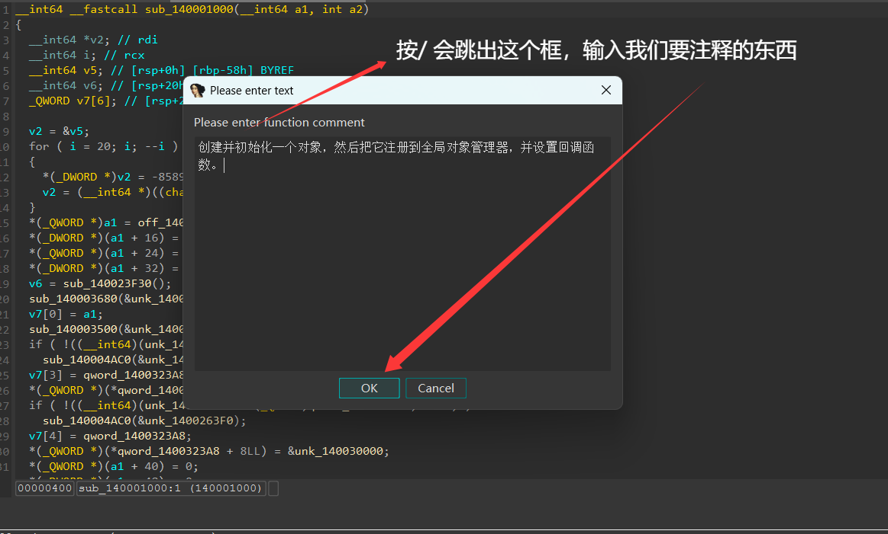
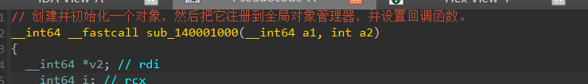
点击我们要改名的函数，按N重命名为：virus_object_ctor
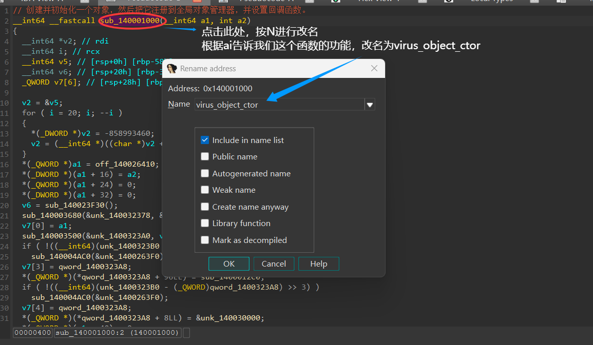

### call 2：空，不管！

回到x64dbg，点击调用堆栈第二行，出门（你懂得！）
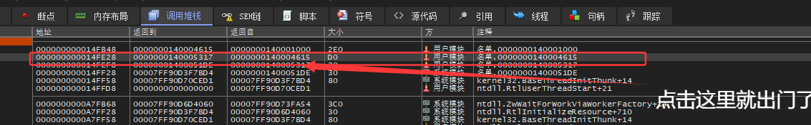
刚好跳到了下一个call，我们打断点运行
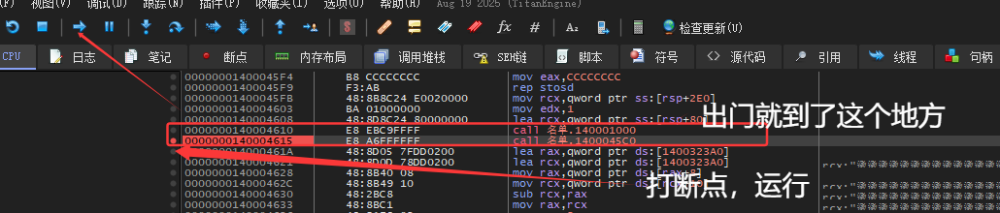
步进看看
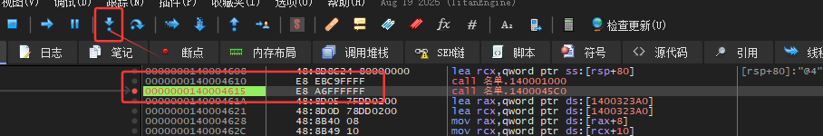
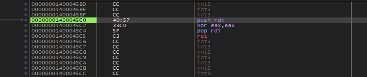
复制这个地址到ida，发现是空函数，去你的，不管
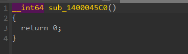
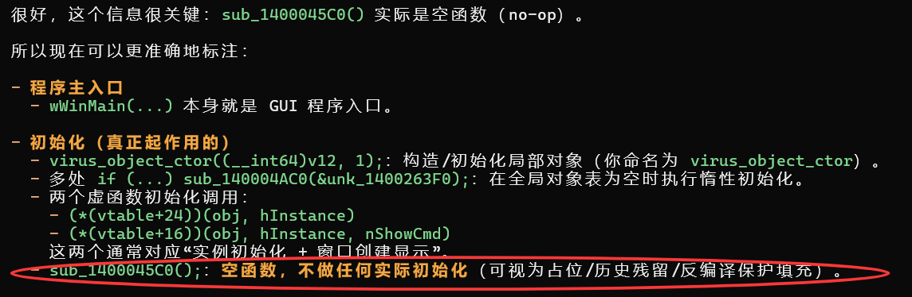

### call 3：准备并注册一个窗口类，用于进行wndproc窗口程序

回到x64dbg，点击调用堆栈第二行，出门（你懂得！）
继续打断点、运行、步过到下一个call140004695
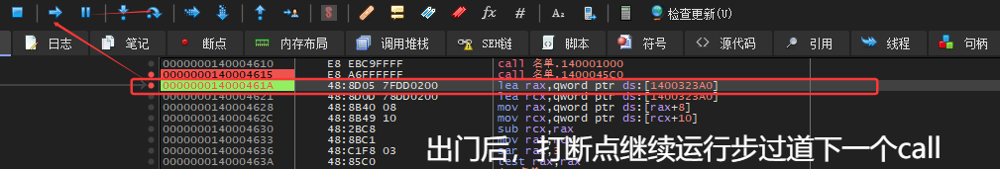
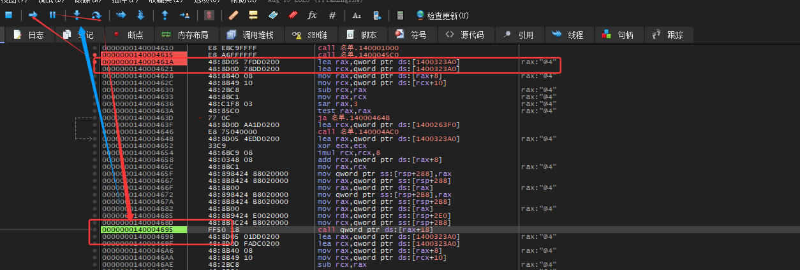
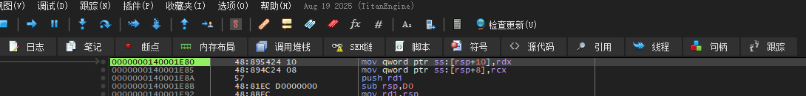
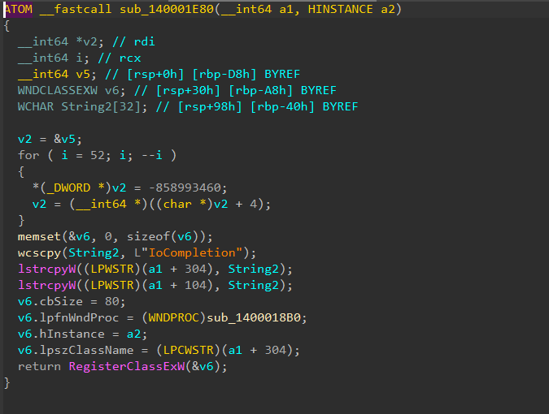
问一下ai啥意思：这个函数是在注册一个窗口
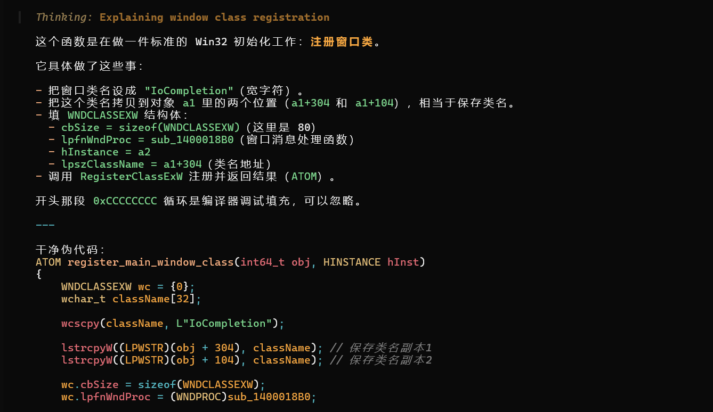

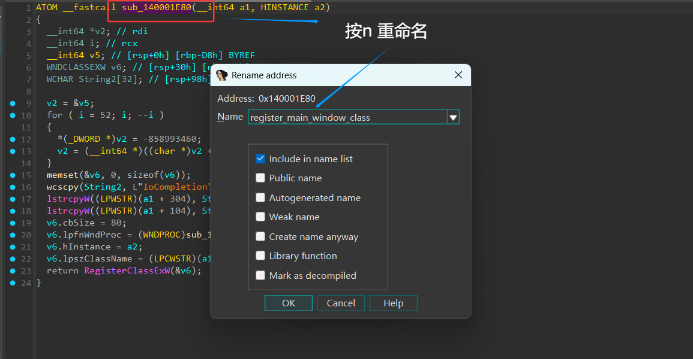
在这里面看见一个关键的东西！窗口程序wndproc：sub_1400018b0，这个函数注册窗口类的核心目的，就是让系统把这个类创建出来的窗口消息交给 WndProc（这里是 sub_1400018B0）处理
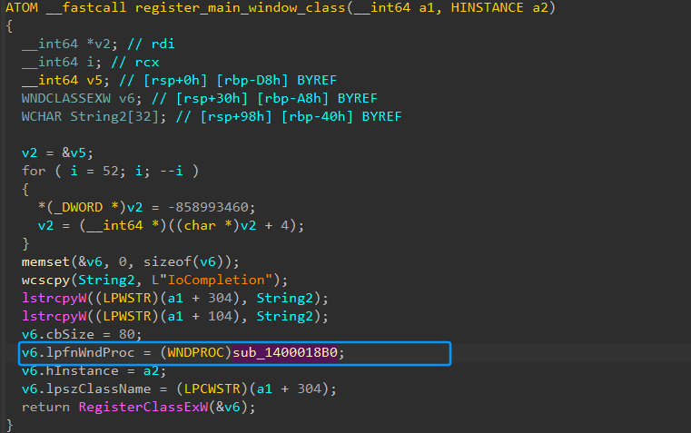
双击sub_1400018b0进来↓，按N重命名为wndproc方便我们辨认，这是非常关键的地方！！
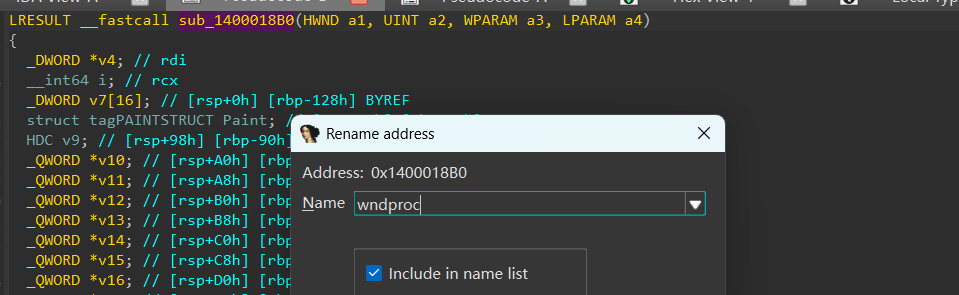

### call 4：创建一个窗口，然后立即隐藏它，用来让 WndProc 接收和处理消息（如定时器、自定义消息等）。

回到x64dbg，点击调用堆栈第二行，出门（你懂得！）
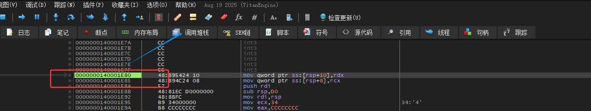
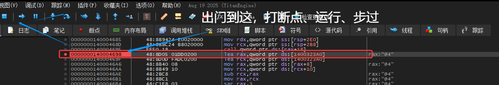
步过到下一个call 14000471B，步进
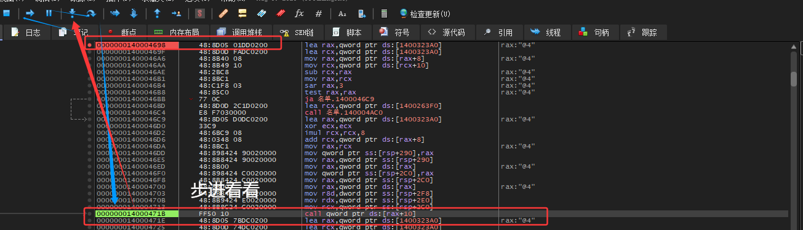
步进到这个地方
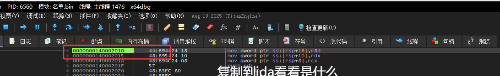
复制这个地址到IDA看看
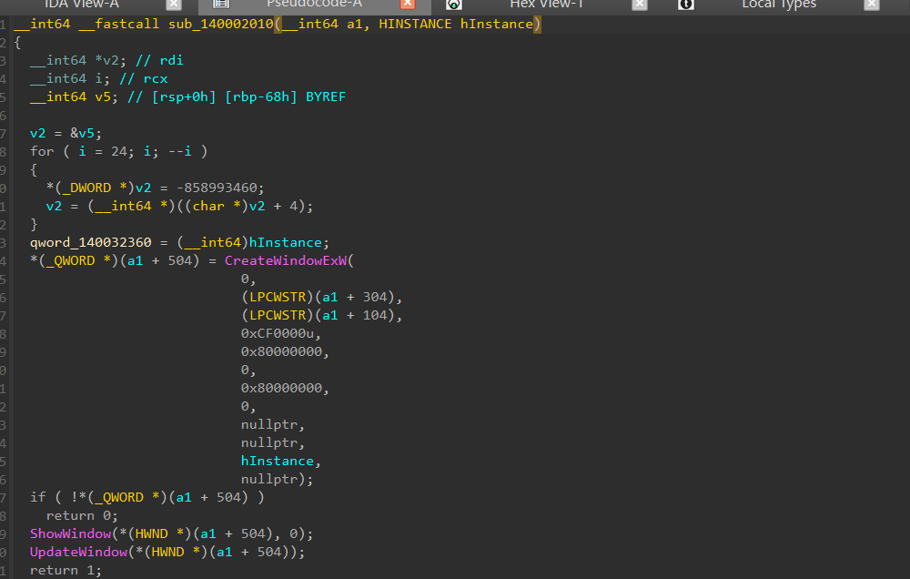
问问AI
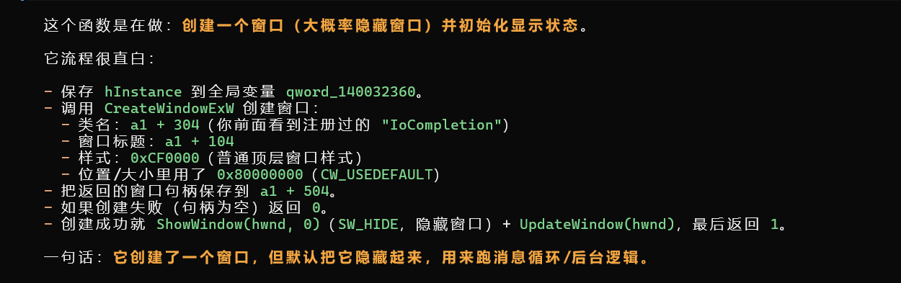
根据ai给的信息，我们给其注释并重命名
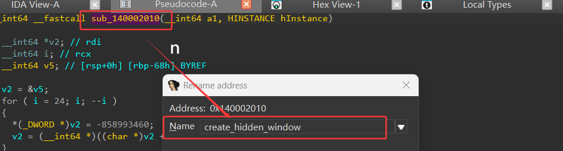
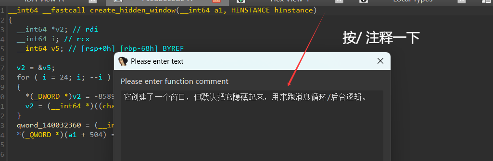
它不是给用户看的界面窗口，而是一个“后台隐藏窗口”，用来让 WndProc 接收和处理消息（如定时器、自定义消息等）。

### call 5：setTimer

##### 找到setTimer

回到x64dbg，点击调用堆栈第二行，出门（你懂得！）
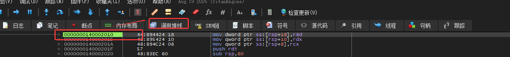
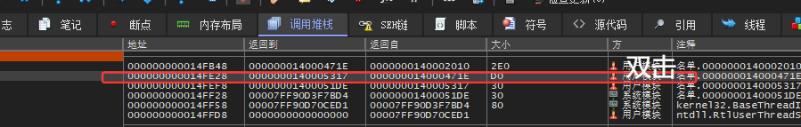
出门后继续打断点、运行步过到下一个call 14000488F
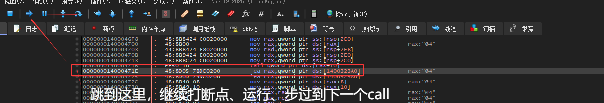
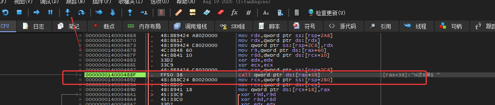
步进后，发现是settimer！
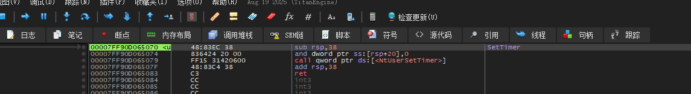
我们找到刚刚那个call的地址14000488F，去IDA找到整个地方，备注上 setTimer
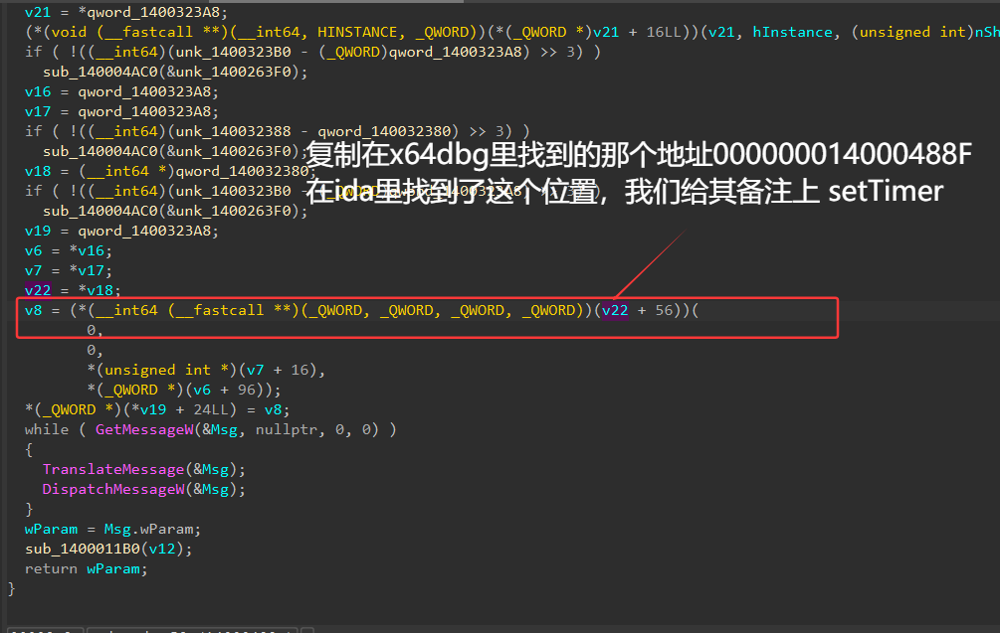
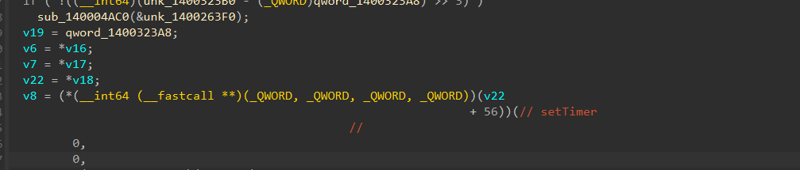

##### 分析setTimer：settimer-->0->sendmsg-->2b11-->wndproc case0~6

Settimer通过查询文档可知：
SetTimer是Windows操作系统API函数，用于创建或设置定时器，可通过发送WM_TIMER消息或调用回调函数实现周期性触发。
其函数原型为：UINT_PTR SetTimer(HWND hWnd, UINT_PTR nIDEvent, UINT uElapse, TIMERPROC lpTimerFunc)。

- hWnd参数‌：与计时器关联的窗口句柄，如果为NULL，则计时器不与特定窗口关联。‌
- ‌nIDEvent参数‌：非零计时器标识符，用于区分多个定时器。‌
- ‌uElapse参数‌：超时值（以毫秒为单位），指定定时器触发间隔。如果值小于USER_TIMER_MINIMUM（0x0000000A）或大于USER_TIMER_MAXIMUM（0x7FFFFFFF），系统会自动调整为最小或最大值。‌
- ‌lpTimerFunc参数‌：指向回调函数的指针，如果为NULL，系统会向应用程序队列发送WM_TIMER消息。‌

由上，我们可以知道，settimer的最后一个参数是一个定时器回调函数，他会多少秒后执行这个函数。根据以上知识点和如下动态调试，可以看到
hWnd参数: RCX = 0；
nIDEvent参数参数: RDX =0；
uElapse参数: R8 =1；
lpTimerFunc参数: R9 =00000001400012C0；
因此，可知道目标（也就是这个回调函数）在：00000001400012C0

我们把整个地址复制到ida找到它，看伪代码：

按N 重命名一下：


从伪代码里可以看到：这个病毒代码里有个巨大的switch case，似乎在按照case0-6来执行恶意代码，

问问ai看这坨代码啥意思

似乎是这样没错，那我们就在x64dbg里给这个00000001400012C0打个断点，运行步过到下一个call 14000143d，去看清楚它第一轮在干什么：

第一轮的call是sendmessagew，
我们可以问ai sendmessagew是什么，是什么构造什么含义（或者查文档）：

通过查询文档可知，sendmessagew函数的作用是将指定的消息发送到一个或多个窗口。此函数为指定的窗口调用窗口程序(WNDPROC)，直到窗口程序处理完消息再返回。
其原型为LRESULT SendMessage（HWND hWnd，UINT Msg，WPARAM wParam，LPARAM IParam）

- hWnd参数：指定要接收消息的窗口的句柄。如果此参数为HWND_BROADCAST，则消息将被发送到系统中所有顶层窗口，包括无效或不可见的非自身拥有的窗口、被覆盖的窗口和弹出式窗口，但消息不被发送到子窗口。
- Msg参数：指定被发送的消息。
- wParam参数：指定附加的消息特定信息。
- IParam参数：指定附加的消息特定信息。

据此，我们在x64dbg里看其参数如下图：


- 返回值RAX =1915f0 <&sub_14001B9C0>
- hWnd参数：RCX =39074E
- Msg参数：RDX =2B11
- wParam参数：R8 =0
- IParam参数：R9 =0

复制这个地址14000143d到ida看看：


所以，发给wndproc的msg是参数2，也就是rdx，在这里面是2b11，返回地址是sub14001b9c0这个函数（也就是第一轮恶意代码）
我们在ida里找到sub14001b9c0这个函数

复制伪代码问ai：检查当前进程是否有管理员权限；如果没有，就用自身路径以 runas 方式重新启动并退出当前进程。

根据这个函数的行为，我们按/注释并按N重命名一下

在sub14001b9c0这个函数里面我们看到了这里有个函数sub_14001D5D0，

双击进去，发现是一个用管理员权限（UAC）重新启动指定程序


根据这个函数的行为，我们按/注释并按N重命名一下


小结一下就是：这个sub14001b9c0检查当前是不是管理员权限（UAC），不是管理权限用就调用sub_14001D5D0提权，一直到是管理员权限为止。

就此，病毒的执行流程就很清楚了，创建一个定时器，然后定时器里面执行sendmessagew去触发wndproc, 来执行恶意代码，
即：
病毒settimer->0->sendmsg->2b11->wndproc 执行第一轮恶意代码（UAC弹窗）。
由于UAC的弹窗发生在第一轮里面，并且她一定会执行，所以我们只需要给UAC弹窗的代码（sub14001b9c0）在x64dbg里打一个断点，运行看其调用堆栈，就能看调用栈来印证我们的猜想：

我们可以一步一步往上跟进这些调用栈（只看用户模块，名单xxxxx），看看这一条流程链：
00000001400021A7

↑
0000000140001A8A

↑
0000000140001440

↑
00000001400048CE

后面这俩就是整个程序开始，不用管
0000000140005317
00000001400051DE
梳理一下就是：
wwinmain -> wwinmain-settimer进行定时器回调 -> dispatch timer state message->sendmessage 2b11 -> wndproc -> case 0（调用run as admian always 进行UAC弹窗）->case 0
没错就是这样！

### call 6~8：进入消息循环后，重复运行整个wWinMain程序


---

通过以上静态动态结合分析wWinMain主程序，我们梳理一下整个主程序的运行流程，如下图：


---

# 二、静态动态结合分析wndproc轮巡恶意代码：case0~6

根据上面的分析我们可以看到，这个分析这个病毒的重点就在wndproc的那个轮巡的恶意代码case0~6。
那我们就来看看，wndproc轮巡的恶意代码吧！

### case 0

case0触发前提\以及流程我们在章节一中的settimer里粗略分析过了，如果你已经完全明白，那么可以自行跟进研究分析、往下跳到case1 继续下去，如果还是有点不懂，可以继续看我唠叨！
上面我们说，病毒wwinmain -> wwinmain-settimer进行定时器回调 -> dispatch timer state message->sendmessage 2b11 -> wndproc -> case 0（调用run as admian always 进行UAC弹窗）->case 0 执行第一轮恶意代码case 0。
由于UAC的弹窗发生在第一轮里面，并且她一定会执行，所以我们只需要给UAC弹窗的代码（sub14001b9c0）在x64dbg里打一个断点，运行看其调用堆栈，去找一下这个case 0（病毒恶意代码阶段1），研究它到底在干什么！


我们双击第二行，看是谁调用了sub14001b9c0

双击后就跳到这，我们复制这个地址1400021A7到ida看看

在ida里跳到这个位置，也就是说这里调用了sub14001b9c0（run_as_admain_always）

我们按/备注一下

我们现在来看一下1400021A7所在的这个函数的伪代码是什么意思如下：

加上它还调用了前面我们分析到的UAC提权run_as_admain_always，也就是说这个函数它大致的行为是：提权检查 ->扫描获取数据->解码
这里1400021A7就是我们说的第一轮恶意代码case0了，为什么是呢？我们待会就可以验证一下
我们给这个地方备注一下：

在我们跟进整个case0之前，我们必须要一件事！前面我们知道了run as admin always是uac弹窗提权对吧？那么，我们必须得是管理员我们才能在x64dbg里继续跟进case0，不然就会一直停在uac弹窗这里，那我们怎么欺骗病毒我们已经是管理员了呢？

那么，我们就在`000000014001BA16   | 75 13                       | jne 名单.14001BA2B                             |`这个地方改汇编并打个补丁，让他不再跳转回去，这样就达到欺骗病毒我们是管理员的目的了。


ok了，接下去我们就能绕过这个弹窗继续跟进case 0了！
好，现在我们在x64dbg里给1400021A7打断点运行看看：

步过到下一个call 140002260，点击步进，进去看看


问问ai啥意思：这个函数是一个内存签名扫描器（在当前进程内存里找特征块），返回命中地址，否则返回0。

那我们跟据这些信息分别按/和N给其进行注释和重命名为scan_memory_0，如下：

我们返回call 140002260到ida里备注一下，这里调用scan_memory_0

ok，我们出门继续跟进这个case0


出来了，顺道一提，如图可以看到，scan memory 0执行完，返回地址rax=0，也就是说这轮扫描没有找到病毒要的东西！

出门继续打断点、运行步过到下一个call

点击步进


复制地址140024600到ida查看：

发现这个函数也是做内存签名扫描，找一段符合条件的字节序列，也就是说scan memory 0扫描一边没找到，接着让这个函数找一遍


那我们就给这个函数按N重命名为scan_memory

来都来了，那我们顺便看看scan memory的命中地址吧！
回到x64dbg


顺道一提！在执行scan memory，我们看rax=1400300BE，就是说这轮扫描扫到了病毒要找的东西，命中了1400300BE！我们可以在ida里备注，这里就不多赘述。

继续打断点、运行、步过到下一个call

发现是memcpy

记录下来：memcpy（ida里memcpy(&Size, *(*v22 + 40LL), 4u);）在x64dbg里找到其签名参数为：
rax：000000000014FBD0
rdx：00000001400300D6 就发现了这个地方就是读取前面存放00000001400300BE那个地方0x1400300D6，在从该位置读出压缩长度（d5），供后续解压使用

r8：04
r9：d5
rcx：000000000014F3FC
rip 000000014000250B

记录下来：memcpy（ida里memcpy(&Size, *(*v22 + 40LL), 4u);）在x64dbg里找到其签名参数为：
rax：000000000014FBD0
rcx：000000000014F3FC
rdx：00000001400300D6
r8：04
r9：d5
诶！是不是有些参数很眼熟？没错，在前面scan memory的签名参数里出现过！
这个地方就是读取前面存放00000001400300BE那个地方0x1400300D6，在从该位置读出压缩长度（d5），供后续解压使用。
我们接着出门继续操作——打断点、运行、步过到下一个call，步进查看，即继续动态调试还原call的操作，接下去将只会重点分析重要的call，其他将不会再贴图赘述！太罗嗦了！！总之你懂得！！

出门在case0轨道上继续操作，当步过到14000262E时步进看看


复制140002690这个地址到ida看看

问ai告诉我们这个是一个包装函数，有点诡异，我们直接在x64dbg里看它在干啥：


发现他在使用RtlDecompressBuffer进行解压

回到ida给其进行备注改名

在ida里回到case0的伪代码，可以看到，case0在进行解压后就保存到obj+40

这样case0 就结束了！


如果你继续往下找call，就会到0000000140001A8A这个地址，复制到ida就会跳到wndproc，串起来了对吧！

### case 1 恶意代码阶段2


也就是说，这个在wndproc的这个case 0u就是执行的就是恶意代码第二个阶段，那我们看看你这个函数他都干了些什么。
我们先复制这整段代码让ai分析是干什么的，ai告诉我们：这个函数的作用是：从 payload 结构中提取 payload 数据并分配缓冲区。也就是说阶段2是在解析 stage1 结构，提取key_len/key。


Ps：
我们复制0000000140002760到这个地址去x64dbg里打断点运行步过到call
Call1：

Call2 meset函数

Rax:5e
Rcx:2154360（目标地址，key ptr）
Rdx:
R8:5e（长度，key len）
R9:

Call3：memcpy函数
Rax:14fbd0（返回值）
Rxc:2154360（目标地址，key ptr）
Rdx:21535c1（源地址）
R8:5e（key len）
R9:


00000000021E4360+5e=21E 43BE那么关键信息就是这些了
00000000021E4360 71 9E F8 69 C5 32 48 E1 97 09 F6 17 A1 75 AB 08 q.øiÅ2Há..ö.¡u«.  
00000000021E4370 EB 9E 16 8B 6A 30 A2 8A 41 14 1B 0B 08 E9 3A 24 ë...j0¢.A....é:$  
00000000021E4380 81 14 93 4B 54 0C 87 34 8A 33 34 06 EA 32 AE 13 ...KT..4.34.ê2®.  
00000000021E4390 1C 96 53 0B C0 98 3D B4 38 42 96 8D E1 9A DA 19 ..S.À.=´8B..á.Ú.  
00000000021E43A0 36 2B 9C 4B E4 20 C0 AD F5 61 41 92 AA 0F A8 5C 6+.Kä À.õaA.ª.¨\  
00000000021E43B0 F1 6A AF AA 75 BA 56 77 63 40 11 03 34 9D AB AB ñj¯ªuºVwc@..4.««  
00000000021E43C0 AB AB AB AB AB AB AB AB AB AB AB AB AB AB EE FE ««««««««««««««îþ

### case 2 恶意代码阶段3

回到wndproc我们继续看case2


我们复制粘贴这段代码，问ai让他分析这个函数是干什么的，ai告诉我们：这个函数就是从全局数据块中解析出 stage2 payload 的大小，申请内存，然后拷贝并返回这个第二阶段代码的缓冲区。
简单来说，这个函数就是：
从一个大数据包里取出第二阶段程序（stage2），给它分配内存，然后把它拷贝出来准备执行。
也就是把“隐藏在数据里的第二步程序”提取出来。


当然，我们可以动态调试一下佐证是不是这样（就是复制地址到x64dbg、运行、步过找下一个call、单步进去查看复制地址到ida看这个函数是什么在干什么，跟ai说的一样）
00000000021E43F0+0000000000000B84=21E 4F74


### case 3 恶意代码阶段4


步进后找到的地址是140002F90，发现是阶段4，复制到ida看看伪代码，并问ai，可以看到，他是在提取阶段2的解密payload

那我们现在就亲自来看看这个第四阶段是怎么运行的


我们可以问ai伪代码，对应参数


### case 4 恶意代码-服务控制分支

我们接着看下一个case4
Tab键在ida找到其地址0000000140001C22，到x64dbg里打断点，重复上面那些操作


问问ai，发现case4是服务控制分支：检查/启动 vss 或 Schedule 相关路径。

去x64dbg看看
打断点、运行、步过到call：140023D79通过自行分析可以发现它是keyblock的最外层包装函数，这个函数就是：a1里写入qward（sub14001FE60），然后赋值（sub14001a980）包装到sub14001B110再包装到sub_140019EC0


继续在case的轨道上向下分析，发现call 140023D89 是在解析出明文进程名为360tray.exe：


解出进程名为360tray.exe，我们给sbu 140022a70根据其行为改名为decode_proc_name


继续在case的轨道上向下分析，发现call 140023d89是在查找有无目标进程360tray.exe：


复制步进的地址000000014001BA50到ida并问ai，Ai告诉我们，这个函数在按进程名查 PID。用来找目标进程（如你已还原到的 360tray.exe），给后续注入用。（这是可以自行分析验证的，用到的都是上面的用到的方法，这里不多赘述，相信你可以的！），根据其行为改名为find_process_id_by_name，方便辨认。


问问ai，发现这是enum_service，是判断vss/schedule服务是否在运行，再决定是否走start service服务。
由于此时我们没有开360杀毒软件，这个病毒没有找到360tray.exe，于是就走enum_service判断schedule服务（schedule服务是默认运行的，可以自行去任务进程管理器看）是否运行，再注入


出门发现这个case 3u到这里就执行完了

如果我们打开了360杀毒软件，发现会先运行enum service 检查有这个进程名并是否开启vss服务

（但是！由于vss是需要管理员身份时才打开，我们现在只欺骗了这个病毒我们是管理员（前面打了补丁），但是我们还没有开vss服务），如果没有处于关闭停止vss服务状态就会运行start service，病毒就会自我退出，陷入沉睡，动态调试运行至此也就停摆不前了。


如果vss服务是开启的，我们运行到0000000140023D8E这个call时往下步过就会进行enum service检查，跳过start service


往下步过结束了，跳到140001cae也就是wndproc这里进行下一个case4u——注入


### case 5 阶段5

接着看阶段5吧！可以看到，阶段5就是注入了


若解密就绪，就开始触发注入链


仔细看看这个阶段5，发现他是按 PID 打开目标进程 -> 把 payload 写入远程内存 -> 通过 IoCompletion 机制触发执行


---

### case 6

按这样的方法下来看case6，发现它是执行自删除。

---

### 总结病毒的行为

wwinmain -> wwinmain-settimer进行定时器回调 -> dispatch timer state message->sendmessage 2b11 -> wndproc -> case 0（调用run as admian always 进行UAC弹窗）->case 0阶段1(提权检查、扫描获取重要信息、解码、保存)
settimer回调轮巡执行->……wndproc->case 1阶段2（解析case0阶段1.提取key ptr/key len）
settimer回调轮巡执行->……wndproc->case 2阶段3（解析阶段2，payload_len 和密文 payload）
settimer回调轮巡执行->……wndproc->case 3阶段4（解密还原提取出的payload，为后续注入做准备）
settimer回调轮巡执行->……wndproc->case 4控制服务分支（vss/schedule）
settimer回调轮巡执行->……wndproc->case 5阶段5（远程注入+触发执行核心）
settimer回调轮巡执行->……wndproc->case 6阶段6（自删除）
